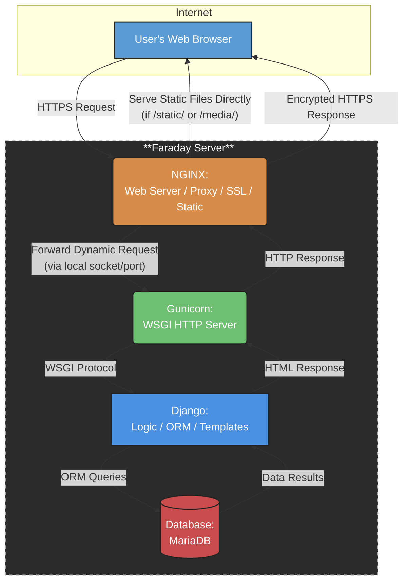

# 📘 Informe Técnico: Análisis y Evaluación del Sistema EIEInfo

**Universidad de Costa Rica**
**Escuela de Ingeniería Eléctrica**  
**IE-0417 – Diseño de Software para Ingeniería**  
**Proyecto Final – Grupo**   
**I semestre 2025**


**Integrantes:**  
- Diego Alfaro (C20259)  
- Edgar Alvarado (C10351)  
- Jean Zúñiga (C18767)

---
# 🧾 Introducción

Como parte del Proyecto Final del curso IE-0417, se realizará un análisis detallado del sistema de información **EIEInfo**, una plataforma desarrollada internamente por la Escuela de Ingeniería Eléctrica (EIE) de la Universidad de Costa Rica. Este sistema apoya procesos académicos, administrativos y de extensión, y será evaluado desde una perspectiva de diseño de software para identificar oportunidades de mejora técnica y estructural.

Durante las próximas semanas, el equipo asumirá el rol de consultoría técnica, realizando ingeniería inversa, entrevistas a stakeholders, revisión de código y documentación, con el fin de proponer mejoras viables y justificadas. A continuación, se detalla la planificación semanal del trabajo.

## 🔗 Recursos adicionales

- [Análisis detallado del sistema actual (Avance 1)](./avances/avance1/README.md)
- [Evaluación técnica y entrevistas(Avance 2)](./avances/avance2/README.md)

- [Propuestas de mejora y rediseño (Avance 3)](./avances/avance3/README.md)

# A. Análisis del sistema actual

## Descripción funcional del sistema EIEInfo

El sistema **EIEInfo** es la plataforma web oficial de la Escuela de Ingeniería Eléctrica (EIE) de la Universidad de Costa Rica. Centraliza información académica, administrativa y de extensión, y sirve como herramienta digital de comunicación y gestión para estudiantes, docentes y personal administrativo.

### Objetivos generales:
- Centralizar el acceso a recursos, noticias y trámites institucionales.
- Optimizar la comunicación interna de la EIE.
- Facilitar la navegación a documentos, formularios y sistemas asociados.

### Tipos de usuarios:
- **Estudiantes**: acceso a información de matrícula, cursos, horarios, bolsas de empleo, anuncios y trámites de graduación.
- **Docentes**: consulta de normativa, asignaciones docentes, proyectos, calendario académico y actividades administrativas.
- **Administrativos**: gestión de contenido, organización del portal, mantenimiento y soporte a módulos institucionales.

---

## Identificación de módulos clave

El sistema está compuesto por múltiples aplicaciones (apps Django) que se especializan en diferentes procesos institucionales. Algunos de los más relevantes incluyen:

- `cursos`: gestión de materias, grupos, horarios, cartas de estudiantes, cátedras.
- `trabajos_finales`: gestión de proyectos de graduación, lectores, avances, concursos.
- `proyecto_electrico`: control de proyectos de electrónica, recursos y laboratorios.
- `practica_profesional`: seguimiento a prácticas estudiantiles, evaluación y vinculación con empresas.
- `profesores`: gestión de nombramientos, comisiones, perfiles y cargas académicas.
- `estudiantes`: administración de matrícula, historial académico, asignaciones.
- `administrativos`: control de funciones y responsabilidades del personal.
- `alumni`: seguimiento de egresados, trayectoria profesional, redes de contacto.
- `anuncios`, `eventos`, `conferencias`: módulos de comunicación institucional.
- `laboratorios`, `inventario`: administración de recursos y equipos físicos.
- `proyectos`, `asistencias`, `atributos`, `webpage`, `eieinfo`, `scripts`: apoyo a procesos internos y configuración del sistema.

---

## Tecnologías utilizadas

### 🔧 Backend y desarrollo:
- **Framework principal**: Django (Python)
- **Base de datos**: MariaDB (via MySQL client)
- **Servidor WSGI**: Gunicorn
- **Servidor web**: NGINX (proxy inverso, archivos estáticos, TLS)
- **Contenedores**: Docker
- **Integración continua**: Drone CI
- **Gestión de tareas programadas**: `django-crontab`
- **Edición enriquecida**: `django-ckeditor`, `martor`
- **Estilo de código**: Flake8 (archivo `.flake8` incluido)

### 📦 Librerías auxiliares:
- `django-widget-tweaks`, `django-select2` (UI)
- `google-api-python-client`, `facebook-sdk`, `oauth2client` (integraciones externas)
- `openpyxl`, `PyPDF2`, `sorl-thumbnail` (procesamiento de archivos)
- `pypandoc`, `docutils` (documentación y conversión)

### 📄 Script de instalación:
- `setup.sh`: instala dependencias del sistema operativo y servicios requeridos (nginx, mysql-server, certbot, etc.)

---

## Diagrama de arquitectura (vista lógica y física)


## Dependencias externas e integraciones

El sistema se apoya en varias **integraciones externas** para extender su funcionalidad y automatizar tareas institucionales.

### 📅 Google Calendar API
- Automatiza la **creación y gestión de eventos** en los calendarios institucionales.
- Utiliza la librería `google-api-python-client`.
- Se requiere el archivo de credenciales `eieinfo_credentials.json`.

### 🔍 Google Custom Search API
- Permite realizar **búsquedas internas** desde el portal institucional.
- Se configura con parámetros de búsqueda y motor personalizado autorizado.

### 📲 Facebook Graph API
- Facilita la **automatización de publicaciones** en la página oficial de la Escuela.
- Utiliza la librería `facebook-sdk`.
- El token de acceso se encuentra definido en el archivo `settings.py`.

---

## Ambiente Dockerizado

El sistema utiliza una arquitectura **basada en Docker Compose**, lo que facilita el despliegue, desarrollo y pruebas locales en contenedores aislados.

### Contenedores principales:
- `eieinfo_app`: aplicación web basada en Django.
- `nginx`: servidor web y **proxy inverso**.
- `mariadb`: base de datos relacional.

### Comandos recomendados:
```bash
docker compose build
docker compose up
docker compose down
```

## CI/CD con Drone
El sistema cuenta con un pipeline de integración continua utilizando Drone CI, lo cual permite una verificación automática del estado del sistema ante cada cambio en el código.

### Funcionalidades del pipeline:
- Validación de servicios (netcat, ping).

- Aplicación de migraciones de base de datos.

- Verificación de rutas clave (como /admin, /estudiantes, etc).

- Generación de fixtures.

- Ejecución de pruebas unitarias.

### Ejecución local del pipeline:
``` bash
Copiar
Editar
drone exec --network eieinfo_default docker/drone-local/drone.yml
```