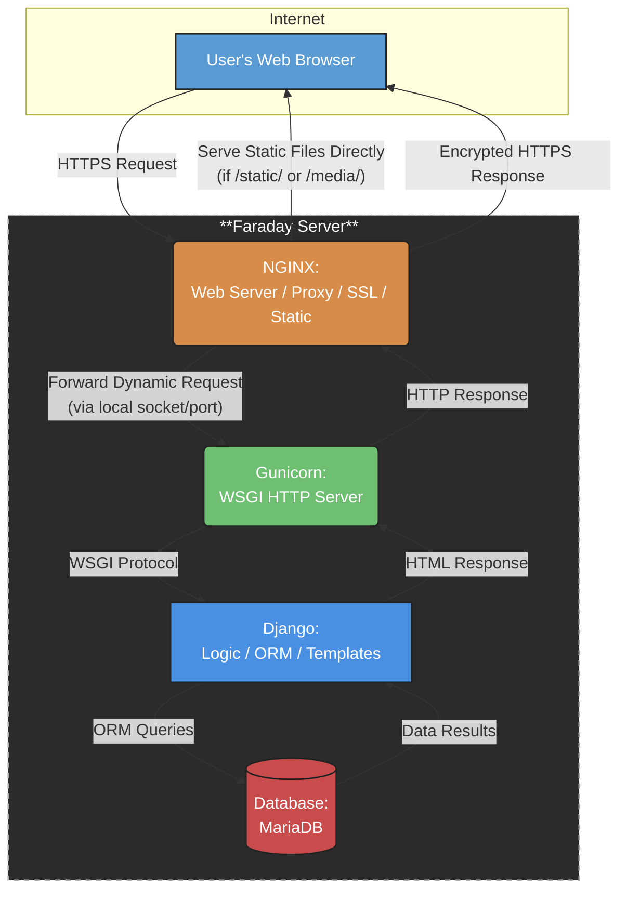

# 📘 Informe Técnico: Análisis y Evaluación del Sistema EIEInfo

**Universidad de Costa Rica**
**Escuela de Ingeniería Eléctrica**  
**IE-0417 – Diseño de Software para Ingeniería**  
**Proyecto Final – Grupo**   
**I semestre 2025**


**Integrantes:**  
- Diego Alfaro (C20259)  
- Edgar Alvarado (C10351)  
- Jean Zúñiga (C18767)

---
# 🧾 Introducción

Como parte del Proyecto Final del curso IE-0417, se realizará un análisis detallado del sistema de información **EIEInfo**, una plataforma desarrollada internamente por la Escuela de Ingeniería Eléctrica (EIE) de la Universidad de Costa Rica. Este sistema apoya procesos académicos, administrativos y de extensión, y será evaluado desde una perspectiva de diseño de software para identificar oportunidades de mejora técnica y estructural.

Durante las próximas semanas, el equipo asumirá el rol de consultoría técnica, realizando ingeniería inversa, entrevistas a stakeholders, revisión de código y documentación, con el fin de proponer mejoras viables y justificadas. A continuación, se detalla la planificación semanal del trabajo.

## 🔗 Recursos adicionales

- [Análisis detallado del sistema actual (Avance 1)](./avances/avance1/README.md)
- [Evaluación técnica y entrevistas(Avance 2)](./avances/avance2/README.md)

- [Propuestas de mejora y rediseño (Avance 3)](./avances/avance3/README.md)

# A. Análisis del sistema actual

## Descripción funcional del sistema EIEInfo

El sistema **EIEInfo** es la plataforma web oficial de la Escuela de Ingeniería Eléctrica (EIE) de la Universidad de Costa Rica. Centraliza información académica, administrativa y de extensión, y sirve como herramienta digital de comunicación y gestión para estudiantes, docentes y personal administrativo.

### Objetivos generales:
- Centralizar el acceso a recursos, noticias y trámites institucionales.
- Optimizar la comunicación interna de la EIE.
- Facilitar la navegación a documentos, formularios y sistemas asociados.

### Tipos de usuarios:
- **Estudiantes**: acceso a información de matrícula, cursos, horarios, bolsas de empleo, anuncios y trámites de graduación.
- **Docentes**: consulta de normativa, asignaciones docentes, proyectos, calendario académico y actividades administrativas.
- **Administrativos**: gestión de contenido, organización del portal, mantenimiento y soporte a módulos institucionales.

---

## Identificación de módulos clave

El sistema está compuesto por múltiples aplicaciones (apps Django) que se especializan en diferentes procesos institucionales. Algunos de los más relevantes incluyen:

- `cursos`: gestión de materias, grupos, horarios, cartas de estudiantes, cátedras.
- `trabajos_finales`: gestión de proyectos de graduación, lectores, avances, concursos.
- `proyecto_electrico`: control de proyectos de electrónica, recursos y laboratorios.
- `practica_profesional`: seguimiento a prácticas estudiantiles, evaluación y vinculación con empresas.
- `profesores`: gestión de nombramientos, comisiones, perfiles y cargas académicas.
- `estudiantes`: administración de matrícula, historial académico, asignaciones.
- `administrativos`: control de funciones y responsabilidades del personal.
- `alumni`: seguimiento de egresados, trayectoria profesional, redes de contacto.
- `anuncios`, `eventos`, `conferencias`: módulos de comunicación institucional.
- `laboratorios`, `inventario`: administración de recursos y equipos físicos.
- `proyectos`, `asistencias`, `atributos`, `webpage`, `eieinfo`, `scripts`: apoyo a procesos internos y configuración del sistema.

---

## Tecnologías utilizadas

### 🔧 Backend y desarrollo:
- **Framework principal**: Django (Python)
- **Base de datos**: MariaDB (via MySQL client)
- **Servidor WSGI**: Gunicorn
- **Servidor web**: NGINX (proxy inverso, archivos estáticos, TLS)
- **Contenedores**: Docker
- **Integración continua**: Drone CI
- **Gestión de tareas programadas**: `django-crontab`
- **Edición enriquecida**: `django-ckeditor`, `martor`
- **Estilo de código**: Flake8 (archivo `.flake8` incluido)

### 📦 Librerías auxiliares:
- `django-widget-tweaks`, `django-select2` (UI)
- `google-api-python-client`, `facebook-sdk`, `oauth2client` (integraciones externas)
- `openpyxl`, `PyPDF2`, `sorl-thumbnail` (procesamiento de archivos)
- `pypandoc`, `docutils` (documentación y conversión)

### 📄 Script de instalación:
- `setup.sh`: instala dependencias del sistema operativo y servicios requeridos (nginx, mysql-server, certbot, etc.)

---

## Diagrama de arquitectura (vista lógica y física)


## Dependencias externas e integraciones

El sistema se apoya en varias **integraciones externas** para extender su funcionalidad y automatizar tareas institucionales.

### 📅 Google Calendar API
- Automatiza la **creación y gestión de eventos** en los calendarios institucionales.
- Utiliza la librería `google-api-python-client`.
- Se requiere el archivo de credenciales `eieinfo_credentials.json`.

### 🔍 Google Custom Search API
- Permite realizar **búsquedas internas** desde el portal institucional.
- Se configura con parámetros de búsqueda y motor personalizado autorizado.

### 📲 Facebook Graph API
- Facilita la **automatización de publicaciones** en la página oficial de la Escuela.
- Utiliza la librería `facebook-sdk`.
- El token de acceso se encuentra definido en el archivo `settings.py`.

---

## Ambiente Dockerizado

El sistema utiliza una arquitectura **basada en Docker Compose**, lo que facilita el despliegue, desarrollo y pruebas locales en contenedores aislados.

### Contenedores principales:
- `eieinfo_app`: aplicación web basada en Django.
- `nginx`: servidor web y **proxy inverso**.
- `mariadb`: base de datos relacional.

### Comandos recomendados:
```bash
docker compose build
docker compose up
docker compose down
```

## CI/CD con Drone
El sistema cuenta con un pipeline de integración continua utilizando Drone CI, lo cual permite una verificación automática del estado del sistema ante cada cambio en el código.

### Funcionalidades del pipeline:
- Validación de servicios (netcat, ping).

- Aplicación de migraciones de base de datos.

- Verificación de rutas clave (como /admin, /estudiantes, etc).

- Generación de fixtures.

- Ejecución de pruebas unitarias.

### Ejecución local del pipeline:
``` bash
Copiar
Editar
drone exec --network eieinfo_default docker/drone-local/drone.yml
```

# B. Evaluación de calidad técnica

## Rendimiento y eficiencia
Se realizó un análisis usando cProfile en distintos módulos del sistema: `cursos` , `trabajos_finales`, 
`profesores`, `estudiantes`, `administrativos`, `alumno`, `anuncios`, `eventos`, `conferencias`, `laboratorios`, `proyectos`, `atributos`. Todos estos archivos se encuentran en la ruta: src/server.

En general,  las funciones nativas de manipulación de cadenas y listas, como endswith, startswith, 
rstrip y append, son las más llamadas en casi todos los módulos evaluados. Por lo que las operaciones sobre 
estructuras de datos básicas constituyen una parte significativa de la carga computacional.

El tiempo total de ejecución (tottime), las funciones relacionadas con operaciones de entrada/salida, 
como nt.stat, _io.open_code, marshal.loads y la lectura de archivos mediante BufferedReader, son responsables 
de los mayores consumos de tiempo. Esto sugiere que el acceso al sistema de archivos y la deserialización de 
datos representan cuellos de botella recurrentes, especialmente en módulos con alto volumen de procesamiento 
de archivos o interacción con el sistema operativo.

El análisis por tiempo promedio por llamada (percall_tottime) y tiempo acumulado por llamada (percall_cumtime) 
muestran el cuidado al usar funciones como builtins.exec y los mecanismos internos de importación de 
módulos de Python (_find_and_load, _find_and_load_unlocked) cuando se quiere reducir el tiempo promedio. Estas 
funciones presentan los valores más altos, por lo que la carga dinámica de módulos y la ejecución de código 
dinámico tienen un gran impacto de rendimiento del trabajo.

En módulos específicos, como trabajos_finales y alumni, se observa una mayor frecuencia de llamadas a métodos 
de listas y funciones de la biblioteca re (expresiones regulares), lo cual puede estar asociado a procesos de 
parsing o manipulación intensiva de datos textuales. Asimismo, en los módulos administrativos y anuncios, 
el acceso al sistema de archivos y la manipulación de cadenas siguen siendo predominantes, aunque con ligeras 
variaciones en los tiempos registrados.

En resumen, las pruebas mostraron que las operaciones básicas de manipulación de cadenas y listas, junto con 
las funciones de entrada/salida y carga de módulos, son los principales focos de consumo de recursos en los 
módulos analizados. 

## Calidad de código y CI

### SonarQube
[SonarQube](https://www.sonarsource.com/products/sonarqube/) es una herramienta de análisis estático de código fuente que permite identificar **problemas de calidad, vulnerabilidades de seguridad, problemas de mantenibilidad, errores de fiabilidad** y más, en múltiples lenguajes de programación. Es especialmente útil para implementar buenas prácticas de desarrollo y mejorar la calidad del software a lo largo del tiempo.

En este proyecto se configuró un servidor local de SonarQube, y se utilizó el `SonarScanner` para analizar el código fuente de toda la base del sistema EIEInfo. A continuación, se incluye una imagen de los resultados obtenidos tras el escaneo del proyecto:


#### Resultados del análisis

- **Quality Gate**: ✅ **Passed**  
  _El proyecto pasó la evaluación de calidad mínima, aunque con advertencias._

| Métrica              | Resultado                             | Nivel  |
|----------------------|----------------------------------------|--------|
| **Security**          | 5 issues de alto impacto              | E      |
| **Reliability**       | 2,600 issues                          | D      |
| **Maintainability**   | 6,400 issues (técnica aceptable)      | A      |
| **Coverage**          | 0.0% (34k líneas sin cobertura)       | ❌     |
| **Duplications**      | 30.2% en 272k líneas                  | ❌     |
| **Security Hotspots** | 375 detectados, menos del 30% revisados | E      |

---

#### Observaciones:

- **Problemas de codificación de archivos**: algunos archivos no usan codificación UTF-8 válida.
- **Errores de análisis**: se encontraron errores de parseo en al menos 3 archivos Python (ej: `backends.py`).
- **Sin pruebas detectadas**: no se halló ningún archivo de cobertura de pruebas ni pruebas automatizadas (coverage 0%).
- Se recomienda revisar los archivos ignorados por `.gitignore` y aquellos detectados como código generado.

---

### ESLint

**ESLint** es una herramienta de análisis estático de código para JavaScript. Ayuda a detectar errores de sintaxis, problemas de estilo y posibles fallos lógicos antes de que el código sea ejecutado. Su integración en el proyecto permite mantener un estándar de calidad, evitar errores comunes y facilitar el mantenimiento colaborativo del sistema.

---

####  ¿Para qué sirve?

- Detectar errores sintácticos y malas prácticas en el código.
- Establecer convenciones de estilo unificadas para todo el equipo.
- Facilitar la revisión de código y prevenir bugs desde etapas tempranas.
- Automatizar la corrección de ciertos errores de estilo o formato.

---

####  Proceso de configuración

Se ejecutó el asistente interactivo de ESLint mediante el comando:

```bash
npx eslint --init
```
### Configuración de ESLint

Las opciones seleccionadas fueron:

- **Lenguaje**: JavaScript  
- **Modo de uso**: Solo sintaxis (syntax)  
- **Tipo de módulo**: CommonJS  
- **Framework**: Ninguno  
- **Uso de TypeScript**: No  
- **Entorno de ejecución**: Navegador (browser)

---

####  Librerías agregadas

Durante la configuración se instalaron las siguientes dependencias mediante `npm`:

- `eslint`
- `globals`

Estas se añadieron automáticamente al archivo `package.json`.

---

#### 🧾 Archivo de configuración `eslint.config.mjs`

```js
import globals from "globals";
import { defineConfig } from "eslint/config";

export default defineConfig([
  { files: ["**/*.js"], languageOptions: { sourceType: "commonjs" } },
  { files: ["**/*.{js,mjs,cjs}"], languageOptions: { globals: globals.browser } },
  {
    ignores: [
      '**/bower_components/**',
      '**/node_modules/**',
      '**/static/libs/**',
    ],
  },
]);
```

---

Este archivo define:

- Qué archivos analizar (`.js`, `.mjs`, `.cjs`).
- El entorno del navegador como global.
- Directorios que deben ignorarse para evitar analizar código de terceros o dependencias externas.

---

###  Resultado del análisis

Se ejecutó el análisis estático con el siguiente comando:

```bash
npx eslint src/server --ext .js
```
Se verificó que los archivos relevantes del sistema fueron analizados correctamente y que las carpetas de librerías externas fueron excluidas exitosamente. El resultado fue positivo, es decir:

 Las pruebas de ESLint sobre los archivos del proyecto salieron limpias, sin errores ni advertencias relevantes.

# C. Exploración del proceso de desarrollo

## Exploración del CI/CD (Drone)

El repositorio incluye una configuración funcional de CI/CD utilizando [Drone CI](https://www.drone.io/), que permite construir, verificar, desplegar y notificar automáticamente en cada cambio que se integra a la rama `master`.

El archivo `drone.yml` define múltiples etapas:

- ✅ **Compilación y despliegue de contenedores Docker (`docker compose build / up`)**.
- ✅ **Pruebas de red (`ping`, `netcat`) entre servicios como `nginx`, `db` y `eieinfo_app`**.
- ✅ **Inicialización de entorno Django (migraciones, static files, configuraciones)**.
- ✅ **Pruebas funcionales sobre endpoints con `curl`**, incluyendo rutas públicas y privadas para distintos tipos de usuario.
- ✅ **Notificaciones a Telegram sobre éxito o fallo de la ejecución**.
- ✅ **Despliegue automatizado en el servidor Faraday, bajo condiciones controladas**.

---

### Intentos de pruebas automatizadas

Durante la evaluación del sistema se intentó ejecutar pruebas unitarias utilizando `pytest`, pero los intentos resultaron fallidos debido a múltiples limitaciones:

- ❌ **No están integradas en el CI**: actualmente no existe ninguna etapa en el archivo `drone.yml` que intente ejecutar pruebas con `pytest` o herramientas equivalentes.
- ❌ **Falta de dependencias**: el archivo `requirements.txt` no incluye paquetes esenciales como `pytest`, `pytest-django` o `coverage`.
- ❌ **Inexistencia de fixtures o datos de prueba**: no se cuenta con scripts o archivos que permitan poblar la base de datos automáticamente para entornos de prueba.
- ❌ **Documentación ausente**: no hay instrucciones sobre cómo correr pruebas localmente ni desde CI.
- ❌ **Estructura de pruebas mínima o vacía**: los archivos `tests.py` en algunos módulos existen pero están vacíos o sin contenido ejecutable.
- ❌ **Cobertura del 0.0%**: reportada tanto por SonarQube como por la falta de integración con `coverage.py`.

---

### Recomendaciones para mejorar CI/CD

1. ✅ **Agregar pruebas unitarias básicas** en los módulos de backend más críticos (`usuarios`, `estudiantes`, `cursos`, etc.).
2. 🔁 **Incluir una etapa de pruebas en el CI (`drone.yml`) que use `pytest` y `coverage`**. Por ejemplo:

```yaml
- name: run-tests
  image: python:3.10
  commands:
    - pip install -r requirements.txt
    - pip install pytest pytest-django coverage
    - cd src/server
    - coverage run --source='.' manage.py test
    - coverage report -m
```
3. **🧪 Agregar fixtures reutilizables (loaddata)** para poblar la base de datos en pruebas automatizadas.

4. **📊 Subir los resultados de cobertura** a SonarQube usando sonar.python.coverage.reportPaths.


## Estilo y documentación


### Reglas de formato
En la descripción del repositorio se establecen las siguientes reglas de formato para los scripts escritos en Python:
* Se siguen las reglas de formato definidas en [PEP8](https://peps.python.org/pep-0008/).
* Nombres de `clases`, `modelos`, `métodos de modelos` y `funciones independientes` se escriben en [CamelCase](https://en.wikipedia.org/wiki/Camel_case).
* Nombres de `atributos de clases`, `variables locales` y `decoradores` se escriben en [snake_case](https://en.wikipedia.org/wiki/Snake_case).
* La documentación de funciones y clases se debe realizar con [docstrings](https://peps.python.org/pep-0257/).

### [Flake8](https://flake8.pycqa.org/en/latest/)
Se establece el uso de Flake8 como herramienta para verificar que se cumplan las reglas de formato de PEP8. Se menciona el uso del mismo en linters como [linter-flake8](https://atom.io/packages/linter-flake8). Sin embargo, esta es una herramienta para [Atom](https://atom.io/), el cual ha sido archivado como proyecto y ya no recibe actualizaciones. Esto indica que las prácticas de linting usadas en el proyecto, o la referencia de linter listada,  *están desactualizadas por al menos 2 años*.

Para el uso de Flake8 se tiene el archivo `.flake8` con las configuraciones de archivos a excluir (`__pycache__` `migrations`, `./src/server/eieinfo/settings.py`, `scripts`, etc) y los tipos de errores a ignorar (`D203`, `E731`, `W503`, `W504`, `W605`). Si se ejecuta el módulo de flake8 desde el root del proyecto, se obtienen hasta 1256 líneas de errores encontrados, indicando una cantidad considerable de violaciones de formato. Por ejemplo, en el archivo `src/server/asistencias/test.py`, se encuentran 203 errores de linting para PEP8. En este mismo archivo se nota que no se siguen las convenciones de documentación con docstrings para las funciones, pero si se encuentran comentarios en español indicando que se trata de documentación hecha por los desarrolladores (no automáticamente por Django). Por ende, **existe una fuerte deficiencia en el seguimiento de los estilos de documentación establecidos.**

Para evaluar la severidad de esta deficiencia se utiliza la opción `-q` con flake8 para encontrar cada archivo con errores de formato, resultando en 83 archivos (algunos listados más adelante). Estos provienen en su gran mayoría del código fuente del módulo `server`. No se considera prudente emplear las herramientas de corrección automática de flake8, puesto que pueden generar errores imprevistos. 

```bash
$ flake8 -q
./docker/django/secret_credentials.py
./docker/django/settings.py
./src/server/administrativos/models.py
./src/server/administrativos/nombramientos_auto.py
./src/server/administrativos/tests.py
./src/server/administrativos/urls.py
    ·
    ·
    ·
```

En el repo se emplea un hook (localizado en `.git/hooks` al obtener el repo de forma local) el cual debe asegurar que los commits hechos en el repo sigan las reglas de formato especificadas. Al instalar el repo de forma local se nota que estos archivos de hook se encuentran nombrados como `samples`, y se deben renombrar para que tomen efecto. Sin embargo, aún luego de hacer esto se encontró que los archivos no se encuentran configurados para realizar revisiones del estilo de código con Flake8. Esto podría indicar que en el ciclo de desarrollo no se están revisando correctamente estas guías, o que la configuración de los hooks debe realizarse de forma manual, lo cual indicaría un proceso más obtuso de desarrollo. Por ejemplo, `pre-commit.sample` solo contiene pruebas para verificar nombres de archivos no ASCII o con espacios en blanco.

# D. Entrevistas e interacción con stakeholders

Se realizaron 2 entrevistas con el propósito de obtener mayor entendimiento del sistema y de las posibles áreas de mejora que tiene el mismo. Se pueden encontrar las transcripciones completas en la [carpeta de entrevistas en avance 2](/ie0417-proyecto/avances/avance2/entrevistas/).


## Transcripción de entrevista a [Profesor Gustavo Nuñez](https://eie.ucr.ac.cr/profesores/gustavo.nunez/) - Plataforma EIE

### 1. Experiencia General y Usabilidad

* **¿Ha participado en alguna forma en el desarrollo de la página o servidor? Si es así, ¿cuál fue su rol?**

    Sí, coordina los cambios/desarrollos a realizar en el sistema, así como el arreglo de bugs. No es desarrollador ni colabora del lado técnico, solo ayuda a coordinar sugerencias/proyectos.

* **¿Desde cuándo utiliza la plataforma EIE y para qué (usos)?**

    Formalmente desde 2022. Con uso principal para coordinar asistencias de cursos, realizar anuncios, revisar información de cursos y, recientemente, asignar horarios a profesores del departamento.

* **¿Qué funcionalidades considera más útiles?**

    Las funciones de abrir concursos de asistencias para cursos dados y mostrar la información de cada docente (posición en la cátedra, laboratorios asignados, etc.).

* **¿Qué tan intuitiva y accesible le parece la plataforma? (Interfaz y función)**

    Bastante intuitiva, medianamente accesible (por encima de la media, pero hay mejoras posibles).


### 2. Feedback de usuario

**¿Considera que la plataforma cumple sus necesidades como ...? Si no es así, mencione aspectos a mejorar o potencial de crecimiento.**

* **Profesor (asistencias, información de curso/horarios, etc):**

    Existe potencial de mejora: No existe la opción de ver concursos de asistencia previas, lo que causa que se deba iniciar otro concurso desde cero.

* **Encargado de laboratorio (asistencias, visibilidad, etc):**

    Existe potencial de mejora: Se requiere una forma dinámica y actualizada para mostrar qué **activos** (equipo de laboratorio) están asignados/en posesión de cada laboratorio. Actualmente se tiene una lista dada al inicio de semestre, pero durante el semestre se dan cambios de asignaciones que no son comunicados de forma conveniente. (Sugerencia en desarrollo)

* **Director de Departamento (si es que aplica):**

    Existe potencial de mejora:
    * Cuando se asignan horarios y aulas para los cursos de los siguientes ciclos, se da la opción de generar choques de aula/horario sin saberlo, hasta que se guardan los cambios. Se sugiere que se cambie, para que al establecer horarios solo se den como opción los horarios/aulas disponibles (sugerencia en consideración pero no en desarrollo).
    * No existe forma de visualizar la asignación de los horarios/aulas en un calendario semanal, lo cual sería útil a la hora de acomodar los cursos de un mismo ciclo. Estos deben estar ordenados para que no generen choque de horario, y así los estudiantes que siguen el plan de estudios puedan matricular todos los cursos del ciclo. Se sugiere un sistema que muestre los horarios de forma semanal, uno por cada ciclo, permitiendo una visualización más directa.


### 3. Mantenimiento y Confiabilidad

* **¿Ha experimentado fallas, errores o limitaciones en el uso de la plataforma? ¿Con qué frecuencia?**

    * Frecuentemente se da un error 500 Gateway en formularios, especialmente en la página de bolsa de empleo. El error ocurre cuando se ingresan caracteres no reconocidos por el sistema, el cual no maneja el error correctamente.
    * Se dan errores al realizar llamados a la API de Google Scholar para obtener información de perfiles de investigadores, igual el 500 Gateway. (Se está trabajando activamente en la resolución del bug)

* **¿Considera que el mantenimiento y soporte técnico son adecuados? (Contacto, tiempo de resolución, feedback)**

    Lo considera adecuado para los recursos (cantidad de personal) disponibles, indicando que se podría mejorar con más personal. No existe feedback para errores solucionados.

* **¿Ha encontrado problemas con el rendimiento de la página y dónde?**

    No encuentra problemas de rendimiento.

* **¿Ha encontrado problemas de seguridad?**

    No ha encontrado problemas de seguridad. Se mencionó que no hay autenticación de 2 pasos, pero que el correo tampoco la emplea.


### 4. Áreas de crecimiento

* **¿Qué funcionalidades le gustaría ver implementadas en la plataforma?**

    Agregar un espacio donde se puedan realizar los distintos trámites relacionados a las comisiones (de TFG, acción social, docencia, etc.) de forma conveniente. Actualmente los trámites se realizan por correo, lo que puede dificultar la vista de historial y la claridad de los trámites.

* **¿Ve oportunidades para integrar otras herramientas o sistemas institucionales?**

    Sí, previamente se utilizaban pantallas en el edificio de eléctrica (primer y quinto piso) para mostrar información de la página (conferencias y anuncios). Sería bueno recuperar dicha funcionalidad.

* **¿Qué otros aspectos de mejora considera que hay?**

    Actualmente la sección de jefaturas no muestra nada, falta agregar dicha información.

---
## Transcripción de entrevista a [Profesor Marco Villalta](https://eie.ucr.ac.cr/profesores/m.villalta/) - Plataforma EIE

### 1. Experiencia General y Usabilidad

* **¿Ha participado en alguna forma en el desarrollo de la página o servidor? Si es así, ¿cuál fue su rol?**

Sí. Su rol ha sido principalmente en testing y corrección de errores urgentes en producción (rol de "bombero"). También ha trabajado en la configuración de Docker para pruebas e integración continua.

* **¿Desde cuándo utiliza la plataforma EIE y para qué (usos)?**

Desde que se creó. La utiliza como usuario para administrar noticias y anuncios, y como profesor para solicitar asistencias y consultar información académica.

* **¿Qué funcionalidades considera más útiles?**

- Asignación de profesores a cursos.
- Gestión de horarios.
- Subida de archivos para distintos tipos de usuarios.

* **¿Qué tan intuitiva y accesible le parece la plataforma? (Interfaz y función)**

Desde la perspectiva de usuario, la califica con un 8 de 10. Considera que la experiencia es generalmente buena, pero no es claro que se debe iniciar sesión para acceder a ciertas funciones, lo cual afecta la usabilidad.

---

### 2. Feedback de Usuario

* **¿Considera que la plataforma cumple sus necesidades como profesor, administrativo, etc.? ¿Qué aspectos se podrían mejorar?**

Como profesor y administrativo cumple con sus funciones básicas. Sin embargo, como administrador de la plataforma hay áreas poco claras y difíciles de modificar sin causar errores. Algunos registros antiguos no pueden eliminarse debido a dependencias mal gestionadas.

* **Encargado de laboratorio / Director de Departamento**

No aplica directamente en este caso, pero se mencionan limitaciones de visibilidad y administración que podrían afectar a estos perfiles también.

---

### 3. Mantenimiento y Confiabilidad

* **¿Ha experimentado fallas, errores o limitaciones en el uso de la plataforma? ¿Con qué frecuencia?**

Sí. Aproximadamente con una frecuencia de 1 a 2 en una escala de 5, especialmente al intentar modificar o eliminar información.

* **¿Considera que el mantenimiento y soporte técnico son adecuados?**

Es principalmente reactivo. Se revisan logs frecuentemente para detectar fallas que no detienen la plataforma pero que requieren atención.

* **¿Ha encontrado problemas con el rendimiento de la página y dónde?**

No ha realizado mediciones formales de rendimiento. Asigna recursos suficientes, pero no hay métricas claras de desempeño.

* **¿Ha encontrado problemas de seguridad?**

No. Django ofrece una buena base de seguridad. Sin embargo, no se han realizado pruebas activas de penetración o auditorías.

---

### 4. Áreas de Crecimiento

* **¿Qué funcionalidades le gustaría ver implementadas en la plataforma?**

- Integración del módulo de reservas de espacios (actualmente oculto).
- Ampliación e integración de un nuevo módulo de bodega que un estudiante está desarrollando por aparte.

* **¿Ve oportunidades para integrar otras herramientas o sistemas institucionales?**

Sí. Mencionó como ejemplo:
  - Conexión con las pantallas informativas de la escuela.
  - Integración de un bot para enviar anuncios/eventos al canal oficial de la EIE.

---

### 5. Aspectos no cubiertos (desarrollo)

* **¿Qué desafíos técnicos encuentra en la implementación/desarrollo presente?**

- Falta de documentación del código.
- Ausencia de un estilo de codificación consistente.
- Base de datos mal estructurada, con relaciones improvisadas y sin una planificación escalable.

* **¿Qué cambios está implementando o considera implementar?**

Está integrando gradualmente pruebas unitarias escritas en 2023. Utiliza el servicio Drone en un servidor local para CI/CD, ya que GitLab institucional tiene restricciones de recursos.

* **¿Qué otros aspectos de mejora considera que hay?**

- Mejorar la cobertura de pruebas.
- Incorporar documentación formal (Sphinx, Doxygen).
- Unificar estilos de codificación.
- Rediseñar la base de datos con principios de escalabilidad y relaciones bien definidas.
## Revición cruzada de los análisis
### 1. Experiencia General y Usabilidad

| Aspecto                        | Análisis 1 (Usuario Administrativo)                                           | Análisis 2 (Desarrollador/Profesor)                                           | Observaciones Cruzadas |
|-------------------------------|--------------------------------------------------------------------------------|--------------------------------------------------------------------------------|-------------------------|
| **Rol en la plataforma**      | Coordinador de funciones y bugs, sin participación técnica                     | Testing, corrección de errores en producción, CI con Docker                   | Perspectivas complementarias: usuario administrativo vs. técnico-operativo. |
| **Tiempo de uso**             | Desde 2022                                                                    | Desde la creación de la plataforma                                            | Ambos tienen experiencia significativa y prolongada. |
| **Funciones más útiles**      | Concursos de asistencia, info de docentes                                     | Asignación de cursos, horarios, subida de archivos                            | Los dos valoran la funcionalidad relacionada con **cursos y gestión académica**. |
| **Usabilidad e interfaz**     | Intuitiva pero con margen de mejora                                           | 8/10. Problema: acceso a funciones sin login claro                            | Coinciden en que **la experiencia es positiva**, pero mejorable, especialmente en **claridad de navegación**. |

### 2. Feedback de Usuario

| Aspecto                                 | Análisis 1                                                                       | Análisis 2                                                                                         | Observaciones Cruzadas |
|----------------------------------------|----------------------------------------------------------------------------------|----------------------------------------------------------------------------------------------------|-------------------------|
| **Como profesor**                      | No se pueden ver concursos anteriores                                           | Cumple funciones básicas, pero interfaz administrativa poco clara                                | Ambos notan **limitaciones para funciones avanzadas** y navegación de datos históricos. |
| **Como encargado de laboratorio**      | No hay visibilidad dinámica de equipos                                          | No aplica directamente                                                                             | El primer análisis señala una **necesidad no cubierta**, relevante para roles logísticos. |
| **Como director de departamento**      | Choques de horario/aula, falta de visualización semanal                        | No aplica directamente                                                                             | Se identifican **falencias de planificación visual** útiles para gestión académica. |
| **Limitaciones administrativas**       | N/A                                                                             | Registros antiguos no pueden eliminarse; dependencias mal gestionadas                             | Se evidencian **problemas estructurales** en la administración de datos. |

### 3. Mantenimiento y Confiabilidad

| Aspecto                                | Análisis 1                                                                      | Análisis 2                                                                                          | Observaciones Cruzadas |
|---------------------------------------|----------------------------------------------------------------------------------|------------------------------------------------------------------------------------------------------|-------------------------|
| **Errores frecuentes**                | Error 500 en formularios y APIs externas                                        | Fallas al modificar/eliminar info, nivel de error medio                                             | Coinciden en que **los errores existen**, y algunos son recurrentes. |
| **Soporte técnico**                   | Adecuado, pero podría mejorar con más personal                                  | Reactivo, se revisan logs pero sin métricas formales                                                | Ambos reconocen que **el soporte es limitado**, principalmente reactivo. |
| **Rendimiento**                       | No hay quejas importantes                                                       | Sin métricas, pero asignación adecuada de recursos                                                  | Ausencia de **monitoreo formal** de rendimiento. |
| **Seguridad**                         | No ha identificado problemas. No hay 2FA                                        | No ha identificado problemas. Falta auditoría o pruebas de penetración                             | Coinciden en **ausencia de problemas críticos**, pero también en **falta de pruebas formales**. |

### 4. Áreas de Crecimiento

| Aspecto                              | Análisis 1                                                                             | Análisis 2                                                                                          | Observaciones Cruzadas |
|-------------------------------------|----------------------------------------------------------------------------------------|------------------------------------------------------------------------------------------------------|-------------------------|
| **Nuevas funcionalidades**         | Trámites de comisiones en línea; visualización de jefaturas                           | Integrar módulo de reservas; módulo de bodega en desarrollo                                          | Ambos sugieren **extender funcionalidades existentes** y crear nuevas herramientas de gestión. |
| **Integraciones institucionales**  | Pantallas informativas en edificio                                                    | Pantallas, bot para Telegram/Discord                                                                 | Coinciden en la **oportunidad de recuperar y ampliar canales de comunicación institucional**. |
| **Otras mejoras**                  | Visualización de horarios por ciclo; evitar choques de aulas                          | Documentación del código, rediseño de BD, CI/CD                                                      | Los usuarios apuntan tanto a mejoras de **usabilidad** como de **estructura técnica interna**. |

### Coincidencias clave

- La plataforma es funcional, pero limitada en aspectos de gestión y visualización.
- El soporte técnico es adecuado, aunque reactivo y con pocos procesos automatizados.
- La interfaz es generalmente intuitiva, pero con obstáculos como la falta de claridad al requerir inicio de sesión para ciertas funciones.
- Existe un interés compartido en integrar herramientas institucionales (pantallas informativas, bots, reservas, etc.) y en expandir funcionalidades útiles para perfiles administrativos.

### Divergencias relevantes

- Los problemas estructurales del sistema (como dependencias internas mal gestionadas, falta de documentación, y pobre modelado de base de datos) solo son evidentes desde el lado técnico.
- Las necesidades de roles como encargados de laboratorio o directores de departamento no están suficientemente visibilizadas en el desarrollo actual.
