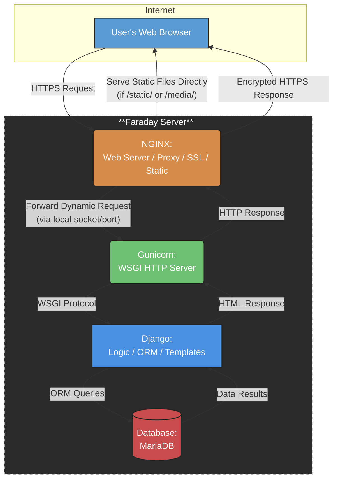
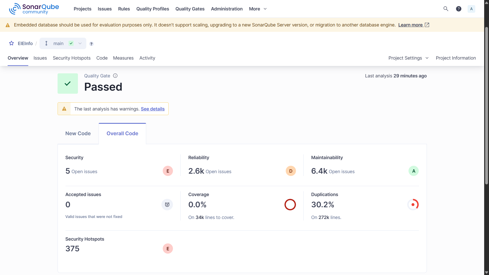
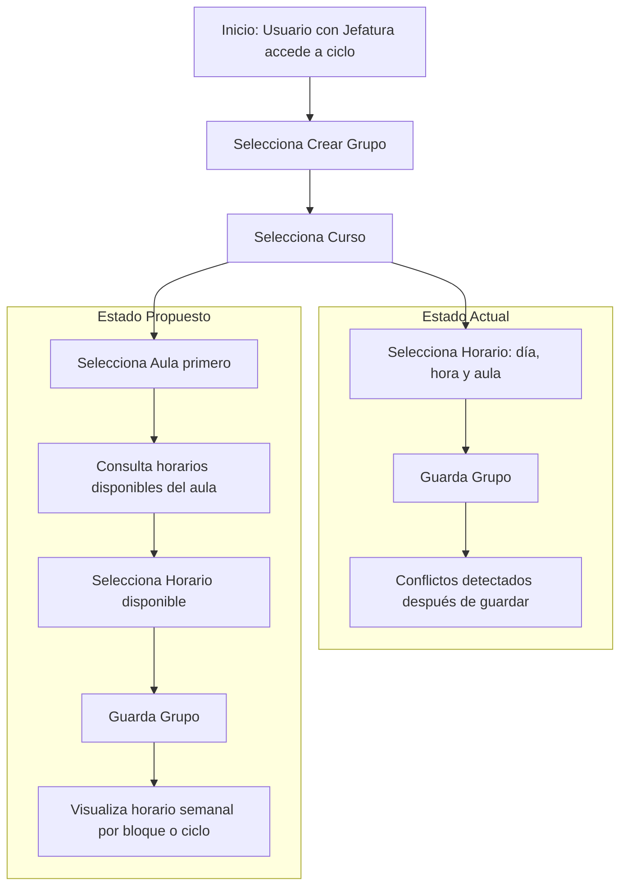
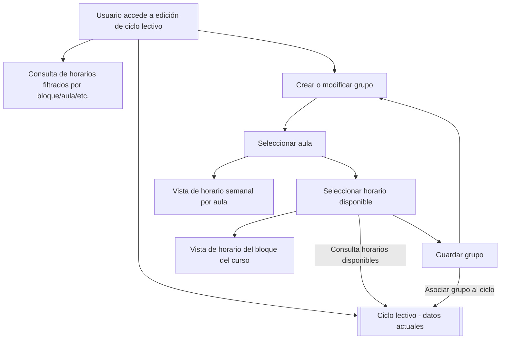
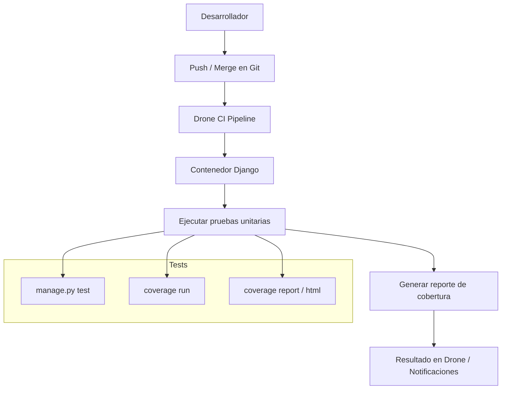

# 📘 Informe Técnico: Análisis y Evaluación del Sistema EIEInfo

**Universidad de Costa Rica**
**Escuela de Ingeniería Eléctrica**  
**IE-0417 – Diseño de Software para Ingeniería**  
**Proyecto Final – Grupo**   
**I semestre 2025**


**Integrantes:**  
- Diego Alfaro (C20259)  
- Edgar Alvarado (C10351)  
- Jean Zúñiga (C18767)

---
## 🔗 Recursos adicionales

- [Análisis detallado del sistema actual (Avance 1)](avances/avance1/README.md)
- [Evaluación técnica y entrevistas(Avance 2)](avances/avance2/README.md)

- [Propuestas de mejora y rediseño (Avance 3)](avances/avance3/README.md)

# A. Análisis del sistema actual

## Descripción funcional del sistema

El sistema **EIEInfo** es la plataforma web oficial de la Escuela de Ingeniería Eléctrica (EIE) de la Universidad de Costa Rica. Su propósito es centralizar y facilitar el acceso a información institucional, administrativa, académica y de extensión tanto para estudiantes, docentes como personal administrativo.

#### 🎯 Objetivos generales del sistema:
- Servir como puerta de entrada institucional para los distintos actores vinculados con la Escuela.
- **Optimizar la comunicación interna** mediante anuncios actualizados y visibles desde el portal principal.
- **Ofrecer enlaces rápidos y organizados** a recursos clave en los ámbitos de docencia, investigación, acción social y vida estudiantil.

#### 👥 Tipos de usuarios:
- **Estudiantes**: acceden a noticias, calendario académico, horarios de cursos, bolsas de empleo y procesos de graduación.
- **Docentes**: consultan recursos institucionales, información de proyectos, actividades académicas y administrativas.
- **Administrativos**: gestionan el contenido publicado, estructuran la organización interna y actualizan la información crítica para la comunidad.

#### 🧩 Funcionalidades clave:
- **Anuncios destacados**: desde la portada se publican recordatorios y eventos como el calendario de graduaciones, convocatorias de Radio201, horarios de cursos y ferias de empleo.
- **Menú desplegable organizado** en cinco grandes áreas:
  - 📚 **Estudios**: plan de estudios, matrícula, programas académicos.
  - 🧪 **Investigación**: proyectos activos, grupos de investigación.
  - 🎓 **Docencia**: personal docente, guías, normativas.
  - 🧭 **Acción Social**: programas, iniciativas comunitarias.
  - 🏫 **Escuela**: historia, estructura organizacional, comisiones.

- **Integración de enlaces útiles**: como acceso a sistemas de matrícula, bibliotecas, reglamentos universitarios y recursos de apoyo.
- **Diseño responsivo y navegación intuitiva**, con secciones jerarquizadas que permiten al usuario llegar fácilmente a la información deseada.

En conjunto, EIEInfo actúa como un centro digital de operaciones que conecta a los miembros de la EIE con su vida institucional y académica, fortaleciendo los canales de información y el vínculo con la comunidad universitaria.

## Identificación de Tecnologías utilizadas
Basándose en la documentación y estructura general del proyecto, el sistema de EIE implementa varias tecnologías/servicios distintos para el *deployment/funcionamiento* de la página, al igual que para su *desarrollo y verificación*.

### 🔬 Desarrollo/verificación:

#### [Docker:](https://www.docker.com/)
- **Ambiente de desarrollo:** Crea un ambiente de desarrollo/prueba lo más parecido posible a la instancia real ejecutada en [Faraday](REPORTE.md#faraday), permitiendo recrear el entorno de deployment para propósitos de desarrollo y depuración de cambios. El docker empleado por EIEInfo genera 3 contenedores para la [base de datos](REPORTE.md#mariadb-base-de-datos), [NGINX](REPORTE.md#nginx-reverse-proxy-servidor-de-archivos-estáticos-y-terminador-ssl) y el [Django](REPORTE.md#django-framework-y-backend).

#### [Drone](https://drone.eie.ucr.ac.cr/welcome)
- **Pipeline CI/CD:** Se utiliza para la ejecución de pruebas y pipelines de integración y despliegue continuo (CI/CD). Se utiliza en conjunto con los contenedores de Docker.

#### [Flake8:](https://flake8.pycqa.org/en/latest/)
- **Formato:** Estándar con reglas de formato PEP8 que se deben seguir en los scripts de Python del proyecto, se pueden utilizar distintos linters para asegurar que se cumplan, y se usa un archivo .flake8 para especificar exclusiones en el proceso de revisión.

### 📲 Deployment/funcionamiento:

#### Faraday:
- **Hardware para hosting:** Es el servidor propio de la Escuela de Ingeniería Eléctrica (EIE), en el cual se ejecutan las herramientas principales para el despliegue de la página de eie.
- **Almacenamiento:** Almacena el backend del sitio, incluyendo todos los scripts/settings para el despliegue de la aplicación, al igual que la base de datos con la información de usuarios.

#### [NGINX ("Reverse proxy", servidor de archivos estáticos y terminador SSL):](https://nginx.org/)
- **Punto de entrada:** Es el servidor del front-end, y el primer punto de entrada al que llegan los requests de un usuario.
- **Terminal SSL/TLS:** Descifra o encripta los requests HTTP que entran/salen del sistema EIE, realizando el *handshake* de seguridad en capa de transporte (ya sea SSL o TLS).
- **Servicio de archivos estáticos:** Para requests estáticos, que requieren el despliegue de archivos estáticos (imágenes, formato de página, etc), NGINX los retorna directamente de forma eficiente sin tener que consultar a capas posteriores.
- **Reverse proxy:** Para requests dinámicos, que requieren consultar datos de la base de datos o procesamiento, se reenvían los requests al servidor Gunicorn por medio de un puerto interno en el hardware de Faraday.

#### [Gunicorn (Servidor WSGI HTTP):](https://gunicorn.org/)
- **WSGI (Web Server Gateway Interface):** Funciona como la interfaz entre el backend escrito en Python y los requests vistos por el servidor NGINX. Traduce los requests a un formato entendido por Python (WSGI standard) para el backend y las respuestas del backend a requests para el servidor NGINX.
- **Comunicación interna:** Se comunica con el servidor NGINX por medio de un puerto local o un socket dentro del hardware de Faraday, esto evita exponer el resto del sistema al internet abierto (más robusto).
- **Manejo de workers:** Se encarga de crear/manejar instancias de procesos "workers" que ejecutan el framework de Django, permitiendo el manejo de varios usuarios concurrentes. También mantiene la estabilidad en casos de fallo de un worker, puesto que se crea otra instancia de worker sin afectar al resto.

#### [Django (Framework y backend):](https://www.djangoproject.com/)
- **Framework:** Maneja la lógica interna de la página, incluyendo las interacciones con la base de datos y procesamiento de datos.
- **Templates:** Define y edita las vistas generadas en cada URL de la página, al igual que el formato de las páginas.

#### [MariaDB (Base de datos):](https://mariadb.org/)
- **Almacenamiento de datos persistente:** Almacena todos los datos de usuarios, de contenido (Django) y demás de forma persistente. Es modificada por medio del ORM de Django, según los modelos definidos en el framework. Se usa MariaDB, un fork de MySQL altamente compatible con el mismo.

La estructura del proyecto según estas herramientas se muestra en el siguiente diagrama:



## Módulos Clave del Sistema
### `cursos/`
- Este módulo se encarga de todo lo relacionado con los cursos de la EIE: desde la gestión de materias y grupos, hasta la asignación de aulas y horarios. También permite emitir cartas a estudiantes y coordinar los horarios de consulta de los profesores y la asignación de cátedras.

### `trabajos_finales/`
- Aquí se administra todo el proceso de los trabajos finales de graduación. Permite gestionar proyectos de grado, asignar lectores y evaluadores, hacer seguimiento al avance de los estudiantes y organizar concursos relacionados con los trabajos finales.

### `proyecto_electrico/`
- Este módulo está dedicado a la gestión de los proyectos eléctricos desarrollados por estudiantes. Facilita el registro, control y seguimiento de los proyectos, así como la asignación de recursos, materiales y laboratorios necesarios para su desarrollo.

### `practica_profesional/`
- Permite administrar las prácticas profesionales de los estudiantes, registrando y dando seguimiento a cada práctica. Además, gestiona las empresas colaboradoras, los supervisores asignados y evalúa el desempeño y cumplimiento de objetivos de los estudiantes.

### `profesores/`
- Este módulo centraliza la gestión del personal docente, almacenando información personal y profesional, gestionando nombramientos y cargas académicas, administrando perfiles y documentación, y controlando la participación en comisiones y consejos.

### `estudiantes/`
- Se encarga de la administración de toda la comunidad estudiantil: registro, consulta y actualización de datos, control de matrículas y cargas académicas, seguimiento del historial y rendimiento académico, y la gestión de asignaciones a grupos, carreras o proyectos.

### `administrativos/`
- Este modulo gestiona el personal administrativo, permitiendo registrar funciones por puesto, controlar las responsabilidades de cada funcionario y administrar recursos y documentación de soporte.

### `alumni/`
- Este módulo permite mantiener un vínculo con los egresados de la EIE, actualizando sus datos, siguiendo su trayectoria profesional y promoviendo redes de contacto y colaboración con la comunidad.

### `anuncios/`
- Gestiona las comunicaciones internas de la escuela, permitiendo publicar anuncios oficiales, segmentar la información por perfiles de usuario y controlar la edición, eliminación y auditoría de los anuncios.

### `eventos/`
- Módulo para organizar y administrar los eventos académicos y administrativos, gestionando la programación, los calendarios compartidos y los recursos logísticos necesarios para cada evento.

### `conferencias/`
- Este módulo se enfoca en la organización de conferencias y seminarios especializados, registrando ponentes y asistentes, controlando la logística y generando certificados de participación.

### `laboratorios/`
- Este módulo gestiona el uso y mantenimiento de los laboratorios, registrando equipos y materiales disponibles, organizando horarios de uso y controlando los mantenimientos programados y correctivos.

### `inventario/`
- Este módulo permite administrar el inventario físico de la escuela, llevando un control detallado de recursos, herramientas y activos, registrando entradas y salidas, y gestionando los préstamos temporales.

### `proyectos/`
- Gestiona los proyectos de investigación vinculados a la escuela, registrando y documentando los proyectos activos, controlando recursos y haciendo seguimiento de hitos y resultados.

### `asistencias/`
- Este módulo controla la asistencia en actividades, ya sea de forma automática o manual, gestionando horarios y generando reportes y análisis de participación.

### `atributos/`
- Permite configurar los atributos técnicos del sistema, gestionando parámetros, etiquetas y características, y personalizando funcionalidades mediante atributos configurables.

### `webpage/`
- Administra el sitio web oficial de la EIE, gestionando el contenido institucional, noticias y enlaces, controlando accesos y permisos de edición, e integrando otros módulos del sistema.

### `eieinfo/`
- Es donde se controlan los parámetros globales, las integraciones externas y la configuración de autenticación, rutas y roles.

### `scripts/`
- Almacena scripts utilitarios para tareas recurrentes, automatizando procesos administrativos o técnicos y facilitando el mantenimiento, respaldo y limpieza de datos.

## Dependencias externas y configuración del entorno

El sistema EIEInfo depende de una serie de bibliotecas, herramientas y servicios externos necesarios para su correcta ejecución tanto en desarrollo como en producción.

### 📦 Dependencias de Python (`requirements.txt`)

Las dependencias del sistema están gestionadas con un archivo `requirements.txt`, que agrupa bibliotecas según su función principal:

- **Framework web:**  
  - `Django`: base para construir la aplicación web, manejo de modelos, vistas y rutas.  
  - `django-extensions`: herramientas adicionales para desarrollo, como comandos de consola y modelos extendidos.  
  - `django-polymorphic`: para manejar modelos con herencia y tipos variados.  
  - `django-crontab`: permite configurar tareas programadas tipo cron dentro de Django.

- **Interfaces de usuario:**  
  - `django-widget-tweaks`: facilita la personalización de formularios HTML en plantillas.  
  - `django-select2`: mejora los selectores desplegables con búsqueda y mejor interfaz.  
  - `django-ckeditor` y `martor`: editores de texto enriquecido, para crear contenido con formato HTML o Markdown.

- **Seguridad y validación:**  
  - `django-recaptcha`: protección contra bots y spam mediante CAPTCHA de Google.  
  - `django-letsencrypt`: automatiza la gestión y renovación de certificados SSL para HTTPS.

- **Documentación:**  
  - `docutils`: para procesar documentos en formatos reStructuredText.  
  - `pypandoc`: convierte documentos entre distintos formatos (por ejemplo, Markdown a HTML).

- **Análisis de código:**  
  - `flake8`, `pycodestyle`, `pyflakes`: herramientas para verificar estilo y calidad del código Python, ayudando a mantener buenas prácticas.

- **APIs y conectores:**  
  - `google-api-python-client` y `oauth2client`: facilitan la integración con APIs de Google, como Calendar y Drive.  
  - `facebook-sdk`: para interactuar con la API de Facebook y automatizar publicaciones.  
  - `mysqlclient`: cliente para conectar Django con bases de datos MySQL/MariaDB.

- **Procesamiento de archivos:**  
  - `Pillow`: manipulación y procesamiento de imágenes.  
  - `openpyxl`, `pyexcel-xls`, `XlsxWriter`: lectura y escritura de archivos Excel.  
  - `PyPDF2`: manipulación de documentos PDF.  
  - `vobject`: manejo de archivos vCard y iCalendar.

- **Otros:**  
  - `sorl-thumbnail`: generación y manejo de miniaturas de imágenes para optimizar carga.  
  - `scholarly`: parseador de Google Scholar para búsquedas académicas.  
  - `django-wiki`: módulo para crear wikis integrados en la aplicación.

> 📁 El archivo `requirements.txt` debe instalarse usando:  
> ```bash
> pip install -r requirements.txt
> ```


### 🛠️ Paquetes del sistema (`setup.sh`)

El script `setup.sh` automatiza la instalación de dependencias del sistema operativo necesarias para compilar librerías de Python y manejar servicios externos como MySQL y Nginx.

Incluye paquetes como:

- **Python 3 y herramientas de desarrollo:**  
  `python3-dev`, `pip` — necesarios para compilar extensiones y gestionar paquetes Python.

- **Servidor de base de datos:**  
  `mysql-server`, `python3-mysqldb` — para la instalación y conexión con MySQL/MariaDB.

- **Servidor web:**  
  `nginx`, `nginx-full`, `nginx-extras`, `certbot` — servidor web, módulos extras y gestión automática de certificados SSL.

- **Soporte para imágenes y documentos:**  
  `libjpeg`, `libpng` — librerías para procesamiento de imágenes.  
  `pandoc`, `texlive-full` — herramientas para conversión y creación de documentos, incluyendo PDFs y otros formatos.

> 📁 Ejecutar como superusuario:  
> ```bash
> sudo bash setup.sh
> ```

### 🐳 Ambiente Docker

Para facilitar la implementación y pruebas, el sistema cuenta con un entorno Docker compuesto por tres contenedores:

- `mariadb`: base de datos  
- `nginx`: servidor web que actúa como proxy inverso  
- `eieinfo_app`: aplicación Django

Este entorno permite simular el despliegue en el servidor **Faraday**, y está preparado para integrarse con sistemas de CI/CD como **Drone**, automatizando la ejecución de pruebas y despliegue de código.

> 🔧 Comandos clave:  
> ```bash
> docker compose build
> docker compose up
> docker compose down
> ```

> 🌐 Acceso a la aplicación:  
> [http://localhost:8080](http://localhost:8080)

### 🔄 Integración Continua y Pruebas Locales (Drone CI)

El sistema **EIEInfo** utiliza un pipeline de integración continua local mediante **[Drone CI](https://www.drone.io/)**. Este proceso automatiza:

- 🔍 Validación del estado de los contenedores Docker  
- 🌐 Verificación de accesibilidad de rutas web (públicas y privadas)  
- ⚙️ Ejecución de migraciones de base de datos  
- 📦 Generación de fixtures  
- ✅ Pruebas unitarias sobre módulos seleccionados

📄 Archivo del pipeline: [`drone.yml`](https://git.ucr.ac.cr/eieinfo/EIEInfo/-/blob/master/docker/drone-local/drone.yml)

### 🛠️ Etapas del pipeline

1. **Inicialización del pipeline**
   - Muestra mensaje de inicio y pausa breve

2. **Test de conectividad entre contenedores**
   - Usa `ping` para validar que `db`, `nginx` y `eieinfo_app` están corriendo

3. **Verificación de servicios activos**
   - Usa `netcat` para asegurar puertos abiertos en los servicios web y base de datos

4. **Configuración del entorno Django**
   - Ejecuta scripts `.env` y `migraciones.sh` para preparar el entorno

5. **Pruebas de URLs institucionales**
   - Usa `curl` para verificar acceso a rutas públicas y privadas:
     - `/estudiantes`, `/profesores/login`, `/admin`, etc.
     - Incluye pruebas con autenticación básica para usuarios del sistema

6. **Generación de fixtures y pruebas unitarias**
   - Exporta datos en formato JSON para pruebas
   - (Opcional) ejecuta pruebas Django, algunas comentadas por dependencias pendientes

> ⚠️ Algunas rutas pueden fallar si recursos estáticos o dependencias no están presentes. Estas están documentadas con comentarios en el archivo `drone.yml`.


#### 🧪 Ejecución local del pipeline

1. Asegurate de que los contenedores Docker estén en ejecución y en red (por ejemplo, `eieinfo_default`)
2. Ejecutá el siguiente comando desde el directorio raíz:

```bash
drone exec --network eieinfo_default docker/drone-local/drone.yml
```

--- 
### 🔌 Integración con APIs Externas

El sistema **EIEInfo** se integra con varias APIs para extender su funcionalidad, automatizar procesos institucionales y conectar servicios externos.

#### 📅 Google Calendar API

Se utiliza para crear y gestionar eventos automáticamente en los calendarios institucionales de la Escuela.

- **Scope requerido:** [`https://www.googleapis.com/auth/calendar`](https://www.googleapis.com/auth/calendar)
- **Archivo de credenciales:** `eieinfo_credentials.json`
- **Librería:** `google-api-python-client`
- **Aplicación registrada:** *Google Calendar API Python Quickstart*
- **Uso principal:** Automatización de calendarios de actividades y eventos académicos

#### 🔍 Google Custom Search API

Permite realizar búsquedas dentro del sitio institucional y fuentes específicas autorizadas.

- **URL base:**
[Google APIS](https://www.googleapis.com/customsearch/v1?key={API_KEY}&cx={SEARCH_ENGINE_ID}&q={QUERY})
- **Parámetros:**
- `API_KEY`: clave de acceso
- `cx`: ID del motor de búsqueda personalizado
- `q`: término o frase de búsqueda

#### 📲 Facebook Graph API

Utilizada para automatizar publicaciones en la página oficial de la Escuela de Ingeniería Eléctrica.

- **Funciones disponibles:**
- `PostearEnFacebook(message, attachment)`
- `PostearImagenEnFacebook(image, message)`
- **Librería:** `facebook-sdk`
- **Token de acceso:** definido en `settings.py` como `FACEBOOK_ACCESS_TOKEN`
- **Ejemplo de uso:**
```python
attachment = {
    'name': 'Estudiar en Ingeniería Eléctrica',
    'link': 'https://eie.ucr.ac.cr/anuncios/15/',
    'caption': 'Anuncios EIE',
    'description': 'La carrera de Ingeniería Eléctrica ofrece...',
    'picture': 'https://eie.ucr.ac.cr/media/anuncios/Redes.jpg'
}
```

# B. Evaluación de calidad técnica

## Rendimiento y eficiencia
Se realizó un análisis usando cProfile en distintos módulos del sistema: `cursos` , `trabajos_finales`, 
`profesores`, `estudiantes`, `administrativos`, `alumno`, `anuncios`, `eventos`, `conferencias`, `laboratorios`, `proyectos`, `atributos`. Todos estos archivos se encuentran en la ruta: src/server.

En general,  las funciones nativas de manipulación de cadenas y listas, como endswith, startswith, 
rstrip y append, son las más llamadas en casi todos los módulos evaluados. Por lo que las operaciones sobre 
estructuras de datos básicas constituyen una parte significativa de la carga computacional.

El tiempo total de ejecución (tottime), las funciones relacionadas con operaciones de entrada/salida, 
como nt.stat, _io.open_code, marshal.loads y la lectura de archivos mediante BufferedReader, son responsables 
de los mayores consumos de tiempo. Esto sugiere que el acceso al sistema de archivos y la deserialización de 
datos representan cuellos de botella recurrentes, especialmente en módulos con alto volumen de procesamiento 
de archivos o interacción con el sistema operativo.

El análisis por tiempo promedio por llamada (percall_tottime) y tiempo acumulado por llamada (percall_cumtime) 
muestran el cuidado al usar funciones como builtins.exec y los mecanismos internos de importación de 
módulos de Python (_find_and_load, _find_and_load_unlocked) cuando se quiere reducir el tiempo promedio. Estas 
funciones presentan los valores más altos, por lo que la carga dinámica de módulos y la ejecución de código 
dinámico tienen un gran impacto de rendimiento del trabajo.

En módulos específicos, como trabajos_finales y alumni, se observa una mayor frecuencia de llamadas a métodos 
de listas y funciones de la biblioteca re (expresiones regulares), lo cual puede estar asociado a procesos de 
parsing o manipulación intensiva de datos textuales. Asimismo, en los módulos administrativos y anuncios, 
el acceso al sistema de archivos y la manipulación de cadenas siguen siendo predominantes, aunque con ligeras 
variaciones en los tiempos registrados.

En resumen, las pruebas mostraron que las operaciones básicas de manipulación de cadenas y listas, junto con 
las funciones de entrada/salida y carga de módulos, son los principales focos de consumo de recursos en los 
módulos analizados. 

## Calidad de código y CI

### SonarQube
[SonarQube](https://www.sonarsource.com/products/sonarqube/) es una herramienta de análisis estático de código fuente que permite identificar **problemas de calidad, vulnerabilidades de seguridad, problemas de mantenibilidad, errores de fiabilidad** y más, en múltiples lenguajes de programación. Es especialmente útil para implementar buenas prácticas de desarrollo y mejorar la calidad del software a lo largo del tiempo.

En este proyecto se configuró un servidor local de SonarQube, y se utilizó el `SonarScanner` para analizar el código fuente de toda la base del sistema EIEInfo. A continuación, se incluye una imagen de los resultados obtenidos tras el escaneo del proyecto:



#### Resultados del análisis

- **Quality Gate**: ✅ **Passed**  
  _El proyecto pasó la evaluación de calidad mínima, aunque con advertencias._

| Métrica              | Resultado                             | Nivel  |
|----------------------|----------------------------------------|--------|
| **Security**          | 5 issues de alto impacto              | E      |
| **Reliability**       | 2,600 issues                          | D      |
| **Maintainability**   | 6,400 issues (técnica aceptable)      | A      |
| **Coverage**          | 0.0% (34k líneas sin cobertura)       | ❌     |
| **Duplications**      | 30.2% en 272k líneas                  | ❌     |
| **Security Hotspots** | 375 detectados, menos del 30% revisados | E      |

---

#### Observaciones:

- **Problemas de codificación de archivos**: algunos archivos no usan codificación UTF-8 válida.
- **Errores de análisis**: se encontraron errores de parseo en al menos 3 archivos Python (ej: `backends.py`).
- **Sin pruebas detectadas**: no se halló ningún archivo de cobertura de pruebas ni pruebas automatizadas (coverage 0%).
- Se recomienda revisar los archivos ignorados por `.gitignore` y aquellos detectados como código generado.

---

### ESLint

**ESLint** es una herramienta de análisis estático de código para JavaScript. Ayuda a detectar errores de sintaxis, problemas de estilo y posibles fallos lógicos antes de que el código sea ejecutado. Su integración en el proyecto permite mantener un estándar de calidad, evitar errores comunes y facilitar el mantenimiento colaborativo del sistema.

---

####  ¿Para qué sirve?

- Detectar errores sintácticos y malas prácticas en el código.
- Establecer convenciones de estilo unificadas para todo el equipo.
- Facilitar la revisión de código y prevenir bugs desde etapas tempranas.
- Automatizar la corrección de ciertos errores de estilo o formato.

---

####  Proceso de configuración

Se ejecutó el asistente interactivo de ESLint mediante el comando:

```bash
npx eslint --init
```
### Configuración de ESLint

Las opciones seleccionadas fueron:

- **Lenguaje**: JavaScript  
- **Modo de uso**: Solo sintaxis (syntax)  
- **Tipo de módulo**: CommonJS  
- **Framework**: Ninguno  
- **Uso de TypeScript**: No  
- **Entorno de ejecución**: Navegador (browser)

---

####  Librerías agregadas

Durante la configuración se instalaron las siguientes dependencias mediante `npm`:

- `eslint`
- `globals`

Estas se añadieron automáticamente al archivo `package.json`.

---

#### 🧾 Archivo de configuración `eslint.config.mjs`

```js
import globals from "globals";
import { defineConfig } from "eslint/config";

export default defineConfig([
  { files: ["**/*.js"], languageOptions: { sourceType: "commonjs" } },
  { files: ["**/*.{js,mjs,cjs}"], languageOptions: { globals: globals.browser } },
  {
    ignores: [
      '**/bower_components/**',
      '**/node_modules/**',
      '**/static/libs/**',
    ],
  },
]);
```

---

Este archivo define:

- Qué archivos analizar (`.js`, `.mjs`, `.cjs`).
- El entorno del navegador como global.
- Directorios que deben ignorarse para evitar analizar código de terceros o dependencias externas.

---

###  Resultado del análisis

Se ejecutó el análisis estático con el siguiente comando:

```bash
npx eslint src/server --ext .js
```
Se verificó que los archivos relevantes del sistema fueron analizados correctamente y que las carpetas de librerías externas fueron excluidas exitosamente. El resultado fue positivo, es decir:

 Las pruebas de ESLint sobre los archivos del proyecto salieron limpias, sin errores ni advertencias relevantes.

# C. Exploración del proceso de desarrollo

## Exploración del CI/CD (Drone)

El repositorio incluye una configuración funcional de CI/CD utilizando [Drone CI](https://www.drone.io/), que permite construir, verificar, desplegar y notificar automáticamente en cada cambio que se integra a la rama `master`.

El archivo `drone.yml` define múltiples etapas:

- ✅ **Compilación y despliegue de contenedores Docker (`docker compose build / up`)**.
- ✅ **Pruebas de red (`ping`, `netcat`) entre servicios como `nginx`, `db` y `eieinfo_app`**.
- ✅ **Inicialización de entorno Django (migraciones, static files, configuraciones)**.
- ✅ **Pruebas funcionales sobre endpoints con `curl`**, incluyendo rutas públicas y privadas para distintos tipos de usuario.
- ✅ **Notificaciones a Telegram sobre éxito o fallo de la ejecución**.
- ✅ **Despliegue automatizado en el servidor Faraday, bajo condiciones controladas**.

---

### Intentos de pruebas automatizadas

Durante la evaluación del sistema se intentó ejecutar pruebas unitarias utilizando `pytest`, pero los intentos resultaron fallidos debido a múltiples limitaciones:

- ❌ **No están integradas en el CI**: actualmente no existe ninguna etapa en el archivo `drone.yml` que intente ejecutar pruebas con `pytest` o herramientas equivalentes.
- ❌ **Falta de dependencias**: el archivo `requirements.txt` no incluye paquetes esenciales como `pytest`, `pytest-django` o `coverage`.
- ❌ **Inexistencia de fixtures o datos de prueba**: no se cuenta con scripts o archivos que permitan poblar la base de datos automáticamente para entornos de prueba.
- ❌ **Documentación ausente**: no hay instrucciones sobre cómo correr pruebas localmente ni desde CI.
- ❌ **Estructura de pruebas mínima o vacía**: los archivos `tests.py` en algunos módulos existen pero están vacíos o sin contenido ejecutable.
- ❌ **Cobertura del 0.0%**: reportada tanto por SonarQube como por la falta de integración con `coverage.py`.

---

### Recomendaciones para mejorar CI/CD

1. ✅ **Agregar pruebas unitarias básicas** en los módulos de backend más críticos (`usuarios`, `estudiantes`, `cursos`, etc.).
2. 🔁 **Incluir una etapa de pruebas en el CI (`drone.yml`) que use `pytest` y `coverage`**. Por ejemplo:

```yaml
- name: run-tests
  image: python:3.10
  commands:
    - pip install -r requirements.txt
    - pip install pytest pytest-django coverage
    - cd src/server
    - coverage run --source='.' manage.py test
    - coverage report -m
```
3. **🧪 Agregar fixtures reutilizables (loaddata)** para poblar la base de datos en pruebas automatizadas.

4. **📊 Subir los resultados de cobertura** a SonarQube usando sonar.python.coverage.reportPaths.


## Estilo y documentación


### Reglas de formato
En la descripción del repositorio se establecen las siguientes reglas de formato para los scripts escritos en Python:
* Se siguen las reglas de formato definidas en [PEP8](https://peps.python.org/pep-0008/).
* Nombres de `clases`, `modelos`, `métodos de modelos` y `funciones independientes` se escriben en [CamelCase](https://en.wikipedia.org/wiki/Camel_case).
* Nombres de `atributos de clases`, `variables locales` y `decoradores` se escriben en [snake_case](https://en.wikipedia.org/wiki/Snake_case).
* La documentación de funciones y clases se debe realizar con [docstrings](https://peps.python.org/pep-0257/).

### [Flake8](https://flake8.pycqa.org/en/latest/)
Se establece el uso de Flake8 como herramienta para verificar que se cumplan las reglas de formato de PEP8. Se menciona el uso del mismo en linters como [linter-flake8](https://atom.io/packages/linter-flake8). Sin embargo, esta es una herramienta para [Atom](https://atom.io/), el cual ha sido archivado como proyecto y ya no recibe actualizaciones. Esto indica que las prácticas de linting usadas en el proyecto, o la referencia de linter listada,  *están desactualizadas por al menos 2 años*.

Para el uso de Flake8 se tiene el archivo `.flake8` con las configuraciones de archivos a excluir (`__pycache__` `migrations`, `./src/server/eieinfo/settings.py`, `scripts`, etc) y los tipos de errores a ignorar (`D203`, `E731`, `W503`, `W504`, `W605`). Si se ejecuta el módulo de flake8 desde el root del proyecto, se obtienen hasta 1256 líneas de errores encontrados, indicando una cantidad considerable de violaciones de formato. Por ejemplo, en el archivo `src/server/asistencias/test.py`, se encuentran 203 errores de linting para PEP8. En este mismo archivo se nota que no se siguen las convenciones de documentación con docstrings para las funciones, pero si se encuentran comentarios en español indicando que se trata de documentación hecha por los desarrolladores (no automáticamente por Django). Por ende, **existe una fuerte deficiencia en el seguimiento de los estilos de documentación establecidos.**

Para evaluar la severidad de esta deficiencia se utiliza la opción `-q` con flake8 para encontrar cada archivo con errores de formato, resultando en 83 archivos (algunos listados más adelante). Estos provienen en su gran mayoría del código fuente del módulo `server`. No se considera prudente emplear las herramientas de corrección automática de flake8, puesto que pueden generar errores imprevistos. 

```bash
$ flake8 -q
./docker/django/secret_credentials.py
./docker/django/settings.py
./src/server/administrativos/models.py
./src/server/administrativos/nombramientos_auto.py
./src/server/administrativos/tests.py
./src/server/administrativos/urls.py
    ·
    ·
    ·
```

En el repo se emplea un hook (localizado en `.git/hooks` al obtener el repo de forma local) el cual debe asegurar que los commits hechos en el repo sigan las reglas de formato especificadas. Al instalar el repo de forma local se nota que estos archivos de hook se encuentran nombrados como `samples`, y se deben renombrar para que tomen efecto. Sin embargo, aún luego de hacer esto se encontró que los archivos no se encuentran configurados para realizar revisiones del estilo de código con Flake8. Esto podría indicar que en el ciclo de desarrollo no se están revisando correctamente estas guías, o que la configuración de los hooks debe realizarse de forma manual, lo cual indicaría un proceso más obtuso de desarrollo. Por ejemplo, `pre-commit.sample` solo contiene pruebas para verificar nombres de archivos no ASCII o con espacios en blanco.

# D. Entrevistas e interacción con stakeholders

Se realizaron 2 entrevistas con el propósito de obtener mayor entendimiento del sistema y de las posibles áreas de mejora que tiene el mismo. Se pueden encontrar las transcripciones completas en la [carpeta de entrevistas en avance 2](/avances/avance2/entrevistas/).


## Transcripción de entrevista a [Profesor Gustavo Nuñez](https://eie.ucr.ac.cr/profesores/gustavo.nunez/) - Plataforma EIE

### 1. Experiencia General y Usabilidad

* **¿Ha participado en alguna forma en el desarrollo de la página o servidor? Si es así, ¿cuál fue su rol?**

    Sí, coordina los cambios/desarrollos a realizar en el sistema, así como el arreglo de bugs. No es desarrollador ni colabora del lado técnico, solo ayuda a coordinar sugerencias/proyectos.

* **¿Desde cuándo utiliza la plataforma EIE y para qué (usos)?**

    Formalmente desde 2022. Con uso principal para coordinar asistencias de cursos, realizar anuncios, revisar información de cursos y, recientemente, asignar horarios a profesores del departamento.

* **¿Qué funcionalidades considera más útiles?**

    Las funciones de abrir concursos de asistencias para cursos dados y mostrar la información de cada docente (posición en la cátedra, laboratorios asignados, etc.).

* **¿Qué tan intuitiva y accesible le parece la plataforma? (Interfaz y función)**

    Bastante intuitiva, medianamente accesible (por encima de la media, pero hay mejoras posibles).


### 2. Feedback de usuario

**¿Considera que la plataforma cumple sus necesidades como ...? Si no es así, mencione aspectos a mejorar o potencial de crecimiento.**

* **Profesor (asistencias, información de curso/horarios, etc):**

    Existe potencial de mejora: No existe la opción de ver concursos de asistencia previas, lo que causa que se deba iniciar otro concurso desde cero.

* **Encargado de laboratorio (asistencias, visibilidad, etc):**

    Existe potencial de mejora: Se requiere una forma dinámica y actualizada para mostrar qué **activos** (equipo de laboratorio) están asignados/en posesión de cada laboratorio. Actualmente se tiene una lista dada al inicio de semestre, pero durante el semestre se dan cambios de asignaciones que no son comunicados de forma conveniente. (Sugerencia en desarrollo)

* **Director de Departamento (si es que aplica):**

    Existe potencial de mejora:
    * Cuando se asignan horarios y aulas para los cursos de los siguientes ciclos, se da la opción de generar choques de aula/horario sin saberlo, hasta que se guardan los cambios. Se sugiere que se cambie, para que al establecer horarios solo se den como opción los horarios/aulas disponibles (sugerencia en consideración pero no en desarrollo).
    * No existe forma de visualizar la asignación de los horarios/aulas en un calendario semanal, lo cual sería útil a la hora de acomodar los cursos de un mismo ciclo. Estos deben estar ordenados para que no generen choque de horario, y así los estudiantes que siguen el plan de estudios puedan matricular todos los cursos del ciclo. Se sugiere un sistema que muestre los horarios de forma semanal, uno por cada ciclo, permitiendo una visualización más directa.


### 3. Mantenimiento y Confiabilidad

* **¿Ha experimentado fallas, errores o limitaciones en el uso de la plataforma? ¿Con qué frecuencia?**

    * Frecuentemente se da un error 500 Gateway en formularios, especialmente en la página de bolsa de empleo. El error ocurre cuando se ingresan caracteres no reconocidos por el sistema, el cual no maneja el error correctamente.
    * Se dan errores al realizar llamados a la API de Google Scholar para obtener información de perfiles de investigadores, igual el 500 Gateway. (Se está trabajando activamente en la resolución del bug)

* **¿Considera que el mantenimiento y soporte técnico son adecuados? (Contacto, tiempo de resolución, feedback)**

    Lo considera adecuado para los recursos (cantidad de personal) disponibles, indicando que se podría mejorar con más personal. No existe feedback para errores solucionados.

* **¿Ha encontrado problemas con el rendimiento de la página y dónde?**

    No encuentra problemas de rendimiento.

* **¿Ha encontrado problemas de seguridad?**

    No ha encontrado problemas de seguridad. Se mencionó que no hay autenticación de 2 pasos, pero que el correo tampoco la emplea.


### 4. Áreas de crecimiento

* **¿Qué funcionalidades le gustaría ver implementadas en la plataforma?**

    Agregar un espacio donde se puedan realizar los distintos trámites relacionados a las comisiones (de TFG, acción social, docencia, etc.) de forma conveniente. Actualmente los trámites se realizan por correo, lo que puede dificultar la vista de historial y la claridad de los trámites.

* **¿Ve oportunidades para integrar otras herramientas o sistemas institucionales?**

    Sí, previamente se utilizaban pantallas en el edificio de eléctrica (primer y quinto piso) para mostrar información de la página (conferencias y anuncios). Sería bueno recuperar dicha funcionalidad.

* **¿Qué otros aspectos de mejora considera que hay?**

    Actualmente la sección de jefaturas no muestra nada, falta agregar dicha información.

---
## Transcripción de entrevista a [Profesor Marco Villalta](https://eie.ucr.ac.cr/profesores/m.villalta/) - Plataforma EIE

### 1. Experiencia General y Usabilidad

* **¿Ha participado en alguna forma en el desarrollo de la página o servidor? Si es así, ¿cuál fue su rol?**

Sí. Su rol ha sido principalmente en testing y corrección de errores urgentes en producción (rol de "bombero"). También ha trabajado en la configuración de Docker para pruebas e integración continua.

* **¿Desde cuándo utiliza la plataforma EIE y para qué (usos)?**

Desde que se creó. La utiliza como usuario para administrar noticias y anuncios, y como profesor para solicitar asistencias y consultar información académica.

* **¿Qué funcionalidades considera más útiles?**

- Asignación de profesores a cursos.
- Gestión de horarios.
- Subida de archivos para distintos tipos de usuarios.

* **¿Qué tan intuitiva y accesible le parece la plataforma? (Interfaz y función)**

Desde la perspectiva de usuario, la califica con un 8 de 10. Considera que la experiencia es generalmente buena, pero no es claro que se debe iniciar sesión para acceder a ciertas funciones, lo cual afecta la usabilidad.

---

### 2. Feedback de Usuario

* **¿Considera que la plataforma cumple sus necesidades como profesor, administrativo, etc.? ¿Qué aspectos se podrían mejorar?**

Como profesor y administrativo cumple con sus funciones básicas. Sin embargo, como administrador de la plataforma hay áreas poco claras y difíciles de modificar sin causar errores. Algunos registros antiguos no pueden eliminarse debido a dependencias mal gestionadas.

* **Encargado de laboratorio / Director de Departamento**

No aplica directamente en este caso, pero se mencionan limitaciones de visibilidad y administración que podrían afectar a estos perfiles también.

---

### 3. Mantenimiento y Confiabilidad

* **¿Ha experimentado fallas, errores o limitaciones en el uso de la plataforma? ¿Con qué frecuencia?**

Sí. Aproximadamente con una frecuencia de 1 a 2 en una escala de 5, especialmente al intentar modificar o eliminar información.

* **¿Considera que el mantenimiento y soporte técnico son adecuados?**

Es principalmente reactivo. Se revisan logs frecuentemente para detectar fallas que no detienen la plataforma pero que requieren atención.

* **¿Ha encontrado problemas con el rendimiento de la página y dónde?**

No ha realizado mediciones formales de rendimiento. Asigna recursos suficientes, pero no hay métricas claras de desempeño.

* **¿Ha encontrado problemas de seguridad?**

No. Django ofrece una buena base de seguridad. Sin embargo, no se han realizado pruebas activas de penetración o auditorías.

---

### 4. Áreas de Crecimiento

* **¿Qué funcionalidades le gustaría ver implementadas en la plataforma?**

- Integración del módulo de reservas de espacios (actualmente oculto).
- Ampliación e integración de un nuevo módulo de bodega que un estudiante está desarrollando por aparte.

* **¿Ve oportunidades para integrar otras herramientas o sistemas institucionales?**

Sí. Mencionó como ejemplo:
  - Conexión con las pantallas informativas de la escuela.
  - Integración de un bot para enviar anuncios/eventos al canal oficial de la EIE.

---

### 5. Aspectos no cubiertos (desarrollo)

* **¿Qué desafíos técnicos encuentra en la implementación/desarrollo presente?**

- Falta de documentación del código.
- Ausencia de un estilo de codificación consistente.
- Base de datos mal estructurada, con relaciones improvisadas y sin una planificación escalable.

* **¿Qué cambios está implementando o considera implementar?**

Está integrando gradualmente pruebas unitarias escritas en 2023. Utiliza el servicio Drone en un servidor local para CI/CD, ya que GitLab institucional tiene restricciones de recursos.

* **¿Qué otros aspectos de mejora considera que hay?**

- Mejorar la cobertura de pruebas.
- Incorporar documentación formal (Sphinx, Doxygen).
- Unificar estilos de codificación.
- Rediseñar la base de datos con principios de escalabilidad y relaciones bien definidas.
## Revición cruzada de los análisis
### 1. Experiencia General y Usabilidad

| Aspecto                        | Análisis 1 (Usuario Administrativo)                                           | Análisis 2 (Desarrollador/Profesor)                                           | Observaciones Cruzadas |
|-------------------------------|--------------------------------------------------------------------------------|--------------------------------------------------------------------------------|-------------------------|
| **Rol en la plataforma**      | Coordinador de funciones y bugs, sin participación técnica                     | Testing, corrección de errores en producción, CI con Docker                   | Perspectivas complementarias: usuario administrativo vs. técnico-operativo. |
| **Tiempo de uso**             | Desde 2022                                                                    | Desde la creación de la plataforma                                            | Ambos tienen experiencia significativa y prolongada. |
| **Funciones más útiles**      | Concursos de asistencia, info de docentes                                     | Asignación de cursos, horarios, subida de archivos                            | Los dos valoran la funcionalidad relacionada con **cursos y gestión académica**. |
| **Usabilidad e interfaz**     | Intuitiva pero con margen de mejora                                           | 8/10. Problema: acceso a funciones sin login claro                            | Coinciden en que **la experiencia es positiva**, pero mejorable, especialmente en **claridad de navegación**. |

### 2. Feedback de Usuario

| Aspecto                                 | Análisis 1                                                                       | Análisis 2                                                                                         | Observaciones Cruzadas |
|----------------------------------------|----------------------------------------------------------------------------------|----------------------------------------------------------------------------------------------------|-------------------------|
| **Como profesor**                      | No se pueden ver concursos anteriores                                           | Cumple funciones básicas, pero interfaz administrativa poco clara                                | Ambos notan **limitaciones para funciones avanzadas** y navegación de datos históricos. |
| **Como encargado de laboratorio**      | No hay visibilidad dinámica de equipos                                          | No aplica directamente                                                                             | El primer análisis señala una **necesidad no cubierta**, relevante para roles logísticos. |
| **Como director de departamento**      | Choques de horario/aula, falta de visualización semanal                        | No aplica directamente                                                                             | Se identifican **falencias de planificación visual** útiles para gestión académica. |
| **Limitaciones administrativas**       | N/A                                                                             | Registros antiguos no pueden eliminarse; dependencias mal gestionadas                             | Se evidencian **problemas estructurales** en la administración de datos. |

### 3. Mantenimiento y Confiabilidad

| Aspecto                                | Análisis 1                                                                      | Análisis 2                                                                                          | Observaciones Cruzadas |
|---------------------------------------|----------------------------------------------------------------------------------|------------------------------------------------------------------------------------------------------|-------------------------|
| **Errores frecuentes**                | Error 500 en formularios y APIs externas                                        | Fallas al modificar/eliminar info, nivel de error medio                                             | Coinciden en que **los errores existen**, y algunos son recurrentes. |
| **Soporte técnico**                   | Adecuado, pero podría mejorar con más personal                                  | Reactivo, se revisan logs pero sin métricas formales                                                | Ambos reconocen que **el soporte es limitado**, principalmente reactivo. |
| **Rendimiento**                       | No hay quejas importantes                                                       | Sin métricas, pero asignación adecuada de recursos                                                  | Ausencia de **monitoreo formal** de rendimiento. |
| **Seguridad**                         | No ha identificado problemas. No hay 2FA                                        | No ha identificado problemas. Falta auditoría o pruebas de penetración                             | Coinciden en **ausencia de problemas críticos**, pero también en **falta de pruebas formales**. |

### 4. Áreas de Crecimiento

| Aspecto                              | Análisis 1                                                                             | Análisis 2                                                                                          | Observaciones Cruzadas |
|-------------------------------------|----------------------------------------------------------------------------------------|------------------------------------------------------------------------------------------------------|-------------------------|
| **Nuevas funcionalidades**         | Trámites de comisiones en línea; visualización de jefaturas                           | Integrar módulo de reservas; módulo de bodega en desarrollo                                          | Ambos sugieren **extender funcionalidades existentes** y crear nuevas herramientas de gestión. |
| **Integraciones institucionales**  | Pantallas informativas en edificio                                                    | Pantallas, bot para Telegram/Discord                                                                 | Coinciden en la **oportunidad de recuperar y ampliar canales de comunicación institucional**. |
| **Otras mejoras**                  | Visualización de horarios por ciclo; evitar choques de aulas                          | Documentación del código, rediseño de BD, CI/CD                                                      | Los usuarios apuntan tanto a mejoras de **usabilidad** como de **estructura técnica interna**. |

### Coincidencias clave

- La plataforma es funcional, pero limitada en aspectos de gestión y visualización.
- El soporte técnico es adecuado, aunque reactivo y con pocos procesos automatizados.
- La interfaz es generalmente intuitiva, pero con obstáculos como la falta de claridad al requerir inicio de sesión para ciertas funciones.
- Existe un interés compartido en integrar herramientas institucionales (pantallas informativas, bots, reservas, etc.) y en expandir funcionalidades útiles para perfiles administrativos.

### Divergencias relevantes

- Los problemas estructurales del sistema (como dependencias internas mal gestionadas, falta de documentación, y pobre modelado de base de datos) solo son evidentes desde el lado técnico.
- Las necesidades de roles como encargados de laboratorio o directores de departamento no están suficientemente visibilizadas en el desarrollo actual.

# E. Propuesta de mejoras y rediseño

## Propuesta 1: Mejoras en sistema de asignación de horarios y aulas (Mejora en UI/UX)
### Descripción
Actualmente, el sistema de EIE info le permite a funcionarios administrativos específicos (como los directores de cada departamento de la escuela) realizar la asignación de las aulas y horarios asignados para cada curso de los semestres. Sin embargo este sistema no posee las funciones necesarias para revisar si los cursos agregados (como par de horario y aula) generan conflicto con otros grupos previo a ser agregados. Además, actualmente no se posee una forma de visualizar los cursos agredados, causando que sea difícil identificar horarios disponibles o si los horarios de un mismo ciclo (del plan de estudios) estan bien organizados.


> Captura de interfaz para modificar horarios según el ciclo lectivo.


> Captura de evidencia en la que se muestra que se pueden colocar horarios que generan choque con otros.


> Captura de intento de agregar horario que choca con horarios ya establecidos.


> Captura de grupos de un mismos plan de estudio con choques de horas.

La propuesta general es agregar dos funcionalidades que resuelven dichas deficiencias:

- Restringir los cursos (horario y aula) permitidos en la interfaz de agregar cursos a solo aquellos que no generen error de conflicto.
- Agregar una interfaz que muestre los horarios semanales de los cursos agregados, separados según el ciclo del plan de estudio al que pertenecen.


### Justificación/Evidencia
Estos cambios propuestos provienen de las sugerencias dadas por usuarios administrativos del sistema, que identificaron las deficiencias en la experiencia de usuario (UX) mencionadas. Específicamente, estas fueron mencionadas por el profesor y director de departamento de Electrónica y Telecomunicaciones como respuesta a la [pregunta](/avances/avance2/README.md/#2-feedback-de-usuario) de posibles aspectos de mejora en la sección de su labor como administrativo:


>    Existe potencial de mejora:
>    * Cuando se asignan horarios y aulas para los cursos de los siguientes ciclos, se da la opción de generar choques de aula/horario sin saberlo, hasta que se guardan los cambios. Se sugiere que se cambie, para que al establecer horarios solo se den como opción los horarios/aulas disponibles (sugerencia en consideración pero no en desarrollo).
>    * No existe forma de visualizar la asignación de los horarios/aulas en un calendario semanal, lo cual sería útil a la hora de acomodar los cursos de un mismo ciclo. Estos deben estar ordenados para que no generen choque de horario, y así los estudiantes que siguen el plan de estudios puedan matricular todos los cursos del ciclo. Se sugiere un sistema que muestre los horarios de forma semanal, uno por cada ciclo, permitiendo una visualización más directa.

Considerando que esta función es clave para que se definan los cursos de semestres futuros de una forma clara, eficiente y libre de errores (que pueden generar serios conflictos de horarios en los semestres de estudiantes y profesores), se considera que esta es una propuesta que puede ayudar en gran manera la experiencia de usuario y calidad de servicio que da la página.

### Diagrama o arquitectura sugerida

#### Estructura actual

Luego de analizar el código y estructura de modelos/forms y demás en el backend de Django, se identificó que las funciones responsables al registro y creación de los pares horario/aula para un curso se manejan según instancias de la clase `Grupo` (definida en `src/server/cursos/models.py`) en el form `GrupoAdminForm` (definido en `src/server/cursos/forms.py`). Este form se clasifica como el form default en la clase `GrupoAdmin` (definida en `src/server/cursos/admin.py`) que se registra como modelo a usar por el administrador del backend Django en el dashboard de control/edición de aspectos del sistema. Pero, principalmente, se muestra una interfaz de agregar/editar grupos a través del forms CrearGrupoForm (definido en `src/server/profesores/forms.py`). Esta interfaz gráfica se genera por medio de la interfaz de editar los contenidos de un ciclo lectivo, la cual solo es disponible para usuarios tipo `Profesor` que tengan asignados una `Jefatura` (según las restricciones definidas en `src/server/profesores/misc.py`).


La clase de Grupo posee los siguientes atributos:
- Número de grupo (entero)
- Curso (objeto `Curso`)
- Profesor (objeto `Profesor`)
- Cupo (entero)
- Cátedra (objeto `Cátedra`)
- Horario (objeto `Horario`)
- etc.

Las sub-clases de importancia en este caso son:

- `Horario`: Definida en `src/server/administrativos/models.py`, modela un time-slot (hora de inicio, final y día) y asigna un aula (objeto `Lugar` definido en `src/server/administrativos/models.py`).
- `Curso`: Definida en `src/server/cursos/models.py`, define un curso en específico.

Además, los cursos están agregados según los ciclos (definidos según clase `Ciclo` en `src/server/cursos/models.py`).


#### Estructura propuesta

Para solucionar el despliegue de horarios no disponibles, se proponen las siguientes modificaciones al formulario ya existente:
- Mover la elección de aula a la primera etapa de creación de grupo (previo a escoger horas). Esto pasa la asignación del objeto Lugar al grupo, no al horario.
- El sistema itera por todos los grupos del ciclo actual que tienen asignada dicha aula y obtiene las horas disponibles (horario completo - horas ya asignadas).
- Solo desplegar las horas disponibles para el aula escogida.
- Desplegar una interfaz de horario (semanal) que muestre las horas ocupadas y por cual curso. Podría actualizarse según se selecionan horas.

Además, para facilitar la distribución de los horarios de forma que los ciclos de plan de estudio no se vean afectados:
- Crear bloques (estructura ya existente y vinculada a los `Ciclos`) para categorizar los 8 bloques de cada énfasis de forma predeterminada para cada ciclo.
- Asignar atributo a los cursos para el bloque al que pertenencen.
- En interfaz de grupos mostrar un horario (semanal) para todos los cursos pertenecientes al mismo bloque.

Opcional:
- Extender la funcionalidad de los horarios, agregando una sección que permita visualizar un horario semanal para grupos filtrados según distintos parámetros (bloque, aula, hora, etc).

Se muestra un diagrama comparativo entre 



Además, una vista general de las funciones e interacciones agregadas al sistema se ve en el siguiente diagrama:



### Análisis de costo/impacto esperado

#### Costo estimado

| Componente                                                              | Tipo de trabajo                | Estimación  |
| ----------------------------------------------------------------------- | ------------------------------ | ----------- |
| **Adaptación de `CrearGrupoForm`** para incluir aula y horario filtrado | Refactor backend (form)        | 5–7 h       |
| **Filtrado de horarios disponibles** según aula y ciclo                 | Lógica de consulta             | 4–6 h       |
| **Componente visual** para mostrar horarios semanales por aula/bloque   | Vista + plantilla reutilizable | 8–10 h      |
| **Ajustes menores en modelos** (atributos para bloque, relaciones)      | Migraciones y lógica mínima    | 2–3 h       |
| **Pruebas funcionales internas**                                        | QA y validación básica         | 4–5 h       |
| **Documentación técnica** (código + estructura de flujos)               | Comentarios y explicaciones    | 3–4 h       |
| **Documentación para usuarios técnicos**                                | Guía de uso de la interfaz     | 2–3 h       |
| **Revisión con usuarios administrativos**                               | Revisión y retroalimentación   | 2 h         |
| **Total estimado**                                                      |                                | **30–38 h** |

#### Impacto esperado

| Área afectada                                    | Impacto positivo                                            |
| ------------------------------------------------ | ----------------------------------------------------------- |
| **Experiencia de usuario (UX)**                  | Muy alto: evita errores humanos, navegación más intuitiva.  |
| **Reducción de errores administrativos**         | Alto: evita conflictos de horarios antes de que ocurran.    |
| **Organización de ciclos en el plan de estudio** | Alto: permite visualizar y validar coherencia entre cursos. |
| **Tiempo requerido para asignación de horarios** | Medio: menor necesidad de corrección posterior.             |
| **Carga cognitiva de los administradores**       | Bajo: simplifica la interfaz y reduce dudas.                |

#### Conclusión

El rediseño propuesto representa una mejora significativa en la calidad del sistema, con un costo moderado en tiempo de desarrollo. Mientras que el uso de estas funcionalidades no es lo suficientemente frecuente para justificar el costo de su implementación, las pocas veces que se utiliza conlleva una alta complejidad e inversión de tiempo. Además, al asegurarse que los grupos creados sean acordes a los requisitos del plan de estudio, se evitan problemas de conflictos de horarios que podrían afectar a muchos estudiantes, profesores y demás.

---

## Propuesta 2: Revisión, mejora y ampliación de pruebas unitarias para integración con CI

### Descripción

Actualmente, el sistema cuenta con pruebas unitarias aisladas en algunos módulos (por ejemplo, `cursos/tests.py`), pero estas no se ejecutan automáticamente ni están integradas a ningún proceso de CI. Esta propuesta tiene como objetivo:

1. **Revisar y auditar el estado actual de las pruebas unitarias.**
2. **Mejorar y documentar las pruebas existentes.**
3. **Diseñar y escribir nuevas pruebas para módulos clave del backend en Django.**
4. **Preparar la integración progresiva de estas pruebas al pipeline de Drone CI.**

---


### Justificación / Evidencia

**1. Evidencia técnica:**
- Existen archivos como `tests.py` con pruebas `TestCase`, pero **no hay un entorno configurado para ejecutarlas.**
- Se utilizan fixtures (`cursos.json`) que **no están documentados ni integrados al pipeline.**
- No se han definido comandos ni scripts claros para correr los tests, ni a nivel local ni en CI.

**2. Evidencia de entrevista:**
- > “Hacen falta muchas pruebas unitarias.”  
- > “Tengo que lanzar cosas a producción con pruebas funcionales superficiales.”
- > “Hay pruebas desde el 2023 que nunca se ejecutan.”

**3. Problemas detectados:**
- Bajo control de calidad en despliegues.
- Alta posibilidad de errores regresivos.
- Falta de confianza en los módulos existentes y dificultad para refactorizar sin romper funcionalidades.

---
### Áreas de mejora identificadas

- **Cobertura y calidad de pruebas unitarias:** Las pruebas existentes son insuficientes y no se ejecutan automáticamente.
- **Integración Continua (CI):** No hay pipeline que automatice pruebas antes de despliegues.
- **Documentación y mantenimiento:** Falta documentación clara para la creación y ejecución de pruebas.
- **Modularidad y escalabilidad:** La estructura actual dificulta pruebas modulares e integradas.

---
### Plan de acción sugerido

| Etapa                       | Actividades principales                                                      |
|----------------------------|-------------------------------------------------------------------------------|
| **Revisión**               | Auditoría de todos los archivos `tests.py` existentes.                        |
| **Mejora**                 | Refactorización de pruebas obsoletas o rotas. Documentación de fixtures.     |
| **Ampliación**             | Nuevas pruebas para vistas, modelos y formularios en módulos prioritarios.   |
| **Preparación CI**         | Crear scripts y estructura necesaria para su integración a `drone.yml`.       |

---

### Beneficio esperado

- Reducción de errores en producción y mayor estabilidad del sistema.
- Mayor confianza para hacer cambios y refactorizaciones futuras.
- Base sólida para la integración continua y cobertura de código.
- Facilidad para detectar regresiones y problemas antes del despliegue.

---

### Recomendaciones futuras

- Definir una política clara de pruebas (por ejemplo, 70% cobertura mínima).
- Incorporar `pytest` + `coverage` como herramienta estándar de testing.
- Establecer `pre-commit hooks` para prevenir pushes sin pasar los tests.
- Documentar en el README el proceso para correr y escribir nuevas pruebas.

---

### Diagrama o arquitectura sugerida

Se propone la siguiente arquitectura para facilitar la ejecución y verificación automática de pruebas unitarias como parte del proceso de integración continua:


### Ejemplo de código para pruebas unitarias en `admin.py`

```python
from django.test import TestCase, RequestFactory
from django.contrib.admin.sites import AdminSite
from django.contrib.messages.storage.fallback import FallbackStorage
from cursos.admin import CursoAdmin, GenerarReportePDF
from cursos.models import Curso

class MockRequest:
    def __init__(self):
        self._messages = []
    def _get_messages(self):
        return self._messages
    messages = property(_get_messages)

class CursoAdminTest(TestCase):
    fixtures = ['cursos']

    def setUp(self):
        self.factory = RequestFactory()
        self.site = AdminSite()
        self.admin = CursoAdmin(Curso, self.site)
        self.curso = Curso.objects.first()

    def _get_request_with_messages(self):
        request = self.factory.get('/admin/cursos/curso/')
        # Necesario para que funcionen los mensajes en las acciones admin
        setattr(request, 'session', 'session')
        messages = FallbackStorage(request)
        setattr(request, '_messages', messages)
        return request

    def test_generar_reporte_pdf_exito(self):
        # Aseguramos que ProgramaPDF retorne True simulando éxito
        self.curso.ProgramaPDF = lambda: True

        request = self._get_request_with_messages()
        queryset = Curso.objects.filter(pk=self.curso.pk)

        # Ejecutamos la acción
        GenerarReportePDF(self.admin, request, queryset)

        # No debe haber mensajes de error
        messages = list(request._messages)
        self.assertEqual(len(messages), 0)

    def test_generar_reporte_pdf_error(self):
        # Simulamos fallo en ProgramaPDF
        self.curso.ProgramaPDF = lambda: False

        request = self._get_request_with_messages()
        queryset = Curso.objects.filter(pk=self.curso.pk)

        GenerarReportePDF(self.admin, request, queryset)

        messages = list(request._messages)
        self.assertTrue(any("Error creando carta para el curso" in str(m) for m in messages))

    def test_curso_admin_configuracion(self):
        # Verificar list_display
        self.assertIn('sigla', self.admin.list_display)
        self.assertIn('nombre', self.admin.list_display)
        # Verificar acciones
        self.assertIn(GenerarReportePDF, self.admin.actions)

```
#### Explicación
Este ejemplo muestra cómo realizar pruebas unitarias para las acciones definidas en el admin de Django, usando TestCase y RequestFactory para simular peticiones HTTP. Además, se utiliza FallbackStorage para habilitar la captura de mensajes flash generados por las acciones, lo que permite validar que se muestren mensajes de error o éxito según el caso.

Las pruebas incluyen:

- Validar que la acción GenerarReportePDF funcione correctamente cuando el método ProgramaPDF del modelo devuelve éxito.

- Validar que se capture el mensaje de error cuando ProgramaPDF falla.

- Verificar la configuración del admin, como los campos visibles (list_display) y las acciones disponibles.

Este enfoque asegura que las funcionalidades administrativas sean confiables y facilita su integración en procesos de integración continua (CI).


### Análisis de costo/impacto esperado

#### Costo estimado

El costo de implementar una estrategia formal de pruebas unitarias e integrarlas en el pipeline de integración continua (CI) puede desglosarse en los siguientes rubros:

- **Tiempo de desarrollo inicial**: Se estima entre 2 y 3 semanas para revisar módulos clave del sistema, escribir pruebas unitarias representativas (especialmente en `admin.py`, `views.py` y `models.py`) y configurar adecuadamente el entorno de CI (Drone).
- **Capacitación o familiarización del equipo**: Si parte del equipo no está familiarizado con buenas prácticas de pruebas o uso de `pytest`, `unittest` o herramientas similares, se requerirá una sesión de formación interna.
- **Mantenimiento continuo**: El costo de mantenimiento es marginal comparado con el beneficio, y se vuelve más eficiente conforme aumenta la cobertura de pruebas.

#### Impacto esperado

- **Reducción de errores en producción**: Al integrar pruebas en el ciclo de CI, se evitará que código defectuoso se despliegue automáticamente, reduciendo tiempos de respuesta ante fallos en producción.
- **Mayor confiabilidad en refactorizaciones**: Con una base sólida de pruebas, el equipo puede modificar o reestructurar el código con mayor confianza y menor riesgo.
- **Documentación automática del comportamiento esperado**: Las pruebas bien estructuradas actúan como una forma de documentación viva, que describe cómo deben comportarse los distintos módulos.
- **Facilitación de futuras integraciones**: La validación automatizada facilitará la incorporación de nuevos módulos (como el de bodega o reservas de aulas), ya que se podrán detectar de forma temprana problemas de integración.
- **Mejora en la calidad del software**: Se espera un aumento sostenido en la calidad del sistema y una disminución en los reportes de bugs, especialmente en módulos críticos como `cursos`, `asistencias` y `proyectos`.

#### Viabilidad

La propuesta es altamente viable por las siguientes razones:

- **El sistema ya cuenta con algunos tests existentes** que pueden servir como base para extender la cobertura.
- **Drone CI ya está presente en el repositorio**, por lo que no es necesario incorporar nuevas herramientas externas, solo integrar la ejecución de pruebas dentro del pipeline.
- **La estructura del proyecto está modularizada por aplicaciones Django**, lo cual facilita el aislamiento de pruebas por módulo.
- **La comunidad de Django y Python ofrece amplias herramientas y documentación** para testing, lo que disminuye la curva de aprendizaje.

#### Conclusión

La inversión inicial en pruebas unitarias y su integración al flujo CI es modesta en comparación con los beneficios que se obtienen en términos de calidad, mantenimiento y escalabilidad del sistema. Se recomienda ampliamente priorizar esta mejora como primer paso dentro de un plan de modernización técnica gradual del proyecto.

---

## Propuesta 3: Registro y trazabilidad de concursos de asistencias anteriores
### Descripción
Actualmente, no existe una forma de ver concursos de asistencias previas, lo que obliga a repetir procesos desde cero. Por ello, se propone crear una sección que permita consultar concursos de asistencias anteriores, clonar concursos pasados como plantilla para uno nuevo y visualizar datos históricos, tales como postulantes y criterios de asignación.


El sistema EIEInfo ya cuenta con una infraestructura sólida para el manejo de asistencias. Entre sus modelos principales se encuentran Asistencia, que es un modelo polimórfico base; ConcursarAsistencia, encargado de gestionar los concursos de estudiantes; y Ciclo, que permite la gestión de los ciclos académicos. Los estados de asistencias contemplados en el sistema son: Solicitada, En Concurso, Estudiante Confirmado, Aprobado por el Director, Rechazada y P9 Lista. Por su parte, los concursos pueden encontrarse en los estados de En Concurso, Aceptado o Declinado. Entre las funcionalidades existentes destacan la creación de asistencias por parte de los profesores, la posibilidad de que los estudiantes concursen, la aprobación o rechazo de concursos y la generación de reportes de asistencias por ciclo.

### Justificación/Evidencia
El sistema actual presenta varias fortalezas importantes. Cuenta con persistencia de datos, ya que mantiene todos los datos históricos de asistencias y concursos en la base de datos. Además, dispone de una gestión de ciclos eficiente gracias a un modelo robusto de Ciclo, que permite filtrar la información por períodos académicos. La estructura modular del sistema asegura una organización clara, diferenciando adecuadamente entre estudiantes, profesores y administrativos. Finalmente, ya existe una funcionalidad de reportes, la cual puede ser extendida para cubrir nuevas necesidades.

```python
# Los datos ya se mantienen históricamente
class Asistencia(models.Model):
    ciclo = models.ForeignKey(Ciclo, null=True, on_delete=models.DO_NOTHING)
    ultima_modificacion = models.DateField(auto_now=True)

class ConcursarAsistencia(models.Model):
    fecha_solicitud = models.DateField(auto_now_add=True)
    # Todos los datos del concurso se preservan
```
El archivo views/asistencias.py gestiona la visualización y asignación de concursos activos, pero no expone concursos históricos
```python
# En la función asistencias() - líneas 261-284
asistencias_en_concurso = Asistencia.objects.filter(
    funcionario=context["profesor"], ciclo=this_ciclo,
    estado=ESTADOS_ASISTENCIA_REV['En Concurso'])

# En la función asistencia_concursos() - líneas 324-326
concursos = ConcursarAsistencia.objects.filter(
    asistencia=this_asistencia,
    estado=ESTADO_CONCURSO_ASISTENCIA_REV['En Concurso'])
```
Solo se muestran asistencias y concursos con estado "En Concurso", mientras que no existen consultas para estados como "Aceptado" o "Declinado". Además, únicamente se consideran las asistencias del ciclo actual (this_ciclo), y no hay parámetros de búsqueda que permitan filtrar por fecha, estado histórico u otros criterios.

El modelo ConcursarAsistencia parece ser el núcleo de la gestión de concursos, pero solo se filtra por estado "En Concurso"
```python
class ConcursarAsistencia(models.Model):
    estudiante = models.ForeignKey(Estudiante, null=False, on_delete=models.DO_NOTHING)
    asistencia = models.ForeignKey(Asistencia, on_delete=models.DO_NOTHING)
    fecha_solicitud = models.DateField(auto_now_add=True)
    estado = models.PositiveSmallIntegerField(choices=ESTADO_CONCURSO_ASISTENCIA, default=0)
    nivel_cursa = models.CharField(max_length=255, null=True)
    cursos_matriculados = models.ManyToManyField(PlantillaCurso)
    ciclo_aprobo_curso = models.ForeignKey(Ciclo, null=True, blank=True, on_delete=models.DO_NOTHING)
    creditos_ciclo_anterior = models.PositiveSmallIntegerField(null=True)
    creditos_ciclo_actual = models.PositiveSmallIntegerField(null=True)
    experiencia = models.TextField(null=True, blank=True)
    beca_participacion = models.PositiveSmallIntegerField(choices=RESPUESTAS, default=0, null=True)
    otras_designaciones = models.TextField(null=True, blank=True)
    justificacion = models.TextField()

```
El sistema ya almacena los datos del postulante también que ya existen estados de "aceptado" y "denegado". Además de almacenan datos como experiencia, justificación, créditos, etc.

Los datos históricos ya están en la base de datos. Solo falta implementar las consultas y vistas para acceder a ellos

El sistema de vistas y templates está preparado para mostrar listas y detalles, por lo que la extensión para histórico y clonación es factible

src/server/profesores/templates/profesores/asistencias/

├── asistencia.html (6.2KB, 118 lines)

├── asistencia_concursos.html (3.3KB, 61 lines)

├── asistencias_profesor.html (12KB, 200 lines)

├── confirmar_eliminar_asistencia.html (1.0KB, 31 lines)

└── crear_asistencia.html (2.1KB, 53 lines)


### Diagrama o arquitectura sugerida

```
┌─────────────────────────────────────────────────────────────┐
│                    VISTA DE CONSULTA                        │
├─────────────────────────────────────────────────────────────┤
│  ┌─────────────────┐  ┌─────────────────┐  ┌──────────────┐ │
│  │ Filtros por     │  │ Lista de        │  │ Detalles de  │ │
│  │ Ciclo/Profesor/ │  │ Concursos       │  │ Concurso     │ │
│  │ Tipo            │  │ Anteriores      │  │ Específico   │ │
│  └─────────────────┘  └─────────────────┘  └──────────────┘ │
└─────────────────────────────────────────────────────────────┘
                              │
                              ▼
┌─────────────────────────────────────────────────────────────┐
│                    CAPA DE VISTAS                           │
├─────────────────────────────────────────────────────────────┤
│  ┌─────────────────┐  ┌─────────────────┐  ┌──────────────┐ │
│  │ Vista           │  │ Vista           │  │ Vista        │ │
│  │ Consulta        │  │ Clonación       │  │ Detalle      │ │
│  │ Histórica       │  │ Concurso        │  │ Histórico    │ │
│  └─────────────────┘  └─────────────────┘  └──────────────┘ │
└─────────────────────────────────────────────────────────────┘
                              │
                              ▼
┌─────────────────────────────────────────────────────────────┐
│                    CAPA DE SERVICIOS                        │
├─────────────────────────────────────────────────────────────┤
│  ┌─────────────────┐  ┌─────────────────┐  ┌──────────────┐ │
│  │ Servicio        │  │ Servicio        │  │ Servicio     │ │
│  │ Consulta        │  │ Clonación       │  │ Reportes     │ │
│  │ Histórica       │  │ Concurso        │  │ Históricos   │ │
│  └─────────────────┘  └─────────────────┘  └──────────────┘ │
└─────────────────────────────────────────────────────────────┘
                              │
                              ▼
┌─────────────────────────────────────────────────────────────┐
│                    CAPA DE MODELOS                          │
├─────────────────────────────────────────────────────────────┤
│  ┌─────────────────┐  ┌─────────────────┐  ┌──────────────┐ │
│  │ Asistencia      │  │ Concursar       │  │ Ciclo        │ │
│  │ (existente)     │  │ Asistencia      │  │ (existente)  │ │
│  │                 │  │ (existente)     │  │              │ │
│  └─────────────────┘  └─────────────────┘  └──────────────┘ │
└─────────────────────────────────────────────────────────────┘
```


### Análisis de costo/impacto esperado
Las dificultades técnicas incluyen la clonación de relaciones ManyToMany, ya que la función copy_model_instance existente no maneja correctamente estas relaciones, como el campo cursos_matriculados en el modelo ConcursarAsistencia. Es necesario implementar una clonación profunda que preserve estas relaciones sin crear duplicados o referencias inválidas para evitar pérdida de información o inconsistencias en la base de datos. En cuanto a la consistencia de estados históricos, el sistema actual solo filtra por el estado "En Concurso", pero los concursos históricos pueden tener estados "Aceptado" y "Declinado", por lo que se debe asegurar que las consultas incluyan todos los estados relevantes sin afectar la lógica existente, evitando que concursos históricos no aparezcan o se dupliquen en diferentes vistas. También se presenta un desafío en el rendimiento cuando hay grandes volúmenes de concursos históricos, lo que requiere implementar paginación eficiente y filtros que no sobrecarguen la base de datos para mantener una interfaz rápida y responsiva. Además, la integración con el sistema de permisos es compleja, dado que la lógica actual (como profesor_login_required y verificaciones de funcionario) debe extenderse a las nuevas vistas sin comprometer la seguridad, evitando accesos no autorizados.

Respecto a las dificultades de datos, la migración de datos existentes es un reto porque los concursos con estados "Aceptado" o "Declinado" podrían no tener todos los campos requeridos por las nuevas funcionalidades, por lo que es necesario migrar o limpiar estos datos para asegurar compatibilidad y evitar datos corruptos o incompletos. También existen referencias cruzadas, ya que los concursos históricos pueden referenciar objetos (cursos, ciclos, estudiantes) que han cambiado o sido eliminados, y se debe manejar esto para que el histórico siga siendo válido y comprensible, evitando errores al mostrar datos o al clonar concursos antiguos.

En cuanto a la interfaz, se debe evitar la confusión entre estados, ya que los usuarios podrían confundir concursos activos ("En Concurso") con históricos ("Aceptado"/"Declinado"). Por ello, es importante diseñar una interfaz clara que distinga estos estados sin sobrecargar la experiencia de usuario, para que no intenten modificar concursos históricos o no entiendan sus posibilidades. La complejidad de filtros también es un desafío, ya que agregar opciones por ciclo, estado, fecha, etc., puede complicar la interfaz; se debe mantener la simplicidad mientras se añaden funcionalidades avanzadas para evitar que los usuarios no utilicen las nuevas opciones por considerarlas complicadas.

En mantenimiento, la evolución de requisitos implica que si los procesos de concursos cambian (nuevos criterios, más pasos), el código de histórico y clonación debe ser flexible para adaptarse a futuros cambios y no volverse rígido o difícil de mantener. Las pruebas de regresión son necesarias para asegurar que las nuevas funcionalidades no rompan las existentes, lo que requiere implementar pruebas que cubran ambos casos y evitar bugs en funcionalidades críticas.

Las dificultades organizacionales incluyen la definición de políticas claras sobre qué datos deben clonarse (solo estructura, postulantes, criterios de selección, etc.), para que la implementación satisfaga las necesidades reales de los usuarios. También es fundamental la capacitación de usuarios, ya que necesitarán aprender nuevos flujos y funcionalidades, por lo que se debe crear documentación y capacitación efectiva sin sobrecargar a los usuarios, para evitar baja adopción.

Por último, en el despliegue, las migraciones de base de datos presentan un reto porque los cambios en modelos requieren migraciones complejas que deben ejecutarse de forma segura para no afectar datos existentes ni causar tiempo de inactividad. Además, la compatibilidad con versiones es importante, ya que el sistema podría estar en uso activo durante la implementación de cambios, por lo que se deben desplegar sin interrumpir el uso normal, evitando interrupciones o datos inconsistentes durante el proceso.

# F. Conclusiones

## Aprendizajes obtenidos
Algunos de los puntos de aprendizaje más relevantes obtenidos por medio del proyecto:

- **Comprensión de la estructura de proyectos grandes en Django:** Se obtuvo un entendimiento más profundo de la forma en la que se estructuran proyectos hechos a base de Django, con los distintos módulos, manejo de forms y misc.
- **Importancia de las prácticas de ingeniería de software a gran escala:** Se evidenció cómo aspectos como la documentación, las pruebas unitarias y la integración continua juegan un papel fundamental para asegurar la mantenibilidad y escalabilidad de un sistema en producción.
- **Valor del análisis técnico combinado con entrevistas cualitativas:** El cruce entre la revisión técnica del repositorio y las entrevistas a miembros clave del equipo permitió una visión más completa del sistema, incluyendo tanto aspectos técnicos como organizacionales.

## Principales desafíos enfrentados en el análisis del sistema
Los principales desafíos que se encontraron durante el proyecto fueron:

- **Comprender el flujo interno del sistema, especialmente módulos poco documentados:** Debido al tamaño del proyecto resultó difícil encontrar el flujo y lógica de algunas funcionalidades (ej. permisos de profesores para acceder interfaz de grupos).
- **Falta de documentación técnica actualizada:** Gran parte del código carece de comentarios y estructura que facilite su entendimiento, lo cual aumentó la complejidad del análisis.
- **Dificultad para rastrear errores debido a diseño acumulativo:** El sistema ha crecido progresivamente sin una arquitectura completamente planificada, lo que ha generado dependencias implícitas y comportamientos difíciles de depurar.

## Recomendaciones generales para el equipo de desarrollo de EIEInfo
Algunas recomendaciones hechas para el equipo de desarrollo de EIEInfo:

- **Impulsar la colaboración estudiantil bajo reglas claras de diseño y mantenimiento:** La Escuela de Ingeniería Eléctrica posee una vasta población de estudiantes capaces de contribuir efectivamente en el repositorio; se recomienda establecer lineamientos claros para facilitar su incorporación sin comprometer la calidad del sistema.
- **Incorporar pruebas unitarias como requisito básico para nuevos módulos:** El sistema carece de una cobertura de pruebas adecuada. Es importante establecer un mínimo de pruebas por cada funcionalidad nueva y asegurar su ejecución mediante integración continua.
- **Adoptar una estrategia gradual de documentación y refactorización:** Aunque una reestructuración total del sistema podría ser inviable a corto plazo, se recomienda comenzar a documentar de forma incremental el comportamiento de los módulos más críticos, e incorporar herramientas como Sphinx o Doxygen en el flujo de trabajo.
- **Mejorar la visibilidad de errores y monitoreo en producción:** Integrar herramientas de logging estructurado y monitoreo permitiría al equipo detectar más fácilmente errores en tiempo real y analizar patrones de uso o fallos recurrentes.
- **Planificar un rediseño a mediano plazo del modelo de datos:** Como se identificó en las entrevistas, el diseño actual de la base de datos presenta dificultades para la escalabilidad. Se recomienda evaluar una migración progresiva a un esquema más normalizado y sostenible.

## Reflexión final
Este proyecto permitió comprender los retos reales de mantener sistemas en producción dentro de entornos universitarios, donde el personal y los recursos pueden variar con el tiempo. Asimismo, demostró la importancia de combinar habilidades técnicas con sensibilidad hacia los usuarios y procesos institucionales. La experiencia ha fortalecido habilidades en análisis de sistemas, comunicación técnica y propuesta de soluciones dentro de contextos reales y complejos.
