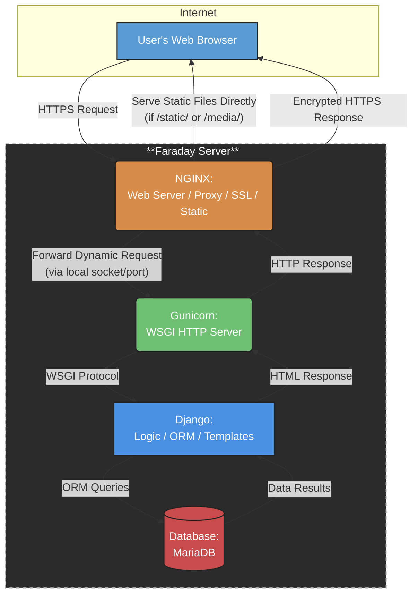

## Descripción funcional del sistema

El sistema **EIEInfo** es la plataforma web oficial de la Escuela de Ingeniería Eléctrica (EIE) de la Universidad de Costa Rica. Su propósito es centralizar y facilitar el acceso a información institucional, administrativa, académica y de extensión tanto para estudiantes, docentes como personal administrativo.

#### 🎯 Objetivos generales del sistema:
- Servir como puerta de entrada institucional para los distintos actores vinculados con la Escuela.
- **Optimizar la comunicación interna** mediante anuncios actualizados y visibles desde el portal principal.
- **Ofrecer enlaces rápidos y organizados** a recursos clave en los ámbitos de docencia, investigación, acción social y vida estudiantil.

#### 👥 Tipos de usuarios:
- **Estudiantes**: acceden a noticias, calendario académico, horarios de cursos, bolsas de empleo y procesos de graduación.
- **Docentes**: consultan recursos institucionales, información de proyectos, actividades académicas y administrativas.
- **Administrativos**: gestionan el contenido publicado, estructuran la organización interna y actualizan la información crítica para la comunidad.

#### 🧩 Funcionalidades clave:
- **Anuncios destacados**: desde la portada se publican recordatorios y eventos como el calendario de graduaciones, convocatorias de Radio201, horarios de cursos y ferias de empleo.
- **Menú desplegable organizado** en cinco grandes áreas:
  - 📚 **Estudios**: plan de estudios, matrícula, programas académicos.
  - 🧪 **Investigación**: proyectos activos, grupos de investigación.
  - 🎓 **Docencia**: personal docente, guías, normativas.
  - 🧭 **Acción Social**: programas, iniciativas comunitarias.
  - 🏫 **Escuela**: historia, estructura organizacional, comisiones.

- **Integración de enlaces útiles**: como acceso a sistemas de matrícula, bibliotecas, reglamentos universitarios y recursos de apoyo.
- **Diseño responsivo y navegación intuitiva**, con secciones jerarquizadas que permiten al usuario llegar fácilmente a la información deseada.

En conjunto, EIEInfo actúa como un centro digital de operaciones que conecta a los miembros de la EIE con su vida institucional y académica, fortaleciendo los canales de información y el vínculo con la comunidad universitaria.

## Identificación de Tecnologías utilizadas
Basándose en la documentación y estructura general del proyecto, el sistema de EIE implementa varias tecnologías/servicios distintos para el *deployment/funcionamiento* de la página, al igual que para su *desarrollo y verificación*.

### 🔬 Desarrollo/verificación:

#### [Docker:](https://www.docker.com/)
- **Ambiente de desarrollo:** Crea un ambiente de desarrollo/prueba lo más parecido posible a la instancia real ejecutada en [Faraday](#faraday), permitiendo recrear el entorno de deployment para propósitos de desarrollo y depuración de cambios. El docker empleado por EIEInfo genera 3 contenedores para la [base de datos](#mariadb-base-de-datos), [NGINX](#nginx-reverse-proxy-servidor-de-archivos-estáticos-y-terminador-ssl) y el [Django](#django-framework-y-backend).

#### [Drone](https://drone.eie.ucr.ac.cr/welcome)
- **Pipeline CI/CD:** Se utiliza para la ejecución de pruebas y pipelines de integración y despliegue continuo (CI/CD). Se utiliza en conjunto con los contenedores de Docker.

#### [Flake8:](https://flake8.pycqa.org/en/latest/)
- **Formato:** Estándar con reglas de formato PEP8 que se deben seguir en los scripts de Python del proyecto, se pueden utilizar distintos linters para asegurar que se cumplan, y se usa un archivo .flake8 para especificar exclusiones en el proceso de revisión.

### 📲 Deployment/funcionamiento:

#### Faraday:
- **Hardware para hosting:** Es el servidor propio de la Escuela de Ingeniería Eléctrica (EIE), en el cual se ejecutan las herramientas principales para el despliegue de la página de eie.
- **Almacenamiento:** Almacena el backend del sitio, incluyendo todos los scripts/settings para el despliegue de la aplicación, al igual que la base de datos con la información de usuarios.

#### [NGINX ("Reverse proxy", servidor de archivos estáticos y terminador SSL):](https://nginx.org/)
- **Punto de entrada:** Es el servidor del front-end, y el primer punto de entrada al que llegan los requests de un usuario.
- **Terminal SSL/TLS:** Descifra o encripta los requests HTTP que entran/salen del sistema EIE, realizando el *handshake* de seguridad en capa de transporte (ya sea SSL o TLS).
- **Servicio de archivos estáticos:** Para requests estáticos, que requieren el despliegue de archivos estáticos (imágenes, formato de página, etc), NGINX los retorna directamente de forma eficiente sin tener que consultar a capas posteriores.
- **Reverse proxy:** Para requests dinámicos, que requieren consultar datos de la base de datos o procesamiento, se reenvían los requests al servidor Gunicorn por medio de un puerto interno en el hardware de Faraday.

#### [Gunicorn (Servidor WSGI HTTP):](https://gunicorn.org/)
- **WSGI (Web Server Gateway Interface):** Funciona como la interfaz entre el backend escrito en Python y los requests vistos por el servidor NGINX. Traduce los requests a un formato entendido por Python (WSGI standard) para el backend y las respuestas del backend a requests para el servidor NGINX.
- **Comunicación interna:** Se comunica con el servidor NGINX por medio de un puerto local o un socket dentro del hardware de Faraday, esto evita exponer el resto del sistema al internet abierto (más robusto).
- **Manejo de workers:** Se encarga de crear/manejar instancias de procesos "workers" que ejecutan el framework de Django, permitiendo el manejo de varios usuarios concurrentes. También mantiene la estabilidad en casos de fallo de un worker, puesto que se crea otra instancia de worker sin afectar al resto.

#### [Django (Framework y backend):](https://www.djangoproject.com/)
- **Framework:** Maneja la lógica interna de la página, incluyendo las interacciones con la base de datos y procesamiento de datos.
- **Templates:** Define y edita las vistas generadas en cada URL de la página, al igual que el formato de las páginas.

#### [MariaDB (Base de datos):](https://mariadb.org/)
- **Almacenamiento de datos persistente:** Almacena todos los datos de usuarios, de contenido (Django) y demás de forma persistente. Es modificada por medio del ORM de Django, según los modelos definidos en el framework. Se usa MariaDB, un fork de MySQL altamente compatible con el mismo.

La estructura del proyecto según estas herramientas se muestra en el siguiente diagrama:



## Módulos Clave del Sistema
### `cursos/`
- Este módulo se encarga de todo lo relacionado con los cursos de la EIE: desde la gestión de materias y grupos, hasta la asignación de aulas y horarios. También permite emitir cartas a estudiantes y coordinar los horarios de consulta de los profesores y la asignación de cátedras.

### `trabajos_finales/`
- Aquí se administra todo el proceso de los trabajos finales de graduación. Permite gestionar proyectos de grado, asignar lectores y evaluadores, hacer seguimiento al avance de los estudiantes y organizar concursos relacionados con los trabajos finales.

### `proyecto_electrico/`
- Este módulo está dedicado a la gestión de los proyectos eléctricos desarrollados por estudiantes. Facilita el registro, control y seguimiento de los proyectos, así como la asignación de recursos, materiales y laboratorios necesarios para su desarrollo.

### `practica_profesional/`
- Permite administrar las prácticas profesionales de los estudiantes, registrando y dando seguimiento a cada práctica. Además, gestiona las empresas colaboradoras, los supervisores asignados y evalúa el desempeño y cumplimiento de objetivos de los estudiantes.

### `profesores/`
- Este módulo centraliza la gestión del personal docente, almacenando información personal y profesional, gestionando nombramientos y cargas académicas, administrando perfiles y documentación, y controlando la participación en comisiones y consejos.

### `estudiantes/`
- Se encarga de la administración de toda la comunidad estudiantil: registro, consulta y actualización de datos, control de matrículas y cargas académicas, seguimiento del historial y rendimiento académico, y la gestión de asignaciones a grupos, carreras o proyectos.

### `administrativos/`
- Este modulo gestiona el personal administrativo, permitiendo registrar funciones por puesto, controlar las responsabilidades de cada funcionario y administrar recursos y documentación de soporte.

### `alumni/`
- Este módulo permite mantiener un vínculo con los egresados de la EIE, actualizando sus datos, siguiendo su trayectoria profesional y promoviendo redes de contacto y colaboración con la comunidad.

### `anuncios/`
- Gestiona las comunicaciones internas de la escuela, permitiendo publicar anuncios oficiales, segmentar la información por perfiles de usuario y controlar la edición, eliminación y auditoría de los anuncios.

### `eventos/`
- Módulo para organizar y administrar los eventos académicos y administrativos, gestionando la programación, los calendarios compartidos y los recursos logísticos necesarios para cada evento.

### `conferencias/`
- Este módulo se enfoca en la organización de conferencias y seminarios especializados, registrando ponentes y asistentes, controlando la logística y generando certificados de participación.

### `laboratorios/`
- Este módulo gestiona el uso y mantenimiento de los laboratorios, registrando equipos y materiales disponibles, organizando horarios de uso y controlando los mantenimientos programados y correctivos.

### `inventario/`
- Este módulo permite administrar el inventario físico de la escuela, llevando un control detallado de recursos, herramientas y activos, registrando entradas y salidas, y gestionando los préstamos temporales.

### `proyectos/`
- Gestiona los proyectos de investigación vinculados a la escuela, registrando y documentando los proyectos activos, controlando recursos y haciendo seguimiento de hitos y resultados.

### `asistencias/`
- Este módulo controla la asistencia en actividades, ya sea de forma automática o manual, gestionando horarios y generando reportes y análisis de participación.

### `atributos/`
- Permite configurar los atributos técnicos del sistema, gestionando parámetros, etiquetas y características, y personalizando funcionalidades mediante atributos configurables.

### `webpage/`
- Administra el sitio web oficial de la EIE, gestionando el contenido institucional, noticias y enlaces, controlando accesos y permisos de edición, e integrando otros módulos del sistema.

### `eieinfo/`
- Es donde se controlan los parámetros globales, las integraciones externas y la configuración de autenticación, rutas y roles.

### `scripts/`
- Almacena scripts utilitarios para tareas recurrentes, automatizando procesos administrativos o técnicos y facilitando el mantenimiento, respaldo y limpieza de datos.

## Dependencias externas y configuración del entorno

El sistema EIEInfo depende de una serie de bibliotecas, herramientas y servicios externos necesarios para su correcta ejecución tanto en desarrollo como en producción.

### 📦 Dependencias de Python (`requirements.txt`)

Las dependencias del sistema están gestionadas con un archivo `requirements.txt`, que agrupa bibliotecas según su función principal:

- **Framework web:**  
  - `Django`: base para construir la aplicación web, manejo de modelos, vistas y rutas.  
  - `django-extensions`: herramientas adicionales para desarrollo, como comandos de consola y modelos extendidos.  
  - `django-polymorphic`: para manejar modelos con herencia y tipos variados.  
  - `django-crontab`: permite configurar tareas programadas tipo cron dentro de Django.

- **Interfaces de usuario:**  
  - `django-widget-tweaks`: facilita la personalización de formularios HTML en plantillas.  
  - `django-select2`: mejora los selectores desplegables con búsqueda y mejor interfaz.  
  - `django-ckeditor` y `martor`: editores de texto enriquecido, para crear contenido con formato HTML o Markdown.

- **Seguridad y validación:**  
  - `django-recaptcha`: protección contra bots y spam mediante CAPTCHA de Google.  
  - `django-letsencrypt`: automatiza la gestión y renovación de certificados SSL para HTTPS.

- **Documentación:**  
  - `docutils`: para procesar documentos en formatos reStructuredText.  
  - `pypandoc`: convierte documentos entre distintos formatos (por ejemplo, Markdown a HTML).

- **Análisis de código:**  
  - `flake8`, `pycodestyle`, `pyflakes`: herramientas para verificar estilo y calidad del código Python, ayudando a mantener buenas prácticas.

- **APIs y conectores:**  
  - `google-api-python-client` y `oauth2client`: facilitan la integración con APIs de Google, como Calendar y Drive.  
  - `facebook-sdk`: para interactuar con la API de Facebook y automatizar publicaciones.  
  - `mysqlclient`: cliente para conectar Django con bases de datos MySQL/MariaDB.

- **Procesamiento de archivos:**  
  - `Pillow`: manipulación y procesamiento de imágenes.  
  - `openpyxl`, `pyexcel-xls`, `XlsxWriter`: lectura y escritura de archivos Excel.  
  - `PyPDF2`: manipulación de documentos PDF.  
  - `vobject`: manejo de archivos vCard y iCalendar.

- **Otros:**  
  - `sorl-thumbnail`: generación y manejo de miniaturas de imágenes para optimizar carga.  
  - `scholarly`: parseador de Google Scholar para búsquedas académicas.  
  - `django-wiki`: módulo para crear wikis integrados en la aplicación.

> 📁 El archivo `requirements.txt` debe instalarse usando:  
> ```bash
> pip install -r requirements.txt
> ```


### 🛠️ Paquetes del sistema (`setup.sh`)

El script `setup.sh` automatiza la instalación de dependencias del sistema operativo necesarias para compilar librerías de Python y manejar servicios externos como MySQL y Nginx.

Incluye paquetes como:

- **Python 3 y herramientas de desarrollo:**  
  `python3-dev`, `pip` — necesarios para compilar extensiones y gestionar paquetes Python.

- **Servidor de base de datos:**  
  `mysql-server`, `python3-mysqldb` — para la instalación y conexión con MySQL/MariaDB.

- **Servidor web:**  
  `nginx`, `nginx-full`, `nginx-extras`, `certbot` — servidor web, módulos extras y gestión automática de certificados SSL.

- **Soporte para imágenes y documentos:**  
  `libjpeg`, `libpng` — librerías para procesamiento de imágenes.  
  `pandoc`, `texlive-full` — herramientas para conversión y creación de documentos, incluyendo PDFs y otros formatos.

> 📁 Ejecutar como superusuario:  
> ```bash
> sudo bash setup.sh
> ```

### 🐳 Ambiente Docker

Para facilitar la implementación y pruebas, el sistema cuenta con un entorno Docker compuesto por tres contenedores:

- `mariadb`: base de datos  
- `nginx`: servidor web que actúa como proxy inverso  
- `eieinfo_app`: aplicación Django

Este entorno permite simular el despliegue en el servidor **Faraday**, y está preparado para integrarse con sistemas de CI/CD como **Drone**, automatizando la ejecución de pruebas y despliegue de código.

> 🔧 Comandos clave:  
> ```bash
> docker compose build
> docker compose up
> docker compose down
> ```

> 🌐 Acceso a la aplicación:  
> [http://localhost:8080](http://localhost:8080)

### 🔄 Integración Continua y Pruebas Locales (Drone CI)

El sistema **EIEInfo** utiliza un pipeline de integración continua local mediante **[Drone CI](https://www.drone.io/)**. Este proceso automatiza:

- 🔍 Validación del estado de los contenedores Docker  
- 🌐 Verificación de accesibilidad de rutas web (públicas y privadas)  
- ⚙️ Ejecución de migraciones de base de datos  
- 📦 Generación de fixtures  
- ✅ Pruebas unitarias sobre módulos seleccionados

📄 Archivo del pipeline: [`drone.yml`](https://git.ucr.ac.cr/eieinfo/EIEInfo/-/blob/master/docker/drone-local/drone.yml)

### 🛠️ Etapas del pipeline

1. **Inicialización del pipeline**
   - Muestra mensaje de inicio y pausa breve

2. **Test de conectividad entre contenedores**
   - Usa `ping` para validar que `db`, `nginx` y `eieinfo_app` están corriendo

3. **Verificación de servicios activos**
   - Usa `netcat` para asegurar puertos abiertos en los servicios web y base de datos

4. **Configuración del entorno Django**
   - Ejecuta scripts `.env` y `migraciones.sh` para preparar el entorno

5. **Pruebas de URLs institucionales**
   - Usa `curl` para verificar acceso a rutas públicas y privadas:
     - `/estudiantes`, `/profesores/login`, `/admin`, etc.
     - Incluye pruebas con autenticación básica para usuarios del sistema

6. **Generación de fixtures y pruebas unitarias**
   - Exporta datos en formato JSON para pruebas
   - (Opcional) ejecuta pruebas Django, algunas comentadas por dependencias pendientes

> ⚠️ Algunas rutas pueden fallar si recursos estáticos o dependencias no están presentes. Estas están documentadas con comentarios en el archivo `drone.yml`.


#### 🧪 Ejecución local del pipeline

1. Asegurate de que los contenedores Docker estén en ejecución y en red (por ejemplo, `eieinfo_default`)
2. Ejecutá el siguiente comando desde el directorio raíz:

```bash
drone exec --network eieinfo_default docker/drone-local/drone.yml
```

--- 
### 🔌 Integración con APIs Externas

El sistema **EIEInfo** se integra con varias APIs para extender su funcionalidad, automatizar procesos institucionales y conectar servicios externos.

#### 📅 Google Calendar API

Se utiliza para crear y gestionar eventos automáticamente en los calendarios institucionales de la Escuela.

- **Scope requerido:** [`https://www.googleapis.com/auth/calendar`](https://www.googleapis.com/auth/calendar)
- **Archivo de credenciales:** `eieinfo_credentials.json`
- **Librería:** `google-api-python-client`
- **Aplicación registrada:** *Google Calendar API Python Quickstart*
- **Uso principal:** Automatización de calendarios de actividades y eventos académicos

#### 🔍 Google Custom Search API

Permite realizar búsquedas dentro del sitio institucional y fuentes específicas autorizadas.

- **URL base:**
[Google APIS](https://www.googleapis.com/customsearch/v1?key={API_KEY}&cx={SEARCH_ENGINE_ID}&q={QUERY})
- **Parámetros:**
- `API_KEY`: clave de acceso
- `cx`: ID del motor de búsqueda personalizado
- `q`: término o frase de búsqueda

#### 📲 Facebook Graph API

Utilizada para automatizar publicaciones en la página oficial de la Escuela de Ingeniería Eléctrica.

- **Funciones disponibles:**
- `PostearEnFacebook(message, attachment)`
- `PostearImagenEnFacebook(image, message)`
- **Librería:** `facebook-sdk`
- **Token de acceso:** definido en `settings.py` como `FACEBOOK_ACCESS_TOKEN`
- **Ejemplo de uso:**
```python
attachment = {
    'name': 'Estudiar en Ingeniería Eléctrica',
    'link': 'https://eie.ucr.ac.cr/anuncios/15/',
    'caption': 'Anuncios EIE',
    'description': 'La carrera de Ingeniería Eléctrica ofrece...',
    'picture': 'https://eie.ucr.ac.cr/media/anuncios/Redes.jpg'
}
```