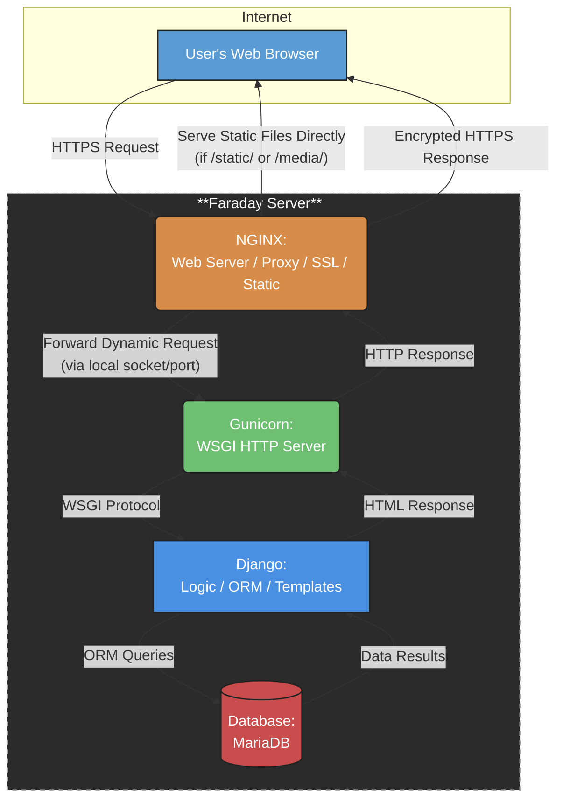

## Descripción funcional del sistema

El sistema **EIEInfo** es la plataforma web oficial de la Escuela de Ingeniería Eléctrica (EIE) de la Universidad de Costa Rica. Su propósito es centralizar y facilitar el acceso a información institucional, administrativa, académica y de extensión tanto para estudiantes, docentes como personal administrativo.

#### 🎯 Objetivos generales del sistema:
- Servir como puerta de entrada institucional para los distintos actores vinculados con la Escuela.
- **Optimizar la comunicación interna** mediante anuncios actualizados y visibles desde el portal principal.
- **Ofrecer enlaces rápidos y organizados** a recursos clave en los ámbitos de docencia, investigación, acción social y vida estudiantil.

#### 👥 Tipos de usuarios:
- **Estudiantes**: acceden a noticias, calendario académico, horarios de cursos, bolsas de empleo y procesos de graduación.
- **Docentes**: consultan recursos institucionales, información de proyectos, actividades académicas y administrativas.
- **Administrativos**: gestionan el contenido publicado, estructuran la organización interna y actualizan la información crítica para la comunidad.

#### 🧩 Funcionalidades clave:
- **Anuncios destacados**: desde la portada se publican recordatorios y eventos como el calendario de graduaciones, convocatorias de Radio201, horarios de cursos y ferias de empleo.
- **Menú desplegable organizado** en cinco grandes áreas:
  - 📚 **Estudios**: plan de estudios, matrícula, programas académicos.
  - 🧪 **Investigación**: proyectos activos, grupos de investigación.
  - 🎓 **Docencia**: personal docente, guías, normativas.
  - 🧭 **Acción Social**: programas, iniciativas comunitarias.
  - 🏫 **Escuela**: historia, estructura organizacional, comisiones.

- **Integración de enlaces útiles**: como acceso a sistemas de matrícula, bibliotecas, reglamentos universitarios y recursos de apoyo.
- **Diseño responsivo y navegación intuitiva**, con secciones jerarquizadas que permiten al usuario llegar fácilmente a la información deseada.

En conjunto, EIEInfo actúa como un centro digital de operaciones que conecta a los miembros de la EIE con su vida institucional y académica, fortaleciendo los canales de información y el vínculo con la comunidad universitaria.

## Identificación de Tecnologías utilizadas
Basándose en la documentación y estructura general del proyecto, el sistema de EIE implementa varias tecnologías/servicios distintos para el *deployment/funcionamiento* de la página, al igual que para su *desarrollo y verificación*.

### 🔬 Desarrollo/verificación:

#### [Docker:](https://www.docker.com/)
- **Ambiente de desarrollo:** Crea un ambiente de desarrollo/prueba lo más parecido posible a la instancia real ejecutada en [Faraday](#faraday), permitiendo recrear el entorno de deployment para propósitos de desarrollo y depuración de cambios. El docker empleado por EIEInfo genera 3 contenedores para la [base de datos](#mariadb-base-de-datos), [NGINX](#nginx-reverse-proxy-servidor-de-archivos-estáticos-y-terminador-ssl) y el [Django](#django-framework-y-backend).

#### [Drone](https://drone.eie.ucr.ac.cr/welcome)
- **Pipeline CI/CD:** Se utiliza para la ejecución de pruebas y pipelines de integración y despliegue continuo (CI/CD). Se utiliza en conjunto con los contenedores de Docker.

#### [Flake8:](https://flake8.pycqa.org/en/latest/)
- **Formato:** Estándar con reglas de formato PEP8 que se deben seguir en los scripts de Python del proyecto, se pueden utilizar distintos linters para asegurar que se cumplan, y se usa un archivo .flake8 para especificar exclusiones en el proceso de revisión.

### 📲 Deployment/funcionamiento:

#### Faraday:
- **Hardware para hosting:** Es el servidor propio de la Escuela de Ingeniería Eléctrica (EIE), en el cual se ejecutan las herramientas principales para el despliegue de la página de eie.
- **Almacenamiento:** Almacena el backend del sitio, incluyendo todos los scripts/settings para el despliegue de la aplicación, al igual que la base de datos con la información de usuarios.

#### [NGINX ("Reverse proxy", servidor de archivos estáticos y terminador SSL):](https://nginx.org/)
- **Punto de entrada:** Es el servidor del front-end, y el primer punto de entrada al que llegan los requests de un usuario.
- **Terminal SSL/TLS:** Descifra o encripta los requests HTTP que entran/salen del sistema EIE, realizando el *handshake* de seguridad en capa de transporte (ya sea SSL o TLS).
- **Servicio de archivos estáticos:** Para requests estáticos, que requieren el despliegue de archivos estáticos (imágenes, formato de página, etc), NGINX los retorna directamente de forma eficiente sin tener que consultar a capas posteriores.
- **Reverse proxy:** Para requests dinámicos, que requieren consultar datos de la base de datos o procesamiento, se reenvían los requests al servidor Gunicorn por medio de un puerto interno en el hardware de Faraday.

#### [Gunicorn (Servidor WSGI HTTP):](https://gunicorn.org/)
- **WSGI (Web Server Gateway Interface):** Funciona como la interfaz entre el backend escrito en Python y los requests vistos por el servidor NGINX. Traduce los requests a un formato entendido por Python (WSGI standard) para el backend y las respuestas del backend a requests para el servidor NGINX.
- **Comunicación interna:** Se comunica con el servidor NGINX por medio de un puerto local o un socket dentro del hardware de Faraday, esto evita exponer el resto del sistema al internet abierto (más robusto).
- **Manejo de workers:** Se encarga de crear/manejar instancias de procesos "workers" que ejecutan el framework de Django, permitiendo el manejo de varios usuarios concurrentes. También mantiene la estabilidad en casos de fallo de un worker, puesto que se crea otra instancia de worker sin afectar al resto.

#### [Django (Framework y backend):](https://www.djangoproject.com/)
- **Framework:** Maneja la lógica interna de la página, incluyendo las interacciones con la base de datos y procesamiento de datos.
- **Templates:** Define y edita las vistas generadas en cada URL de la página, al igual que el formato de las páginas.

#### [MariaDB (Base de datos):](https://mariadb.org/)
- **Almacenamiento de datos persistente:** Almacena todos los datos de usuarios, de contenido (Django) y demás de forma persistente. Es modificada por medio del ORM de Django, según los modelos definidos en el framework. Se usa MariaDB, un fork de MySQL altamente compatible con el mismo.

La estructura del proyecto según estas herramientas se muestra en el siguiente diagrama:

