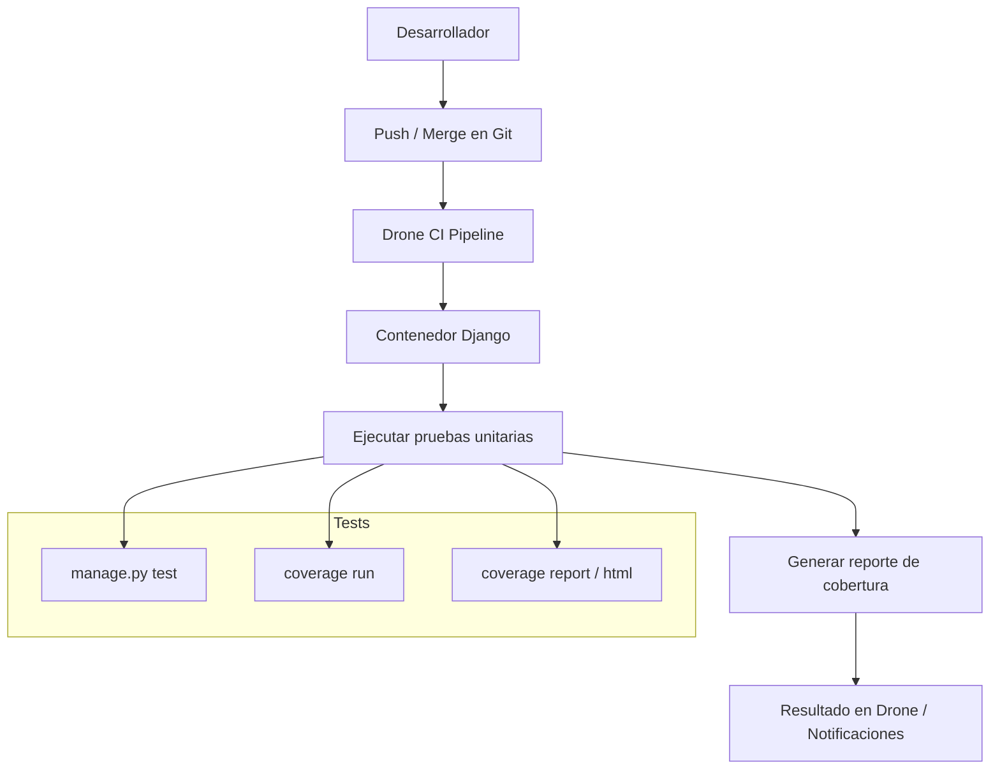

# Propuestas de mejora técnica

## Propuesta 1: Mejoras en sistema de asignación de horarios y aulas (Mejora en UX)
### Descripción
Actualmente, el sistema de EIE info le permite a funcionarios administrativos específicos (como los directores de cada departamento de la escuela) realizar la asignación de las aulas y horarios asignados para cada curso de los semestres. Sin embargo este sistema no posee las funciones necesarias para revisar si los cursos agregados (como par de horario y aula) generan conflicto con otros grupos previo a ser agregados. Además, actualmente no se posee una forma de visualizar los cursos agredados, causando que sea difícil identificar horarios disponibles o si los horarios de un mismo ciclo (del plan de estudios) estan bien organizados. La propuesta general es agregar dos funcionalidades que resuelven dichas deficiencias:

- Restringir los cursos (horario y aula) permitidos en la interfaz de agregar cursos a solo aquellos que no generen error de conflicto.
- Agregar una interfaz que muestre los horarios semanales de los cursos agregados, separados según el ciclo del plan de estudio al que pertenecen.


### Justificación/Evidencia
Estos cambios propuestos provienen de las sugerencias dadas por usuarios administrativos del sistema, que identificaron las deficiencias en la experiencia de usuario (UX) mencionadas. Específicamente, estas fueron mencionadas por el profesor y director de departamento de Electrónica y Telecomunicaciones como respuesta a la [pregunta](/avances/avance2/README.md/#2-feedback-de-usuario) de posibles aspectos de mejora en la sección de su labor como administrativo:


>    Existe potencial de mejora:
>    * Cuando se asignan horarios y aulas para los cursos de los siguientes ciclos, se da la opción de generar choques de aula/horario sin saberlo, hasta que se guardan los cambios. Se sugiere que se cambie, para que al establecer horarios solo se den como opción los horarios/aulas disponibles (sugerencia en consideración pero no en desarrollo).
>    * No existe forma de visualizar la asignación de los horarios/aulas en un calendario semanal, lo cual sería útil a la hora de acomodar los cursos de un mismo ciclo. Estos deben estar ordenados para que no generen choque de horario, y así los estudiantes que siguen el plan de estudios puedan matricular todos los cursos del ciclo. Se sugiere un sistema que muestre los horarios de forma semanal, uno por cada ciclo, permitiendo una visualización más directa.

Considerando que esta función es clave para que se definan los cursos de semestres futuros de una forma clara, eficiente y libre de errores (que pueden generar serios conflictos de horarios en los semestres de estudiantes y profesores), se considera que esta es una propuesta que puede ayudar en gran manera la experiencia de usuario y calidad de servicio que da la página.

### Diagrama o arquitectura sugerida
### Análisis de costo/impacto esperado

---

## Propuesta 2: Revisión, mejora y ampliación de pruebas unitarias para integración con CI

### Descripción

Actualmente, el sistema cuenta con pruebas unitarias aisladas en algunos módulos (por ejemplo, `cursos/tests.py`), pero estas no se ejecutan automáticamente ni están integradas a ningún proceso de CI. Esta propuesta tiene como objetivo:

1. **Revisar y auditar el estado actual de las pruebas unitarias.**
2. **Mejorar y documentar las pruebas existentes.**
3. **Diseñar y escribir nuevas pruebas para módulos clave del backend en Django.**
4. **Preparar la integración progresiva de estas pruebas al pipeline de Drone CI.**

---


### Justificación / Evidencia

**1. Evidencia técnica:**
- Existen archivos como `tests.py` con pruebas `TestCase`, pero **no hay un entorno configurado para ejecutarlas.**
- Se utilizan fixtures (`cursos.json`) que **no están documentados ni integrados al pipeline.**
- No se han definido comandos ni scripts claros para correr los tests, ni a nivel local ni en CI.

**2. Evidencia de entrevista:**
- > “Hacen falta muchas pruebas unitarias.”  
- > “Tengo que lanzar cosas a producción con pruebas funcionales superficiales.”
- > “Hay pruebas desde el 2023 que nunca se ejecutan.”

**3. Problemas detectados:**
- Bajo control de calidad en despliegues.
- Alta posibilidad de errores regresivos.
- Falta de confianza en los módulos existentes y dificultad para refactorizar sin romper funcionalidades.

---
### Áreas de mejora identificadas

- **Cobertura y calidad de pruebas unitarias:** Las pruebas existentes son insuficientes y no se ejecutan automáticamente.
- **Integración Continua (CI):** No hay pipeline que automatice pruebas antes de despliegues.
- **Documentación y mantenimiento:** Falta documentación clara para la creación y ejecución de pruebas.
- **Modularidad y escalabilidad:** La estructura actual dificulta pruebas modulares e integradas.

---
### Plan de acción sugerido

| Etapa                       | Actividades principales                                                      |
|----------------------------|-------------------------------------------------------------------------------|
| **Revisión**               | Auditoría de todos los archivos `tests.py` existentes.                        |
| **Mejora**                 | Refactorización de pruebas obsoletas o rotas. Documentación de fixtures.     |
| **Ampliación**             | Nuevas pruebas para vistas, modelos y formularios en módulos prioritarios.   |
| **Preparación CI**         | Crear scripts y estructura necesaria para su integración a `drone.yml`.       |

---

### Beneficio esperado

- Reducción de errores en producción y mayor estabilidad del sistema.
- Mayor confianza para hacer cambios y refactorizaciones futuras.
- Base sólida para la integración continua y cobertura de código.
- Facilidad para detectar regresiones y problemas antes del despliegue.

---

### Recomendaciones futuras

- Definir una política clara de pruebas (por ejemplo, 70% cobertura mínima).
- Incorporar `pytest` + `coverage` como herramienta estándar de testing.
- Establecer `pre-commit hooks` para prevenir pushes sin pasar los tests.
- Documentar en el README el proceso para correr y escribir nuevas pruebas.

---

### Diagrama o arquitectura sugerida

Se propone la siguiente arquitectura para facilitar la ejecución y verificación automática de pruebas unitarias como parte del proceso de integración continua:


### Ejemplo de código para pruebas unitarias en `admin.py`

```python
from django.test import TestCase, RequestFactory
from django.contrib.admin.sites import AdminSite
from django.contrib.messages.storage.fallback import FallbackStorage
from cursos.admin import CursoAdmin, GenerarReportePDF
from cursos.models import Curso

class MockRequest:
    def __init__(self):
        self._messages = []
    def _get_messages(self):
        return self._messages
    messages = property(_get_messages)

class CursoAdminTest(TestCase):
    fixtures = ['cursos']

    def setUp(self):
        self.factory = RequestFactory()
        self.site = AdminSite()
        self.admin = CursoAdmin(Curso, self.site)
        self.curso = Curso.objects.first()

    def _get_request_with_messages(self):
        request = self.factory.get('/admin/cursos/curso/')
        # Necesario para que funcionen los mensajes en las acciones admin
        setattr(request, 'session', 'session')
        messages = FallbackStorage(request)
        setattr(request, '_messages', messages)
        return request

    def test_generar_reporte_pdf_exito(self):
        # Aseguramos que ProgramaPDF retorne True simulando éxito
        self.curso.ProgramaPDF = lambda: True

        request = self._get_request_with_messages()
        queryset = Curso.objects.filter(pk=self.curso.pk)

        # Ejecutamos la acción
        GenerarReportePDF(self.admin, request, queryset)

        # No debe haber mensajes de error
        messages = list(request._messages)
        self.assertEqual(len(messages), 0)

    def test_generar_reporte_pdf_error(self):
        # Simulamos fallo en ProgramaPDF
        self.curso.ProgramaPDF = lambda: False

        request = self._get_request_with_messages()
        queryset = Curso.objects.filter(pk=self.curso.pk)

        GenerarReportePDF(self.admin, request, queryset)

        messages = list(request._messages)
        self.assertTrue(any("Error creando carta para el curso" in str(m) for m in messages))

    def test_curso_admin_configuracion(self):
        # Verificar list_display
        self.assertIn('sigla', self.admin.list_display)
        self.assertIn('nombre', self.admin.list_display)
        # Verificar acciones
        self.assertIn(GenerarReportePDF, self.admin.actions)

```
#### Explicación
Este ejemplo muestra cómo realizar pruebas unitarias para las acciones definidas en el admin de Django, usando TestCase y RequestFactory para simular peticiones HTTP. Además, se utiliza FallbackStorage para habilitar la captura de mensajes flash generados por las acciones, lo que permite validar que se muestren mensajes de error o éxito según el caso.

Las pruebas incluyen:

- Validar que la acción GenerarReportePDF funcione correctamente cuando el método ProgramaPDF del modelo devuelve éxito.

- Validar que se capture el mensaje de error cuando ProgramaPDF falla.

- Verificar la configuración del admin, como los campos visibles (list_display) y las acciones disponibles.

Este enfoque asegura que las funcionalidades administrativas sean confiables y facilita su integración en procesos de integración continua (CI).


### Análisis de costo/impacto esperado

#### Costo estimado

El costo de implementar una estrategia formal de pruebas unitarias e integrarlas en el pipeline de integración continua (CI) puede desglosarse en los siguientes rubros:

- **Tiempo de desarrollo inicial**: Se estima entre 2 y 3 semanas para revisar módulos clave del sistema, escribir pruebas unitarias representativas (especialmente en `admin.py`, `views.py` y `models.py`) y configurar adecuadamente el entorno de CI (Drone).
- **Capacitación o familiarización del equipo**: Si parte del equipo no está familiarizado con buenas prácticas de pruebas o uso de `pytest`, `unittest` o herramientas similares, se requerirá una sesión de formación interna.
- **Mantenimiento continuo**: El costo de mantenimiento es marginal comparado con el beneficio, y se vuelve más eficiente conforme aumenta la cobertura de pruebas.

#### Impacto esperado

- **Reducción de errores en producción**: Al integrar pruebas en el ciclo de CI, se evitará que código defectuoso se despliegue automáticamente, reduciendo tiempos de respuesta ante fallos en producción.
- **Mayor confiabilidad en refactorizaciones**: Con una base sólida de pruebas, el equipo puede modificar o reestructurar el código con mayor confianza y menor riesgo.
- **Documentación automática del comportamiento esperado**: Las pruebas bien estructuradas actúan como una forma de documentación viva, que describe cómo deben comportarse los distintos módulos.
- **Facilitación de futuras integraciones**: La validación automatizada facilitará la incorporación de nuevos módulos (como el de bodega o reservas de aulas), ya que se podrán detectar de forma temprana problemas de integración.
- **Mejora en la calidad del software**: Se espera un aumento sostenido en la calidad del sistema y una disminución en los reportes de bugs, especialmente en módulos críticos como `cursos`, `asistencias` y `proyectos`.

#### Viabilidad

La propuesta es altamente viable por las siguientes razones:

- **El sistema ya cuenta con algunos tests existentes** que pueden servir como base para extender la cobertura.
- **Drone CI ya está presente en el repositorio**, por lo que no es necesario incorporar nuevas herramientas externas, solo integrar la ejecución de pruebas dentro del pipeline.
- **La estructura del proyecto está modularizada por aplicaciones Django**, lo cual facilita el aislamiento de pruebas por módulo.
- **La comunidad de Django y Python ofrece amplias herramientas y documentación** para testing, lo que disminuye la curva de aprendizaje.

#### Conclusión

La inversión inicial en pruebas unitarias y su integración al flujo CI es modesta en comparación con los beneficios que se obtienen en términos de calidad, mantenimiento y escalabilidad del sistema. Se recomienda ampliamente priorizar esta mejora como primer paso dentro de un plan de modernización técnica gradual del proyecto.

---

## Propuesta 3
### Descripción
### Justificación/Evidencia
### Diagrama o arquitectura sugerida
### Análisis de costo/impacto esperado

---