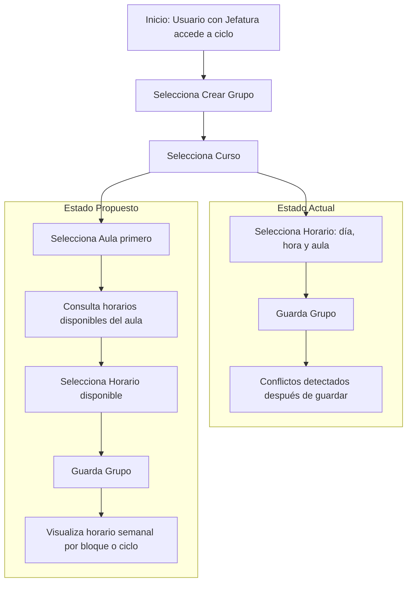
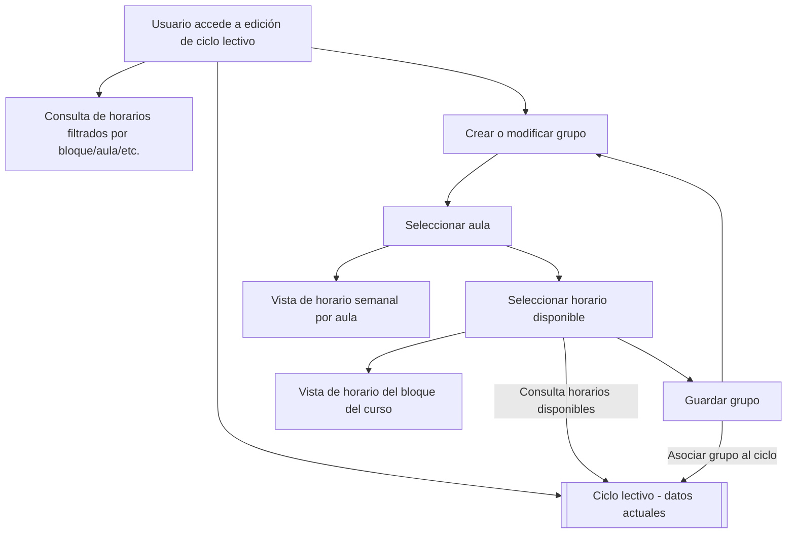
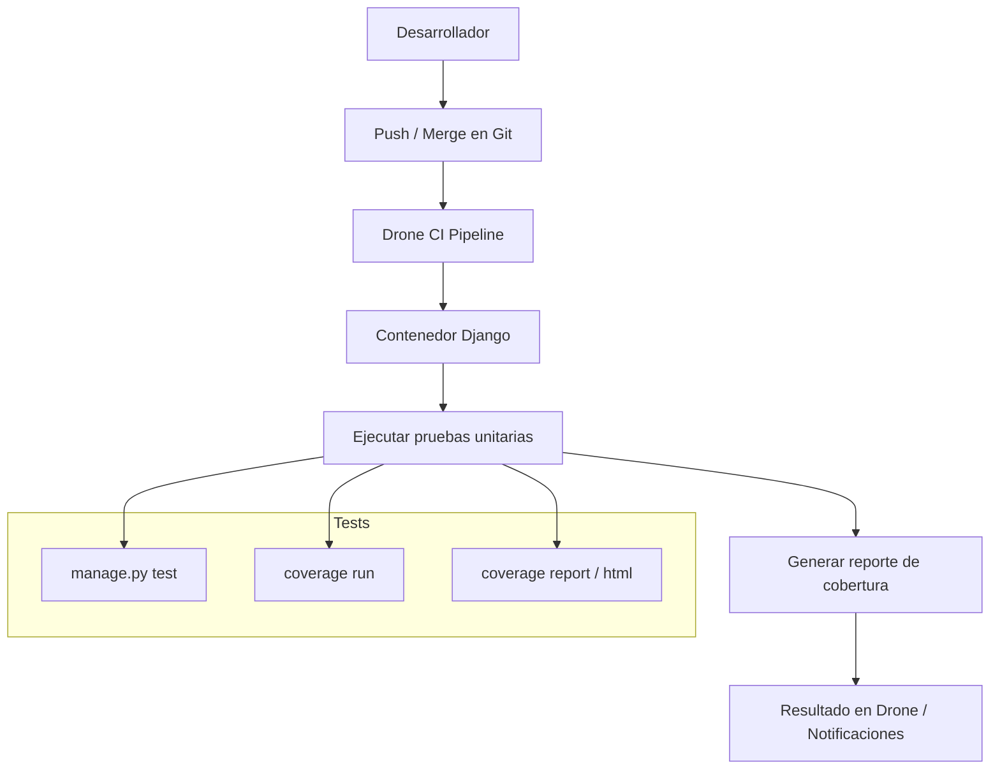

# Propuestas de mejora técnica

## Propuesta 1: Mejoras en sistema de asignación de horarios y aulas (Mejora en UI/UX)
### Descripción
Actualmente, el sistema de EIE info le permite a funcionarios administrativos específicos (como los directores de cada departamento de la escuela) realizar la asignación de las aulas y horarios asignados para cada curso de los semestres. Sin embargo este sistema no posee las funciones necesarias para revisar si los cursos agregados (como par de horario y aula) generan conflicto con otros grupos previo a ser agregados. Además, actualmente no se posee una forma de visualizar los cursos agredados, causando que sea difícil identificar horarios disponibles o si los horarios de un mismo ciclo (del plan de estudios) estan bien organizados.


> Captura de interfaz para modificar horarios según el ciclo lectivo.


> Captura de evidencia en la que se muestra que se pueden colocar horarios que generan choque con otros.


> Captura de intento de agregar horario que choca con horarios ya establecidos.


> Captura de grupos de un mismos plan de estudio con choques de horas.

La propuesta general es agregar dos funcionalidades que resuelven dichas deficiencias:

- Restringir los cursos (horario y aula) permitidos en la interfaz de agregar cursos a solo aquellos que no generen error de conflicto.
- Agregar una interfaz que muestre los horarios semanales de los cursos agregados, separados según el ciclo del plan de estudio al que pertenecen.


### Justificación/Evidencia
Estos cambios propuestos provienen de las sugerencias dadas por usuarios administrativos del sistema, que identificaron las deficiencias en la experiencia de usuario (UX) mencionadas. Específicamente, estas fueron mencionadas por el profesor y director de departamento de Electrónica y Telecomunicaciones como respuesta a la [pregunta](/avances/avance2/README.md/#2-feedback-de-usuario) de posibles aspectos de mejora en la sección de su labor como administrativo:


>    Existe potencial de mejora:
>    * Cuando se asignan horarios y aulas para los cursos de los siguientes ciclos, se da la opción de generar choques de aula/horario sin saberlo, hasta que se guardan los cambios. Se sugiere que se cambie, para que al establecer horarios solo se den como opción los horarios/aulas disponibles (sugerencia en consideración pero no en desarrollo).
>    * No existe forma de visualizar la asignación de los horarios/aulas en un calendario semanal, lo cual sería útil a la hora de acomodar los cursos de un mismo ciclo. Estos deben estar ordenados para que no generen choque de horario, y así los estudiantes que siguen el plan de estudios puedan matricular todos los cursos del ciclo. Se sugiere un sistema que muestre los horarios de forma semanal, uno por cada ciclo, permitiendo una visualización más directa.

Considerando que esta función es clave para que se definan los cursos de semestres futuros de una forma clara, eficiente y libre de errores (que pueden generar serios conflictos de horarios en los semestres de estudiantes y profesores), se considera que esta es una propuesta que puede ayudar en gran manera la experiencia de usuario y calidad de servicio que da la página.

### Diagrama o arquitectura sugerida

#### Estructura actual

Luego de analizar el código y estructura de modelos/forms y demás en el backend de Django, se identificó que las funciones responsables al registro y creación de los pares horario/aula para un curso se manejan según instancias de la clase `Grupo` (definida en `src/server/cursos/models.py`) en el form `GrupoAdminForm` (definido en `src/server/cursos/forms.py`). Este form se clasifica como el form default en la clase `GrupoAdmin` (definida en `src/server/cursos/admin.py`) que se registra como modelo a usar por el administrador del backend Django en el dashboard de control/edición de aspectos del sistema. Pero, principalmente, se muestra una interfaz de agregar/editar grupos a través del forms CrearGrupoForm (definido en `src/server/profesores/forms.py`). Esta interfaz gráfica se genera por medio de la interfaz de editar los contenidos de un ciclo lectivo, la cual solo es disponible para usuarios tipo `Profesor` que tengan asignados una `Jefatura` (según las restricciones definidas en `src/server/profesores/misc.py`).


La clase de Grupo posee los siguientes atributos:
- Número de grupo (entero)
- Curso (objeto `Curso`)
- Profesor (objeto `Profesor`)
- Cupo (entero)
- Cátedra (objeto `Cátedra`)
- Horario (objeto `Horario`)
- etc.

Las sub-clases de importancia en este caso son:

- `Horario`: Definida en `src/server/administrativos/models.py`, modela un time-slot (hora de inicio, final y día) y asigna un aula (objeto `Lugar` definido en `src/server/administrativos/models.py`).
- `Curso`: Definida en `src/server/cursos/models.py`, define un curso en específico.

Además, los cursos están agregados según los ciclos (definidos según clase `Ciclo` en `src/server/cursos/models.py`).


#### Estructura propuesta

Para solucionar el despliegue de horarios no disponibles, se proponen las siguientes modificaciones al formulario ya existente:
- Mover la elección de aula a la primera etapa de creación de grupo (previo a escoger horas). Esto pasa la asignación del objeto Lugar al grupo, no al horario.
- El sistema itera por todos los grupos del ciclo actual que tienen asignada dicha aula y obtiene las horas disponibles (horario completo - horas ya asignadas).
- Solo desplegar las horas disponibles para el aula escogida.
- Desplegar una interfaz de horario (semanal) que muestre las horas ocupadas y por cual curso. Podría actualizarse según se selecionan horas.

Además, para facilitar la distribución de los horarios de forma que los ciclos de plan de estudio no se vean afectados:
- Crear bloques (estructura ya existente y vinculada a los `Ciclos`) para categorizar los 8 bloques de cada énfasis de forma predeterminada para cada ciclo.
- Asignar atributo a los cursos para el bloque al que pertenencen.
- En interfaz de grupos mostrar un horario (semanal) para todos los cursos pertenecientes al mismo bloque.

Opcional:
- Extender la funcionalidad de los horarios, agregando una sección que permita visualizar un horario semanal para grupos filtrados según distintos parámetros (bloque, aula, hora, etc).

Se muestra un diagrama comparativo entre 



Además, una vista general de las funciones e interacciones agregadas al sistema se ve en el siguiente diagrama:



### Análisis de costo/impacto esperado

#### Costo estimado

| Componente                                                              | Tipo de trabajo                | Estimación  |
| ----------------------------------------------------------------------- | ------------------------------ | ----------- |
| **Adaptación de `CrearGrupoForm`** para incluir aula y horario filtrado | Refactor backend (form)        | 5–7 h       |
| **Filtrado de horarios disponibles** según aula y ciclo                 | Lógica de consulta             | 4–6 h       |
| **Componente visual** para mostrar horarios semanales por aula/bloque   | Vista + plantilla reutilizable | 8–10 h      |
| **Ajustes menores en modelos** (atributos para bloque, relaciones)      | Migraciones y lógica mínima    | 2–3 h       |
| **Pruebas funcionales internas**                                        | QA y validación básica         | 4–5 h       |
| **Documentación técnica** (código + estructura de flujos)               | Comentarios y explicaciones    | 3–4 h       |
| **Documentación para usuarios técnicos**                                | Guía de uso de la interfaz     | 2–3 h       |
| **Revisión con usuarios administrativos**                               | Revisión y retroalimentación   | 2 h         |
| **Total estimado**                                                      |                                | **30–38 h** |

#### Impacto esperado

| Área afectada                                    | Impacto positivo                                            |
| ------------------------------------------------ | ----------------------------------------------------------- |
| **Experiencia de usuario (UX)**                  | Muy alto: evita errores humanos, navegación más intuitiva.  |
| **Reducción de errores administrativos**         | Alto: evita conflictos de horarios antes de que ocurran.    |
| **Organización de ciclos en el plan de estudio** | Alto: permite visualizar y validar coherencia entre cursos. |
| **Tiempo requerido para asignación de horarios** | Medio: menor necesidad de corrección posterior.             |
| **Carga cognitiva de los administradores**       | Bajo: simplifica la interfaz y reduce dudas.                |

#### Conclusión

El rediseño propuesto representa una mejora significativa en la calidad del sistema, con un costo moderado en tiempo de desarrollo. Mientras que el uso de estas funcionalidades no es lo suficientemente frecuente para justificar el costo de su implementación, las pocas veces que se utiliza conlleva una alta complejidad e inversión de tiempo. Además, al asegurarse que los grupos creados sean acordes a los requisitos del plan de estudio, se evitan problemas de conflictos de horarios que podrían afectar a muchos estudiantes, profesores y demás.

---

## Propuesta 2: Revisión, mejora y ampliación de pruebas unitarias para integración con CI

### Descripción

Actualmente, el sistema cuenta con pruebas unitarias aisladas en algunos módulos (por ejemplo, `cursos/tests.py`), pero estas no se ejecutan automáticamente ni están integradas a ningún proceso de CI. Esta propuesta tiene como objetivo:

1. **Revisar y auditar el estado actual de las pruebas unitarias.**
2. **Mejorar y documentar las pruebas existentes.**
3. **Diseñar y escribir nuevas pruebas para módulos clave del backend en Django.**
4. **Preparar la integración progresiva de estas pruebas al pipeline de Drone CI.**

---


### Justificación / Evidencia

**1. Evidencia técnica:**
- Existen archivos como `tests.py` con pruebas `TestCase`, pero **no hay un entorno configurado para ejecutarlas.**
- Se utilizan fixtures (`cursos.json`) que **no están documentados ni integrados al pipeline.**
- No se han definido comandos ni scripts claros para correr los tests, ni a nivel local ni en CI.

**2. Evidencia de entrevista:**
- > “Hacen falta muchas pruebas unitarias.”  
- > “Tengo que lanzar cosas a producción con pruebas funcionales superficiales.”
- > “Hay pruebas desde el 2023 que nunca se ejecutan.”

**3. Problemas detectados:**
- Bajo control de calidad en despliegues.
- Alta posibilidad de errores regresivos.
- Falta de confianza en los módulos existentes y dificultad para refactorizar sin romper funcionalidades.

---
### Áreas de mejora identificadas

- **Cobertura y calidad de pruebas unitarias:** Las pruebas existentes son insuficientes y no se ejecutan automáticamente.
- **Integración Continua (CI):** No hay pipeline que automatice pruebas antes de despliegues.
- **Documentación y mantenimiento:** Falta documentación clara para la creación y ejecución de pruebas.
- **Modularidad y escalabilidad:** La estructura actual dificulta pruebas modulares e integradas.

---
### Plan de acción sugerido

| Etapa                       | Actividades principales                                                      |
|----------------------------|-------------------------------------------------------------------------------|
| **Revisión**               | Auditoría de todos los archivos `tests.py` existentes.                        |
| **Mejora**                 | Refactorización de pruebas obsoletas o rotas. Documentación de fixtures.     |
| **Ampliación**             | Nuevas pruebas para vistas, modelos y formularios en módulos prioritarios.   |
| **Preparación CI**         | Crear scripts y estructura necesaria para su integración a `drone.yml`.       |

---

### Beneficio esperado

- Reducción de errores en producción y mayor estabilidad del sistema.
- Mayor confianza para hacer cambios y refactorizaciones futuras.
- Base sólida para la integración continua y cobertura de código.
- Facilidad para detectar regresiones y problemas antes del despliegue.

---

### Recomendaciones futuras

- Definir una política clara de pruebas (por ejemplo, 70% cobertura mínima).
- Incorporar `pytest` + `coverage` como herramienta estándar de testing.
- Establecer `pre-commit hooks` para prevenir pushes sin pasar los tests.
- Documentar en el README el proceso para correr y escribir nuevas pruebas.

---

### Diagrama o arquitectura sugerida

Se propone la siguiente arquitectura para facilitar la ejecución y verificación automática de pruebas unitarias como parte del proceso de integración continua:


### Ejemplo de código para pruebas unitarias en `admin.py`

```python
from django.test import TestCase, RequestFactory
from django.contrib.admin.sites import AdminSite
from django.contrib.messages.storage.fallback import FallbackStorage
from cursos.admin import CursoAdmin, GenerarReportePDF
from cursos.models import Curso

class MockRequest:
    def __init__(self):
        self._messages = []
    def _get_messages(self):
        return self._messages
    messages = property(_get_messages)

class CursoAdminTest(TestCase):
    fixtures = ['cursos']

    def setUp(self):
        self.factory = RequestFactory()
        self.site = AdminSite()
        self.admin = CursoAdmin(Curso, self.site)
        self.curso = Curso.objects.first()

    def _get_request_with_messages(self):
        request = self.factory.get('/admin/cursos/curso/')
        # Necesario para que funcionen los mensajes en las acciones admin
        setattr(request, 'session', 'session')
        messages = FallbackStorage(request)
        setattr(request, '_messages', messages)
        return request

    def test_generar_reporte_pdf_exito(self):
        # Aseguramos que ProgramaPDF retorne True simulando éxito
        self.curso.ProgramaPDF = lambda: True

        request = self._get_request_with_messages()
        queryset = Curso.objects.filter(pk=self.curso.pk)

        # Ejecutamos la acción
        GenerarReportePDF(self.admin, request, queryset)

        # No debe haber mensajes de error
        messages = list(request._messages)
        self.assertEqual(len(messages), 0)

    def test_generar_reporte_pdf_error(self):
        # Simulamos fallo en ProgramaPDF
        self.curso.ProgramaPDF = lambda: False

        request = self._get_request_with_messages()
        queryset = Curso.objects.filter(pk=self.curso.pk)

        GenerarReportePDF(self.admin, request, queryset)

        messages = list(request._messages)
        self.assertTrue(any("Error creando carta para el curso" in str(m) for m in messages))

    def test_curso_admin_configuracion(self):
        # Verificar list_display
        self.assertIn('sigla', self.admin.list_display)
        self.assertIn('nombre', self.admin.list_display)
        # Verificar acciones
        self.assertIn(GenerarReportePDF, self.admin.actions)

```
#### Explicación
Este ejemplo muestra cómo realizar pruebas unitarias para las acciones definidas en el admin de Django, usando TestCase y RequestFactory para simular peticiones HTTP. Además, se utiliza FallbackStorage para habilitar la captura de mensajes flash generados por las acciones, lo que permite validar que se muestren mensajes de error o éxito según el caso.

Las pruebas incluyen:

- Validar que la acción GenerarReportePDF funcione correctamente cuando el método ProgramaPDF del modelo devuelve éxito.

- Validar que se capture el mensaje de error cuando ProgramaPDF falla.

- Verificar la configuración del admin, como los campos visibles (list_display) y las acciones disponibles.

Este enfoque asegura que las funcionalidades administrativas sean confiables y facilita su integración en procesos de integración continua (CI).


### Análisis de costo/impacto esperado

#### Costo estimado

El costo de implementar una estrategia formal de pruebas unitarias e integrarlas en el pipeline de integración continua (CI) puede desglosarse en los siguientes rubros:

- **Tiempo de desarrollo inicial**: Se estima entre 2 y 3 semanas para revisar módulos clave del sistema, escribir pruebas unitarias representativas (especialmente en `admin.py`, `views.py` y `models.py`) y configurar adecuadamente el entorno de CI (Drone).
- **Capacitación o familiarización del equipo**: Si parte del equipo no está familiarizado con buenas prácticas de pruebas o uso de `pytest`, `unittest` o herramientas similares, se requerirá una sesión de formación interna.
- **Mantenimiento continuo**: El costo de mantenimiento es marginal comparado con el beneficio, y se vuelve más eficiente conforme aumenta la cobertura de pruebas.

#### Impacto esperado

- **Reducción de errores en producción**: Al integrar pruebas en el ciclo de CI, se evitará que código defectuoso se despliegue automáticamente, reduciendo tiempos de respuesta ante fallos en producción.
- **Mayor confiabilidad en refactorizaciones**: Con una base sólida de pruebas, el equipo puede modificar o reestructurar el código con mayor confianza y menor riesgo.
- **Documentación automática del comportamiento esperado**: Las pruebas bien estructuradas actúan como una forma de documentación viva, que describe cómo deben comportarse los distintos módulos.
- **Facilitación de futuras integraciones**: La validación automatizada facilitará la incorporación de nuevos módulos (como el de bodega o reservas de aulas), ya que se podrán detectar de forma temprana problemas de integración.
- **Mejora en la calidad del software**: Se espera un aumento sostenido en la calidad del sistema y una disminución en los reportes de bugs, especialmente en módulos críticos como `cursos`, `asistencias` y `proyectos`.

#### Viabilidad

La propuesta es altamente viable por las siguientes razones:

- **El sistema ya cuenta con algunos tests existentes** que pueden servir como base para extender la cobertura.
- **Drone CI ya está presente en el repositorio**, por lo que no es necesario incorporar nuevas herramientas externas, solo integrar la ejecución de pruebas dentro del pipeline.
- **La estructura del proyecto está modularizada por aplicaciones Django**, lo cual facilita el aislamiento de pruebas por módulo.
- **La comunidad de Django y Python ofrece amplias herramientas y documentación** para testing, lo que disminuye la curva de aprendizaje.

#### Conclusión

La inversión inicial en pruebas unitarias y su integración al flujo CI es modesta en comparación con los beneficios que se obtienen en términos de calidad, mantenimiento y escalabilidad del sistema. Se recomienda ampliamente priorizar esta mejora como primer paso dentro de un plan de modernización técnica gradual del proyecto.

---

## Propuesta 3: Registro y trazabilidad de concursos de asistencias anteriores
### Descripción
Actualmente, no existe una forma de ver concursos de asistencias previas, lo que obliga a repetir procesos desde cero. Por ello, se propone crear una sección que permita consultar concursos de asistencias anteriores, clonar concursos pasados como plantilla para uno nuevo y visualizar datos históricos, tales como postulantes y criterios de asignación.


El sistema EIEInfo ya cuenta con una infraestructura sólida para el manejo de asistencias. Entre sus modelos principales se encuentran Asistencia, que es un modelo polimórfico base; ConcursarAsistencia, encargado de gestionar los concursos de estudiantes; y Ciclo, que permite la gestión de los ciclos académicos. Los estados de asistencias contemplados en el sistema son: Solicitada, En Concurso, Estudiante Confirmado, Aprobado por el Director, Rechazada y P9 Lista. Por su parte, los concursos pueden encontrarse en los estados de En Concurso, Aceptado o Declinado. Entre las funcionalidades existentes destacan la creación de asistencias por parte de los profesores, la posibilidad de que los estudiantes concursen, la aprobación o rechazo de concursos y la generación de reportes de asistencias por ciclo.

### Justificación/Evidencia
El sistema actual presenta varias fortalezas importantes. Cuenta con persistencia de datos, ya que mantiene todos los datos históricos de asistencias y concursos en la base de datos. Además, dispone de una gestión de ciclos eficiente gracias a un modelo robusto de Ciclo, que permite filtrar la información por períodos académicos. La estructura modular del sistema asegura una organización clara, diferenciando adecuadamente entre estudiantes, profesores y administrativos. Finalmente, ya existe una funcionalidad de reportes, la cual puede ser extendida para cubrir nuevas necesidades.

```python
# Los datos ya se mantienen históricamente
class Asistencia(models.Model):
    ciclo = models.ForeignKey(Ciclo, null=True, on_delete=models.DO_NOTHING)
    ultima_modificacion = models.DateField(auto_now=True)

class ConcursarAsistencia(models.Model):
    fecha_solicitud = models.DateField(auto_now_add=True)
    # Todos los datos del concurso se preservan
```
El archivo views/asistencias.py gestiona la visualización y asignación de concursos activos, pero no expone concursos históricos
```python
# En la función asistencias() - líneas 261-284
asistencias_en_concurso = Asistencia.objects.filter(
    funcionario=context["profesor"], ciclo=this_ciclo,
    estado=ESTADOS_ASISTENCIA_REV['En Concurso'])

# En la función asistencia_concursos() - líneas 324-326
concursos = ConcursarAsistencia.objects.filter(
    asistencia=this_asistencia,
    estado=ESTADO_CONCURSO_ASISTENCIA_REV['En Concurso'])
```
Solo se muestran asistencias y concursos con estado "En Concurso", mientras que no existen consultas para estados como "Aceptado" o "Declinado". Además, únicamente se consideran las asistencias del ciclo actual (this_ciclo), y no hay parámetros de búsqueda que permitan filtrar por fecha, estado histórico u otros criterios.

El modelo ConcursarAsistencia parece ser el núcleo de la gestión de concursos, pero solo se filtra por estado "En Concurso"
```python
class ConcursarAsistencia(models.Model):
    estudiante = models.ForeignKey(Estudiante, null=False, on_delete=models.DO_NOTHING)
    asistencia = models.ForeignKey(Asistencia, on_delete=models.DO_NOTHING)
    fecha_solicitud = models.DateField(auto_now_add=True)
    estado = models.PositiveSmallIntegerField(choices=ESTADO_CONCURSO_ASISTENCIA, default=0)
    nivel_cursa = models.CharField(max_length=255, null=True)
    cursos_matriculados = models.ManyToManyField(PlantillaCurso)
    ciclo_aprobo_curso = models.ForeignKey(Ciclo, null=True, blank=True, on_delete=models.DO_NOTHING)
    creditos_ciclo_anterior = models.PositiveSmallIntegerField(null=True)
    creditos_ciclo_actual = models.PositiveSmallIntegerField(null=True)
    experiencia = models.TextField(null=True, blank=True)
    beca_participacion = models.PositiveSmallIntegerField(choices=RESPUESTAS, default=0, null=True)
    otras_designaciones = models.TextField(null=True, blank=True)
    justificacion = models.TextField()

```
El sistema ya almacena los datos del postulante también que ya existen estados de "aceptado" y "denegado". Además de almacenan datos como experiencia, justificación, créditos, etc.

Los datos históricos ya están en la base de datos. Solo falta implementar las consultas y vistas para acceder a ellos

El sistema de vistas y templates está preparado para mostrar listas y detalles, por lo que la extensión para histórico y clonación es factible

src/server/profesores/templates/profesores/asistencias/

├── asistencia.html (6.2KB, 118 lines)

├── asistencia_concursos.html (3.3KB, 61 lines)

├── asistencias_profesor.html (12KB, 200 lines)

├── confirmar_eliminar_asistencia.html (1.0KB, 31 lines)

└── crear_asistencia.html (2.1KB, 53 lines)


### Diagrama o arquitectura sugerida

```
┌─────────────────────────────────────────────────────────────┐
│                    VISTA DE CONSULTA                        │
├─────────────────────────────────────────────────────────────┤
│  ┌─────────────────┐  ┌─────────────────┐  ┌──────────────┐ │
│  │ Filtros por     │  │ Lista de        │  │ Detalles de  │ │
│  │ Ciclo/Profesor/ │  │ Concursos       │  │ Concurso     │ │
│  │ Tipo            │  │ Anteriores      │  │ Específico   │ │
│  └─────────────────┘  └─────────────────┘  └──────────────┘ │
└─────────────────────────────────────────────────────────────┘
                              │
                              ▼
┌─────────────────────────────────────────────────────────────┐
│                    CAPA DE VISTAS                           │
├─────────────────────────────────────────────────────────────┤
│  ┌─────────────────┐  ┌─────────────────┐  ┌──────────────┐ │
│  │ Vista           │  │ Vista           │  │ Vista        │ │
│  │ Consulta        │  │ Clonación       │  │ Detalle      │ │
│  │ Histórica       │  │ Concurso        │  │ Histórico    │ │
│  └─────────────────┘  └─────────────────┘  └──────────────┘ │
└─────────────────────────────────────────────────────────────┘
                              │
                              ▼
┌─────────────────────────────────────────────────────────────┐
│                    CAPA DE SERVICIOS                        │
├─────────────────────────────────────────────────────────────┤
│  ┌─────────────────┐  ┌─────────────────┐  ┌──────────────┐ │
│  │ Servicio        │  │ Servicio        │  │ Servicio     │ │
│  │ Consulta        │  │ Clonación       │  │ Reportes     │ │
│  │ Histórica       │  │ Concurso        │  │ Históricos   │ │
│  └─────────────────┘  └─────────────────┘  └──────────────┘ │
└─────────────────────────────────────────────────────────────┘
                              │
                              ▼
┌─────────────────────────────────────────────────────────────┐
│                    CAPA DE MODELOS                          │
├─────────────────────────────────────────────────────────────┤
│  ┌─────────────────┐  ┌─────────────────┐  ┌──────────────┐ │
│  │ Asistencia      │  │ Concursar       │  │ Ciclo        │ │
│  │ (existente)     │  │ Asistencia      │  │ (existente)  │ │
│  │                 │  │ (existente)     │  │              │ │
│  └─────────────────┘  └─────────────────┘  └──────────────┘ │
└─────────────────────────────────────────────────────────────┘
```


### Análisis de costo/impacto esperado
Las dificultades técnicas incluyen la clonación de relaciones ManyToMany, ya que la función copy_model_instance existente no maneja correctamente estas relaciones, como el campo cursos_matriculados en el modelo ConcursarAsistencia. Es necesario implementar una clonación profunda que preserve estas relaciones sin crear duplicados o referencias inválidas para evitar pérdida de información o inconsistencias en la base de datos. En cuanto a la consistencia de estados históricos, el sistema actual solo filtra por el estado "En Concurso", pero los concursos históricos pueden tener estados "Aceptado" y "Declinado", por lo que se debe asegurar que las consultas incluyan todos los estados relevantes sin afectar la lógica existente, evitando que concursos históricos no aparezcan o se dupliquen en diferentes vistas. También se presenta un desafío en el rendimiento cuando hay grandes volúmenes de concursos históricos, lo que requiere implementar paginación eficiente y filtros que no sobrecarguen la base de datos para mantener una interfaz rápida y responsiva. Además, la integración con el sistema de permisos es compleja, dado que la lógica actual (como profesor_login_required y verificaciones de funcionario) debe extenderse a las nuevas vistas sin comprometer la seguridad, evitando accesos no autorizados.

Respecto a las dificultades de datos, la migración de datos existentes es un reto porque los concursos con estados "Aceptado" o "Declinado" podrían no tener todos los campos requeridos por las nuevas funcionalidades, por lo que es necesario migrar o limpiar estos datos para asegurar compatibilidad y evitar datos corruptos o incompletos. También existen referencias cruzadas, ya que los concursos históricos pueden referenciar objetos (cursos, ciclos, estudiantes) que han cambiado o sido eliminados, y se debe manejar esto para que el histórico siga siendo válido y comprensible, evitando errores al mostrar datos o al clonar concursos antiguos.

En cuanto a la interfaz, se debe evitar la confusión entre estados, ya que los usuarios podrían confundir concursos activos ("En Concurso") con históricos ("Aceptado"/"Declinado"). Por ello, es importante diseñar una interfaz clara que distinga estos estados sin sobrecargar la experiencia de usuario, para que no intenten modificar concursos históricos o no entiendan sus posibilidades. La complejidad de filtros también es un desafío, ya que agregar opciones por ciclo, estado, fecha, etc., puede complicar la interfaz; se debe mantener la simplicidad mientras se añaden funcionalidades avanzadas para evitar que los usuarios no utilicen las nuevas opciones por considerarlas complicadas.

En mantenimiento, la evolución de requisitos implica que si los procesos de concursos cambian (nuevos criterios, más pasos), el código de histórico y clonación debe ser flexible para adaptarse a futuros cambios y no volverse rígido o difícil de mantener. Las pruebas de regresión son necesarias para asegurar que las nuevas funcionalidades no rompan las existentes, lo que requiere implementar pruebas que cubran ambos casos y evitar bugs en funcionalidades críticas.

Las dificultades organizacionales incluyen la definición de políticas claras sobre qué datos deben clonarse (solo estructura, postulantes, criterios de selección, etc.), para que la implementación satisfaga las necesidades reales de los usuarios. También es fundamental la capacitación de usuarios, ya que necesitarán aprender nuevos flujos y funcionalidades, por lo que se debe crear documentación y capacitación efectiva sin sobrecargar a los usuarios, para evitar baja adopción.

Por último, en el despliegue, las migraciones de base de datos presentan un reto porque los cambios en modelos requieren migraciones complejas que deben ejecutarse de forma segura para no afectar datos existentes ni causar tiempo de inactividad. Además, la compatibilidad con versiones es importante, ya que el sistema podría estar en uso activo durante la implementación de cambios, por lo que se deben desplegar sin interrumpir el uso normal, evitando interrupciones o datos inconsistentes durante el proceso.
---