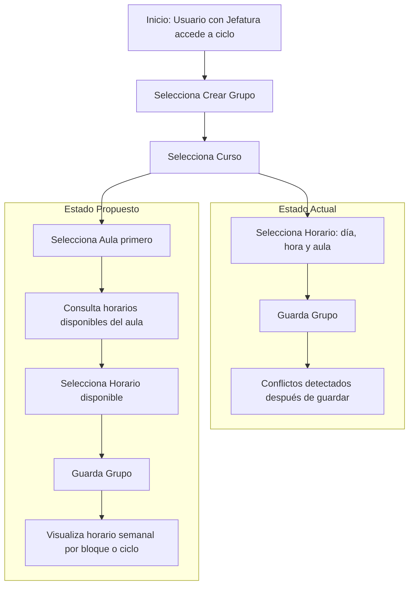
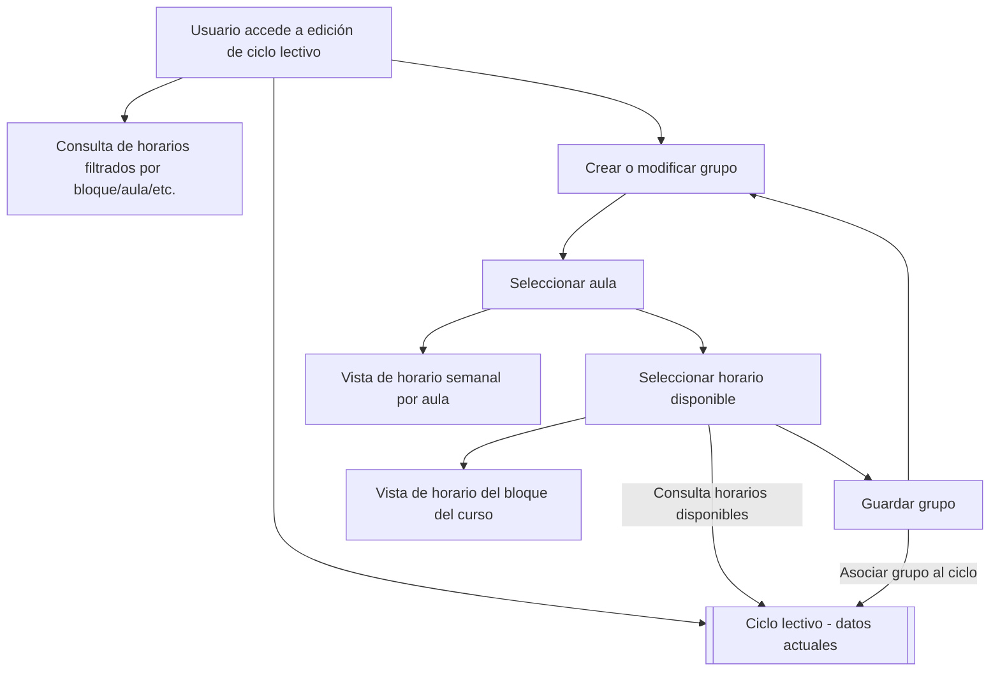

# Propuestas de mejora técnica

## Propuesta 1: Mejoras en sistema de asignación de horarios y aulas (Mejora en UI/UX)
### Descripción
Actualmente, el sistema de EIE info le permite a funcionarios administrativos específicos (como los directores de cada departamento de la escuela) realizar la asignación de las aulas y horarios asignados para cada curso de los semestres. Sin embargo este sistema no posee las funciones necesarias para revisar si los cursos agregados (como par de horario y aula) generan conflicto con otros grupos previo a ser agregados. Además, actualmente no se posee una forma de visualizar los cursos agredados, causando que sea difícil identificar horarios disponibles o si los horarios de un mismo ciclo (del plan de estudios) estan bien organizados.

> Captura de interfaz para modificar horarios según el ciclo lectivo.

> Captura de evidencia en la que se muestra que se pueden colocar horarios que generan choque con otros.

> Captura de intento de agregar horario que choca con horarios ya establecidos.

> Captura de grupos de un mismos plan de estudio con choques de horas.

La propuesta general es agregar dos funcionalidades que resuelven dichas deficiencias:

- Restringir los cursos (horario y aula) permitidos en la interfaz de agregar cursos a solo aquellos que no generen error de conflicto.
- Agregar una interfaz que muestre los horarios semanales de los cursos agregados, separados según el ciclo del plan de estudio al que pertenecen.

### Justificación/Evidencia
Estos cambios propuestos provienen de las sugerencias dadas por usuarios administrativos del sistema, que identificaron las deficiencias en la experiencia de usuario (UX) mencionadas. Específicamente, estas fueron mencionadas por el profesor y director de departamento de Electrónica y Telecomunicaciones como respuesta a la [pregunta](/avances/avance2/README.md/#2-feedback-de-usuario) de posibles aspectos de mejora en la sección de su labor como administrativo:

>    Existe potencial de mejora:
>    * Cuando se asignan horarios y aulas para los cursos de los siguientes ciclos, se da la opción de generar choques de aula/horario sin saberlo, hasta que se guardan los cambios. Se sugiere que se cambie, para que al establecer horarios solo se den como opción los horarios/aulas disponibles (sugerencia en consideración pero no en desarrollo).
>    * No existe forma de visualizar la asignación de los horarios/aulas en un calendario semanal, lo cual sería útil a la hora de acomodar los cursos de un mismo ciclo. Estos deben estar ordenados para que no generen choque de horario, y así los estudiantes que siguen el plan de estudios puedan matricular todos los cursos del ciclo. Se sugiere un sistema que muestre los horarios de forma semanal, uno por cada ciclo, permitiendo una visualización más directa.

Considerando que esta función es clave para que se definan los cursos de semestres futuros de una forma clara, eficiente y libre de errores (que pueden generar serios conflictos de horarios en los semestres de estudiantes y profesores), se considera que esta es una propuesta que puede ayudar en gran manera la experiencia de usuario y calidad de servicio que da la página.

### Diagrama o arquitectura sugerida

#### Estructura actual

Luego de analizar el código y estructura de modelos/forms y demás en el backend de Django, se identificó que las funciones responsables al registro y creación de los pares horario/aula para un curso se manejan según instancias de la clase `Grupo` (definida en `src/server/cursos/models.py`) en el form `GrupoAdminForm` (definido en `src/server/cursos/forms.py`). Este form se clasifica como el form default en la clase `GrupoAdmin` (definida en `src/server/cursos/admin.py`) que se registra como modelo a usar por el administrador del backend Django en el dashboard de control/edición de aspectos del sistema. Pero, principalmente, se muestra una interfaz de agregar/editar grupos a través del forms CrearGrupoForm (definido en `src/server/profesores/forms.py`). Esta interfaz gráfica se genera por medio de la interfaz de editar los contenidos de un ciclo lectivo, la cual solo es disponible para usuarios tipo `Profesor` que tengan asignados una `Jefatura` (según las restricciones definidas en `src/server/profesores/misc.py`).

La clase de Grupo posee los siguientes atributos:
- Número de grupo (entero)
- Curso (objeto `Curso`)
- Profesor (objeto `Profesor`)
- Cupo (entero)
- Cátedra (objeto `Cátedra`)
- Horario (objeto `Horario`)
- etc.

Las sub-clases de importancia en este caso son:

- `Horario`: Definida en `src/server/administrativos/models.py`, modela un time-slot (hora de inicio, final y día) y asigna un aula (objeto `Lugar` definido en `src/server/administrativos/models.py`).
- `Curso`: Definida en `src/server/cursos/models.py`, define un curso en específico.

Además, los cursos están agregados según los ciclos (definidos según clase `Ciclo` en `src/server/cursos/models.py`).

#### Estructura propuesta

Para solucionar el despliegue de horarios no disponibles, se proponen las siguientes modificaciones al formulario ya existente:
- Mover la elección de aula a la primera etapa de creación de grupo (previo a escoger horas). Esto pasa la asignación del objeto Lugar al grupo, no al horario.
- El sistema itera por todos los grupos del ciclo actual que tienen asignada dicha aula y obtiene las horas disponibles (horario completo - horas ya asignadas).
- Solo desplegar las horas disponibles para el aula escogida.
- Desplegar una interfaz de horario (semanal) que muestre las horas ocupadas y por cual curso. Podría actualizarse según se selecionan horas.

Además, para facilitar la distribución de los horarios de forma que los ciclos de plan de estudio no se vean afectados:
- Crear bloques (estructura ya existente y vinculada a los `Ciclos`) para categorizar los 8 bloques de cada énfasis de forma predeterminada para cada ciclo.
- Asignar atributo a los cursos para el bloque al que pertenencen.
- En interfaz de grupos mostrar un horario (semanal) para todos los cursos pertenecientes al mismo bloque.

Opcional:
- Extender la funcionalidad de los horarios, agregando una sección que permita visualizar un horario semanal para grupos filtrados según distintos parámetros (bloque, aula, hora, etc).

Se muestra un diagrama comparativo entre 

Además, una vista general de las funciones e interacciones agregadas al sistema se ve en el siguiente diagrama:

### Análisis de costo/impacto esperado

#### Costo estimado

| Componente                                                              | Tipo de trabajo                | Estimación  |
| ----------------------------------------------------------------------- | ------------------------------ | ----------- |
| **Adaptación de `CrearGrupoForm`** para incluir aula y horario filtrado | Refactor backend (form)        | 5–7 h       |
| **Filtrado de horarios disponibles** según aula y ciclo                 | Lógica de consulta             | 4–6 h       |
| **Componente visual** para mostrar horarios semanales por aula/bloque   | Vista + plantilla reutilizable | 8–10 h      |
| **Ajustes menores en modelos** (atributos para bloque, relaciones)      | Migraciones y lógica mínima    | 2–3 h       |
| **Pruebas funcionales internas**                                        | QA y validación básica         | 4–5 h       |
| **Documentación técnica** (código + estructura de flujos)               | Comentarios y explicaciones    | 3–4 h       |
| **Documentación para usuarios técnicos**                                | Guía de uso de la interfaz     | 2–3 h       |
| **Revisión con usuarios administrativos**                               | Revisión y retroalimentación   | 2 h         |
| **Total estimado**                                                      |                                | **30–38 h** |

#### Impacto esperado

| Área afectada                                    | Impacto positivo                                            |
| ------------------------------------------------ | ----------------------------------------------------------- |
| **Experiencia de usuario (UX)**                  | Muy alto: evita errores humanos, navegación más intuitiva.  |
| **Reducción de errores administrativos**         | Alto: evita conflictos de horarios antes de que ocurran.    |
| **Organización de ciclos en el plan de estudio** | Alto: permite visualizar y validar coherencia entre cursos. |
| **Tiempo requerido para asignación de horarios** | Medio: menor necesidad de corrección posterior.             |
| **Carga cognitiva de los administradores**       | Bajo: simplifica la interfaz y reduce dudas.                |

#### Conclusión

El rediseño propuesto representa una mejora significativa en la calidad del sistema, con un costo moderado en tiempo de desarrollo. Mientras que el uso de estas funcionalidades no es lo suficientemente frecuente para justificar el costo de su implementación, las pocas veces que se utiliza conlleva una alta complejidad e inversión de tiempo. Además, al asegurarse que los grupos creados sean acordes a los requisitos del plan de estudio, se evitan problemas de conflictos de horarios que podrían afectar a muchos estudiantes, profesores y demás.

---

## Propuesta 2: 
### Descripción
### Justificación/Evidencia
### Diagrama o arquitectura sugerida
### Análisis de costo/impacto esperado

---

## Propuesta 3
### Descripción
### Justificación/Evidencia
### Diagrama o arquitectura sugerida
### Análisis de costo/impacto esperado

---